# PulseSoc Native Blocker Inventory - 2026-07-20

## Executive Summary

Release status: **NO-GO** for replacing the production WebView app today.

The prior release-readiness checkpoint reported `57` hard web-exit/fallback blockers. Re-running `.venv/bin/python scripts/pulsesoc_native_webview_replacement_audit.py` reproduced the same `57` raw matches. The forensic reconciliation classifies `54` as active source call-site/fallback findings and `3` as test-only false positives that codify stale fallback expectations. After deduplicating by implementation root cause, the active original findings collapse into `20` unique web/fallback root-cause groups. This pass also records `10` additional non-web release blockers discovered from the release report, broad source search, and current repository state.

## Wave 0 + Wave 1 Resolution Log (2026-07-21)

The following scoped blockers were addressed in the "Wave 0 Release-Gate Cleanup + Wave 1 Auth/Session/Home Stabilization" mission. NRB IDs are preserved; the `Status` column in the master table records finding origin, while resolution state is tracked here.

| ID | Domain | Resolution | Evidence |
| --- | --- | --- | --- |
| NRB-055 | Legal / Privacy | FALSE_POSITIVE (test-only fixture; excluded by audit comment/test-path exclusion, no source change) | `scripts/pulsesoc_native_app_foundation_audit.py` skips `__tests__`; assertion unchanged |
| NRB-056 | Navigation / Routing | FALSE_POSITIVE (test-only fixture; excluded by audit comment/test-path exclusion) | same as NRB-055 |
| NRB-057 | Notifications | FALSE_POSITIVE (test-only fixture; excluded by audit comment/test-path exclusion) | same as NRB-055 |
| NRB-058 | Home | RESOLVED (structural, inset-aware dock clearance; device QA NOT_OBSERVED) | `HomeScreen.tsx` now uses `Math.max(insets.bottom, 12) + BOTTOM_NAV_CONTENT_CLEARANCE`; regression test `HomeScreen.layout.test.ts` |
| NRB-059 | Authentication | RESOLVED-code / PARTIAL pending device QA (deterministic 6-phase bootstrap machine; single-flight refresh; logout state clearing; no token/PII logging) | `session/auth.ts`, `api/pulseApi.ts`, `App.tsx`; tests `restoreSession.test.ts` (7), existing auth suites (43) |
| NRB-060 | Release configuration | RESOLVED (audit repaired: WebView false-positive excluded, messenger routes corrected to communications/v2) | `scripts/pulsesoc_native_app_foundation_audit.py` exit 0 |
| NRB-061 | Live | RESOLVED (audit + report corrected to current native LiveKit host/studio truth) | `scripts/pulsesoc_native_live_audit.py` exit 0 |
| NRB-062 | Release configuration | RESOLVED (stale "device QA setup" recommendation + web-dep expectation corrected) | `scripts/pulsesoc_native_feature_parity_audit.py` exit 0 |

Not in scope this mission (unchanged, still OPEN): the 54 active web-exit/fallback call-site findings (NRB-001..NRB-054) plus their root-cause groups. The authoritative `scripts/pulsesoc_native_webview_replacement_audit.py` still exits 1 by design (`hard_blocker_count=54`), so the WebView-replacement release remains **NO-GO**.

## Original 57-Count Reconciliation

| Metric | Count | Evidence |
| --- | ---: | --- |
| Original reported count | 57 | `reports/pulsesoc_native_release_readiness_2026-07-20.md` |
| Reproduced raw matches | 57 | `scripts/pulsesoc_native_webview_replacement_audit.py` |
| Active original call-site findings | 54 | Original 57 minus test-only findings |
| Test-only false positives | 3 | `mobile-native/src/navigation/__tests__/*` |
| Unique web/fallback root causes | 20 | `duplicate_relationship` groups in JSON |
| Additional non-web blockers | 10 | Release report plus broad search |
| Final blocker records | 67 | JSON blocker register |

The original audit scans `mobile-native/src` TypeScript/JavaScript for `react-native-webview`, `WebView`, `Linking.openURL`, `safe_web_fallback`, `status: "fallback"`, `web fallback` copy, and `webPath`. It does include tests and counts duplicate text/type matches independently. It does not detect every partial native workflow, no-op, physical-device gap, visual defect, or stale audit.

## Final Authoritative Counts

- Active native replacement blocker records: `64`
- Original active web/fallback call-site findings: `54`
- Original test-only false positives: `3`
- Additional non-web blockers: `10`
- Root-cause groups: `28`
- Release readiness: `NO-GO`

## Blocker Methodology

A blocker is any active source path, fallback policy, shell, placeholder, physical QA gap, stale release gate, or configuration gap that prevents a complete production-grade native journey. Test-only expectations are listed individually because they were part of the original 57, but they are excluded from the active implementation count. Legitimate external resources such as legal documents are still blockers when the product goal is a fully native replacement and the route appears in production navigation without a native document surface.

## Complete Blocker Table

| ID | Domain | Severity | Class | File:Line | Status | Root |
| --- | --- | --- | --- | --- | --- | --- |
| NRB-001 | Dashboard | P1 | SAFE_WEB_FALLBACK | `mobile-native/src/navigation/dashboardRouting.ts:13` | ACTIVE_SOURCE | RCG-01 |
| NRB-002 | Dashboard | P1 | SAFE_WEB_FALLBACK | `mobile-native/src/navigation/dashboardRouting.ts:242` | ACTIVE_SOURCE | RCG-01 |
| NRB-003 | Dashboard | P1 | SAFE_WEB_FALLBACK | `mobile-native/src/navigation/dashboardRouting.ts:243` | ACTIVE_SOURCE | RCG-01 |
| NRB-004 | Dashboard | P1 | SAFE_WEB_FALLBACK | `mobile-native/src/navigation/dashboardRouting.ts:258` | ACTIVE_SOURCE | RCG-01 |
| NRB-005 | Dashboard | P1 | SAFE_WEB_FALLBACK | `mobile-native/src/navigation/dashboardRouting.ts:259` | ACTIVE_SOURCE | RCG-01 |
| NRB-006 | Dashboard | P1 | SAFE_WEB_FALLBACK | `mobile-native/src/navigation/dashboardRouting.ts:267` | ACTIVE_SOURCE | RCG-01 |
| NRB-007 | Dashboard | P1 | DIRECT_WEB_EXIT | `mobile-native/src/navigation/dashboardRouting.ts:277` | ACTIVE_SOURCE | RCG-01 |
| NRB-008 | Legal / Privacy | P2 | SAFE_WEB_FALLBACK | `mobile-native/src/navigation/masterNavigation.ts:110` | ACTIVE_SOURCE | RCG-02 |
| NRB-009 | Legal / Privacy | P2 | SAFE_WEB_FALLBACK | `mobile-native/src/navigation/masterNavigation.ts:111` | ACTIVE_SOURCE | RCG-02 |
| NRB-010 | Notifications | P1 | DIRECT_WEB_EXIT | `mobile-native/src/navigation/notificationRouting.ts:472` | ACTIVE_SOURCE | RCG-03 |
| NRB-011 | Events | P2 | SAFE_WEB_FALLBACK | `mobile-native/src/screens/EventsScreen.tsx:184` | ACTIVE_SOURCE | RCG-04 |
| NRB-012 | Dashboard | P1 | SAFE_WEB_FALLBACK | `mobile-native/src/screens/UserDashboardScreen.tsx:57` | ACTIVE_SOURCE | RCG-01 |
| NRB-013 | Dashboard | P1 | SAFE_WEB_FALLBACK | `mobile-native/src/screens/UserDashboardScreen.tsx:105` | ACTIVE_SOURCE | RCG-01 |
| NRB-014 | Dashboard | P1 | SAFE_WEB_FALLBACK | `mobile-native/src/screens/UserDashboardScreen.tsx:136` | ACTIVE_SOURCE | RCG-01 |
| NRB-015 | Dashboard | P1 | SAFE_WEB_FALLBACK | `mobile-native/src/screens/UserDashboardScreen.tsx:154` | ACTIVE_SOURCE | RCG-01 |
| NRB-016 | Authentication | P0 | DIRECT_WEB_EXIT | `mobile-native/src/screens/SignupScreen.tsx:223` | ACTIVE_SOURCE | RCG-05 |
| NRB-017 | Live | P1 | SAFE_WEB_FALLBACK | `mobile-native/src/screens/LiveScreen.tsx:187` | ACTIVE_SOURCE | RCG-06 |
| NRB-018 | Live | P1 | SAFE_WEB_FALLBACK | `mobile-native/src/screens/LiveScreen.tsx:192` | ACTIVE_SOURCE | RCG-06 |
| NRB-019 | Live | P1 | SAFE_WEB_FALLBACK | `mobile-native/src/screens/LiveScreen.tsx:394` | ACTIVE_SOURCE | RCG-06 |
| NRB-020 | Courses / Learning | P1 | SAFE_WEB_FALLBACK | `mobile-native/src/screens/CoursesLearningScreen.tsx:251` | ACTIVE_SOURCE | RCG-07 |
| NRB-021 | Courses / Learning | P1 | SAFE_WEB_FALLBACK | `mobile-native/src/screens/CoursesLearningScreen.tsx:280` | ACTIVE_SOURCE | RCG-07 |
| NRB-022 | Messages | P1 | DIRECT_WEB_EXIT | `mobile-native/src/screens/ChatScreen.tsx:982` | ACTIVE_SOURCE | RCG-08 |
| NRB-023 | Search | P1 | SAFE_WEB_FALLBACK | `mobile-native/src/screens/SearchScreen.tsx:189` | ACTIVE_SOURCE | RCG-09 |
| NRB-024 | Search | P1 | SAFE_WEB_FALLBACK | `mobile-native/src/screens/SearchScreen.tsx:209` | ACTIVE_SOURCE | RCG-09 |
| NRB-025 | Search | P1 | SAFE_WEB_FALLBACK | `mobile-native/src/screens/SearchScreen.tsx:219` | ACTIVE_SOURCE | RCG-09 |
| NRB-026 | Camera | P1 | DIRECT_WEB_EXIT | `mobile-native/src/screens/CameraStudioScreen.tsx:430` | ACTIVE_SOURCE | RCG-10 |
| NRB-027 | Creator Studio | P1 | SAFE_WEB_FALLBACK | `mobile-native/src/screens/ContentPlannerScreen.tsx:188` | ACTIVE_SOURCE | RCG-11 |
| NRB-028 | UNDX / Intelligence | P1 | SAFE_WEB_FALLBACK | `mobile-native/src/screens/AlertManagementScreen.tsx:383` | ACTIVE_SOURCE | RCG-12 |
| NRB-029 | Marketplace / Commerce | P0 | SAFE_WEB_FALLBACK | `mobile-native/src/screens/SellerStoreScreen.tsx:358` | ACTIVE_SOURCE | RCG-13 |
| NRB-030 | Marketplace / Commerce | P0 | DIRECT_WEB_EXIT | `mobile-native/src/screens/SellerStoreScreen.tsx:401` | ACTIVE_SOURCE | RCG-13 |
| NRB-031 | Dashboard | P1 | SAFE_WEB_FALLBACK | `mobile-native/src/screens/DashboardModuleDetailScreen.tsx:125` | ACTIVE_SOURCE | RCG-01 |
| NRB-032 | Ads / Promotions | P2 | DIRECT_WEB_EXIT | `mobile-native/src/components/SponsoredAdCard.tsx:33` | ACTIVE_SOURCE | RCG-14 |
| NRB-033 | Account / Security | P0 | DIRECT_WEB_EXIT | `mobile-native/src/api/account.ts:205` | ACTIVE_SOURCE | RCG-15 |
| NRB-034 | Premium / Subscriptions | P0 | DIRECT_WEB_EXIT | `mobile-native/src/api/premium.ts:101` | ACTIVE_SOURCE | RCG-16 |
| NRB-035 | Premium / Subscriptions | P0 | DIRECT_WEB_EXIT | `mobile-native/src/api/premium.ts:203` | ACTIVE_SOURCE | RCG-16 |
| NRB-036 | Account / Security | P0 | DIRECT_WEB_EXIT | `mobile-native/src/api/accountHealth.ts:113` | ACTIVE_SOURCE | RCG-15 |
| NRB-037 | Calls | P1 | DIRECT_WEB_EXIT | `mobile-native/src/api/calls.ts:256` | ACTIVE_SOURCE | RCG-17 |
| NRB-038 | Courses / Learning | P1 | DIRECT_WEB_EXIT | `mobile-native/src/api/learning.ts:106` | ACTIVE_SOURCE | RCG-07 |
| NRB-039 | Creator Studio | P1 | DIRECT_WEB_EXIT | `mobile-native/src/api/creator.ts:128` | ACTIVE_SOURCE | RCG-11 |
| NRB-040 | Trust / Safety | P1 | SAFE_WEB_FALLBACK | `mobile-native/src/api/safety.ts:122` | ACTIVE_SOURCE | RCG-18 |
| NRB-041 | Trust / Safety | P1 | SAFE_WEB_FALLBACK | `mobile-native/src/api/safety.ts:134` | ACTIVE_SOURCE | RCG-18 |
| NRB-042 | Trust / Safety | P1 | DIRECT_WEB_EXIT | `mobile-native/src/api/safety.ts:142` | ACTIVE_SOURCE | RCG-18 |
| NRB-043 | Marketplace / Commerce | P0 | DIRECT_WEB_EXIT | `mobile-native/src/api/marketplace.ts:227` | ACTIVE_SOURCE | RCG-13 |
| NRB-044 | Marketplace / Commerce | P0 | DIRECT_WEB_EXIT | `mobile-native/src/api/marketplace.ts:261` | ACTIVE_SOURCE | RCG-13 |
| NRB-045 | Live | P1 | DIRECT_WEB_EXIT | `mobile-native/src/api/live.ts:315` | ACTIVE_SOURCE | RCG-06 |
| NRB-046 | Dashboard | P1 | SAFE_WEB_FALLBACK | `mobile-native/src/api/dashboardLiveState.ts:54` | ACTIVE_SOURCE | RCG-01 |
| NRB-047 | Dashboard | P1 | SAFE_WEB_FALLBACK | `mobile-native/src/api/dashboardLiveState.ts:139` | ACTIVE_SOURCE | RCG-01 |
| NRB-048 | Dashboard | P1 | SAFE_WEB_FALLBACK | `mobile-native/src/api/dashboardLiveState.ts:182` | ACTIVE_SOURCE | RCG-01 |
| NRB-049 | Dashboard | P1 | SAFE_WEB_FALLBACK | `mobile-native/src/api/dashboardLiveState.ts:248` | ACTIVE_SOURCE | RCG-01 |
| NRB-050 | Creator Studio | P1 | DIRECT_WEB_EXIT | `mobile-native/src/api/growth.ts:75` | ACTIVE_SOURCE | RCG-11 |
| NRB-051 | Marketplace / Commerce | P0 | DIRECT_WEB_EXIT | `mobile-native/src/api/orders.ts:120` | ACTIVE_SOURCE | RCG-13 |
| NRB-052 | UNDX / Intelligence | P1 | DIRECT_WEB_EXIT | `mobile-native/src/api/intelligence.ts:107` | ACTIVE_SOURCE | RCG-12 |
| NRB-053 | Events | P2 | DIRECT_WEB_EXIT | `mobile-native/src/api/events.ts:90` | ACTIVE_SOURCE | RCG-19 |
| NRB-054 | Help / Support | P2 | DIRECT_WEB_EXIT | `mobile-native/src/api/support.ts:114` | ACTIVE_SOURCE | RCG-20 |
| NRB-055 | Legal / Privacy | P3 | STALE_TEST | `mobile-native/src/navigation/__tests__/routeResolution.test.ts:45` | TEST_ONLY | RCG-21 |
| NRB-056 | Navigation / Routing | P3 | STALE_TEST | `mobile-native/src/navigation/__tests__/routeResolution.test.ts:105` | TEST_ONLY | RCG-21 |
| NRB-057 | Notifications | P3 | STALE_TEST | `mobile-native/src/navigation/__tests__/notificationRouting.test.ts:9` | TEST_ONLY | RCG-03 |
| NRB-058 | Home | P0 | PARTIAL_NATIVE_FLOW | `reports/screenshots/native-release-readiness-2026-07-20/simulator-current-state.png:0` | ACTIVE_SOURCE | RCG-22 |
| NRB-059 | Authentication | P0 | AUTH_SESSION_GAP | `git status:0` | ACTIVE_SOURCE | RCG-23 |
| NRB-060 | Release configuration | P0 | STALE_AUDIT | `scripts/pulsesoc_native_app_foundation_audit.py:0` | ACTIVE_SOURCE | RCG-24 |
| NRB-061 | Live | P2 | STALE_AUDIT | `scripts/pulsesoc_native_live_audit.py:0` | ACTIVE_SOURCE | RCG-25 |
| NRB-062 | Release configuration | P2 | STALE_AUDIT | `scripts/pulsesoc_native_feature_parity_audit.py:0` | ACTIVE_SOURCE | RCG-24 |
| NRB-063 | Background services | P0 | PHYSICAL_QA_GAP | `reports/pulsesoc_native_release_readiness_2026-07-20.md:0` | ACTIVE_SOURCE | RCG-26 |
| NRB-064 | Release configuration | P0 | RELEASE_CONFIG_GAP | `reports/pulsesoc_native_release_readiness_2026-07-20.md:0` | ACTIVE_SOURCE | RCG-24 |
| NRB-065 | Search | P1 | MISSING_NATIVE_SCREEN | `mobile-native/src/screens/SearchScreen.tsx:180` | ACTIVE_SOURCE | RCG-27 |
| NRB-066 | Composer | P1 | PARTIAL_NATIVE_FLOW | `mobile-native/src/components/FeedComposer.tsx:143` | ACTIVE_SOURCE | RCG-28 |
| NRB-067 | Live | P1 | PLACEHOLDER | `mobile-native/src/screens/LiveHostSessionScreen.tsx:76` | ACTIVE_SOURCE | RCG-25 |

## Detailed Blocker Records

### NRB-001 - Dashboard: safe_web_fallback at dashboardRouting.ts:13

- Domain: Dashboard
- Severity: P1
- Priority: Wave 1
- Blocker Class: SAFE_WEB_FALLBACK
- File Path: mobile-native/src/navigation/dashboardRouting.ts
- Line Number: 13
- Triggering User Action: Open dashboard module/action card
- Current Behavior: export type DashboardActionRouteKind = "native_route" | "native_shell_route" | "safe_web_fallback" | "missing_invalid_route";
- Expected Native Behavior: Resolve the user journey inside native PulseSoc without WebView, external browser, inert fallback, or misleading unsupported copy.
- Why Fallback Exists: Shared dashboard route classifier and module shells still permit safe web fallback semantics.
- Native Implementation Status: Partial or shell-only
- Data Api Readiness: Unknown until target contract is traced; many affected flows already have server endpoints but lack native destination policy.
- Tests Currently Covering It: Original static replacement audit
- Tests Missing: Native route/action integration test plus simulator screenshot for the affected journey.
- Recommended Fix: Replace URL/fallback path with native route, native provider boundary, or server-authoritative native mutation; keep production backend contract.
- Estimated Complexity: L
- Duplicate Relationship: RCG-01
- Stale Code Status: ACTIVE_SOURCE
- Evidence: mobile-native/src/navigation/dashboardRouting.ts:13 [safe_web_fallback] export type DashboardActionRouteKind = "native_route" | "native_shell_route" | "safe_web_fallback" | "missing_invalid_route";

### NRB-002 - Dashboard: safe_web_fallback at dashboardRouting.ts:242

- Domain: Dashboard
- Severity: P1
- Priority: Wave 1
- Blocker Class: SAFE_WEB_FALLBACK
- File Path: mobile-native/src/navigation/dashboardRouting.ts
- Line Number: 242
- Triggering User Action: Open dashboard module/action card
- Current Behavior: kind: "safe_web_fallback",
- Expected Native Behavior: Resolve the user journey inside native PulseSoc without WebView, external browser, inert fallback, or misleading unsupported copy.
- Why Fallback Exists: Shared dashboard route classifier and module shells still permit safe web fallback semantics.
- Native Implementation Status: Partial or shell-only
- Data Api Readiness: Unknown until target contract is traced; many affected flows already have server endpoints but lack native destination policy.
- Tests Currently Covering It: Original static replacement audit
- Tests Missing: Native route/action integration test plus simulator screenshot for the affected journey.
- Recommended Fix: Replace URL/fallback path with native route, native provider boundary, or server-authoritative native mutation; keep production backend contract.
- Estimated Complexity: L
- Duplicate Relationship: RCG-01
- Stale Code Status: ACTIVE_SOURCE
- Evidence: mobile-native/src/navigation/dashboardRouting.ts:242 [safe_web_fallback] kind: "safe_web_fallback",

### NRB-003 - Dashboard: web_fallback_copy at dashboardRouting.ts:243

- Domain: Dashboard
- Severity: P1
- Priority: Wave 1
- Blocker Class: SAFE_WEB_FALLBACK
- File Path: mobile-native/src/navigation/dashboardRouting.ts
- Line Number: 243
- Triggering User Action: Open dashboard module/action card
- Current Behavior: label: "Safe fallback",
- Expected Native Behavior: Resolve the user journey inside native PulseSoc without WebView, external browser, inert fallback, or misleading unsupported copy.
- Why Fallback Exists: Shared dashboard route classifier and module shells still permit safe web fallback semantics.
- Native Implementation Status: Partial or shell-only
- Data Api Readiness: Unknown until target contract is traced; many affected flows already have server endpoints but lack native destination policy.
- Tests Currently Covering It: Original static replacement audit
- Tests Missing: Native route/action integration test plus simulator screenshot for the affected journey.
- Recommended Fix: Replace URL/fallback path with native route, native provider boundary, or server-authoritative native mutation; keep production backend contract.
- Estimated Complexity: L
- Duplicate Relationship: RCG-01
- Stale Code Status: ACTIVE_SOURCE
- Evidence: mobile-native/src/navigation/dashboardRouting.ts:243 [web_fallback_copy] label: "Safe fallback",

### NRB-004 - Dashboard: safe_web_fallback at dashboardRouting.ts:258

- Domain: Dashboard
- Severity: P1
- Priority: Wave 1
- Blocker Class: SAFE_WEB_FALLBACK
- File Path: mobile-native/src/navigation/dashboardRouting.ts
- Line Number: 258
- Triggering User Action: Open dashboard module/action card
- Current Behavior: kind: "safe_web_fallback",
- Expected Native Behavior: Resolve the user journey inside native PulseSoc without WebView, external browser, inert fallback, or misleading unsupported copy.
- Why Fallback Exists: Shared dashboard route classifier and module shells still permit safe web fallback semantics.
- Native Implementation Status: Partial or shell-only
- Data Api Readiness: Unknown until target contract is traced; many affected flows already have server endpoints but lack native destination policy.
- Tests Currently Covering It: Original static replacement audit
- Tests Missing: Native route/action integration test plus simulator screenshot for the affected journey.
- Recommended Fix: Replace URL/fallback path with native route, native provider boundary, or server-authoritative native mutation; keep production backend contract.
- Estimated Complexity: L
- Duplicate Relationship: RCG-01
- Stale Code Status: ACTIVE_SOURCE
- Evidence: mobile-native/src/navigation/dashboardRouting.ts:258 [safe_web_fallback] kind: "safe_web_fallback",

### NRB-005 - Dashboard: web_fallback_copy at dashboardRouting.ts:259

- Domain: Dashboard
- Severity: P1
- Priority: Wave 1
- Blocker Class: SAFE_WEB_FALLBACK
- File Path: mobile-native/src/navigation/dashboardRouting.ts
- Line Number: 259
- Triggering User Action: Open dashboard module/action card
- Current Behavior: label: "Safe fallback",
- Expected Native Behavior: Resolve the user journey inside native PulseSoc without WebView, external browser, inert fallback, or misleading unsupported copy.
- Why Fallback Exists: Shared dashboard route classifier and module shells still permit safe web fallback semantics.
- Native Implementation Status: Partial or shell-only
- Data Api Readiness: Unknown until target contract is traced; many affected flows already have server endpoints but lack native destination policy.
- Tests Currently Covering It: Original static replacement audit
- Tests Missing: Native route/action integration test plus simulator screenshot for the affected journey.
- Recommended Fix: Replace URL/fallback path with native route, native provider boundary, or server-authoritative native mutation; keep production backend contract.
- Estimated Complexity: L
- Duplicate Relationship: RCG-01
- Stale Code Status: ACTIVE_SOURCE
- Evidence: mobile-native/src/navigation/dashboardRouting.ts:259 [web_fallback_copy] label: "Safe fallback",

### NRB-006 - Dashboard: web_fallback_copy at dashboardRouting.ts:267

- Domain: Dashboard
- Severity: P1
- Priority: Wave 1
- Blocker Class: SAFE_WEB_FALLBACK
- File Path: mobile-native/src/navigation/dashboardRouting.ts
- Line Number: 267
- Triggering User Action: Open dashboard module/action card
- Current Behavior: detail: "No native, shell, or safe fallback destination is registered for this action.",
- Expected Native Behavior: Resolve the user journey inside native PulseSoc without WebView, external browser, inert fallback, or misleading unsupported copy.
- Why Fallback Exists: Shared dashboard route classifier and module shells still permit safe web fallback semantics.
- Native Implementation Status: Partial or shell-only
- Data Api Readiness: Unknown until target contract is traced; many affected flows already have server endpoints but lack native destination policy.
- Tests Currently Covering It: Original static replacement audit
- Tests Missing: Native route/action integration test plus simulator screenshot for the affected journey.
- Recommended Fix: Replace URL/fallback path with native route, native provider boundary, or server-authoritative native mutation; keep production backend contract.
- Estimated Complexity: L
- Duplicate Relationship: RCG-01
- Stale Code Status: ACTIVE_SOURCE
- Evidence: mobile-native/src/navigation/dashboardRouting.ts:267 [web_fallback_copy] detail: "No native, shell, or safe fallback destination is registered for this action.",

### NRB-007 - Dashboard: Linking.openURL at dashboardRouting.ts:277

- Domain: Dashboard
- Severity: P1
- Priority: Wave 1
- Blocker Class: DIRECT_WEB_EXIT
- File Path: mobile-native/src/navigation/dashboardRouting.ts
- Line Number: 277
- Triggering User Action: Open dashboard module/action card
- Current Behavior: Linking.openURL(dashboardWebUrl(route)).catch(() => undefined);
- Expected Native Behavior: Resolve the user journey inside native PulseSoc without WebView, external browser, inert fallback, or misleading unsupported copy.
- Why Fallback Exists: Shared dashboard route classifier and module shells still permit safe web fallback semantics.
- Native Implementation Status: Partial or shell-only
- Data Api Readiness: Unknown until target contract is traced; many affected flows already have server endpoints but lack native destination policy.
- Tests Currently Covering It: Original static replacement audit
- Tests Missing: Native route/action integration test plus simulator screenshot for the affected journey.
- Recommended Fix: Replace URL/fallback path with native route, native provider boundary, or server-authoritative native mutation; keep production backend contract.
- Estimated Complexity: L
- Duplicate Relationship: RCG-01
- Stale Code Status: ACTIVE_SOURCE
- Evidence: mobile-native/src/navigation/dashboardRouting.ts:277 [Linking.openURL] Linking.openURL(dashboardWebUrl(route)).catch(() => undefined);

### NRB-008 - Legal / Privacy: fallback_status at masterNavigation.ts:110

- Domain: Legal / Privacy
- Severity: P2
- Priority: Wave 5
- Blocker Class: SAFE_WEB_FALLBACK
- File Path: mobile-native/src/navigation/masterNavigation.ts
- Line Number: 110
- Triggering User Action: Open Terms or Privacy from drawer/notification
- Current Behavior: { label: "Terms", route: "/terms", status: "fallback", description: "Legal document provider boundary." },
- Expected Native Behavior: Resolve the user journey inside native PulseSoc without WebView, external browser, inert fallback, or misleading unsupported copy.
- Why Fallback Exists: Master navigation includes legal fallback entries without native legal document surfaces.
- Native Implementation Status: Partial or shell-only
- Data Api Readiness: Unknown until target contract is traced; many affected flows already have server endpoints but lack native destination policy.
- Tests Currently Covering It: Original static replacement audit
- Tests Missing: Native route/action integration test plus simulator screenshot for the affected journey.
- Recommended Fix: Replace URL/fallback path with native route, native provider boundary, or server-authoritative native mutation; keep production backend contract.
- Estimated Complexity: M
- Duplicate Relationship: RCG-02
- Stale Code Status: ACTIVE_SOURCE
- Evidence: mobile-native/src/navigation/masterNavigation.ts:110 [fallback_status] { label: "Terms", route: "/terms", status: "fallback", description: "Legal document provider boundary." },

### NRB-009 - Legal / Privacy: fallback_status at masterNavigation.ts:111

- Domain: Legal / Privacy
- Severity: P2
- Priority: Wave 5
- Blocker Class: SAFE_WEB_FALLBACK
- File Path: mobile-native/src/navigation/masterNavigation.ts
- Line Number: 111
- Triggering User Action: Open Terms or Privacy from drawer/notification
- Current Behavior: { label: "Privacy Policy", route: "/privacy", status: "fallback", description: "Legal document provider boundary." },
- Expected Native Behavior: Resolve the user journey inside native PulseSoc without WebView, external browser, inert fallback, or misleading unsupported copy.
- Why Fallback Exists: Master navigation includes legal fallback entries without native legal document surfaces.
- Native Implementation Status: Partial or shell-only
- Data Api Readiness: Unknown until target contract is traced; many affected flows already have server endpoints but lack native destination policy.
- Tests Currently Covering It: Original static replacement audit
- Tests Missing: Native route/action integration test plus simulator screenshot for the affected journey.
- Recommended Fix: Replace URL/fallback path with native route, native provider boundary, or server-authoritative native mutation; keep production backend contract.
- Estimated Complexity: M
- Duplicate Relationship: RCG-02
- Stale Code Status: ACTIVE_SOURCE
- Evidence: mobile-native/src/navigation/masterNavigation.ts:111 [fallback_status] { label: "Privacy Policy", route: "/privacy", status: "fallback", description: "Legal document provider boundary." },

### NRB-010 - Notifications: Linking.openURL at notificationRouting.ts:472

- Domain: Notifications
- Severity: P1
- Priority: Wave 2
- Blocker Class: DIRECT_WEB_EXIT
- File Path: mobile-native/src/navigation/notificationRouting.ts
- Line Number: 472
- Triggering User Action: Tap notification/deep link with unresolved target
- Current Behavior: await Linking.openURL(webTarget);
- Expected Native Behavior: Resolve the user journey inside native PulseSoc without WebView, external browser, inert fallback, or misleading unsupported copy.
- Why Fallback Exists: Notification/deep-link resolver still opens intentional legal web targets and falls back unresolved app paths to Activity.
- Native Implementation Status: Partial or shell-only
- Data Api Readiness: Unknown until target contract is traced; many affected flows already have server endpoints but lack native destination policy.
- Tests Currently Covering It: Original static replacement audit
- Tests Missing: Native route/action integration test plus simulator screenshot for the affected journey.
- Recommended Fix: Replace URL/fallback path with native route, native provider boundary, or server-authoritative native mutation; keep production backend contract.
- Estimated Complexity: M
- Duplicate Relationship: RCG-03
- Stale Code Status: ACTIVE_SOURCE
- Evidence: mobile-native/src/navigation/notificationRouting.ts:472 [Linking.openURL] await Linking.openURL(webTarget);

### NRB-011 - Events: web_fallback_copy at EventsScreen.tsx:184

- Domain: Events
- Severity: P2
- Priority: Wave 2
- Blocker Class: SAFE_WEB_FALLBACK
- File Path: mobile-native/src/screens/EventsScreen.tsx
- Line Number: 184
- Triggering User Action: Open events, scheduled Live creation, ticketing, or event details
- Current Behavior: <Text style={styles.gatewayText}>Native discovery uses existing Live scheduled data. Creation and payments stay on safe fallback.</Text>
- Expected Native Behavior: Resolve the user journey inside native PulseSoc without WebView, external browser, inert fallback, or misleading unsupported copy.
- Why Fallback Exists: Unclassified native web/fallback dependency.
- Native Implementation Status: Partial or shell-only
- Data Api Readiness: Unknown until target contract is traced; many affected flows already have server endpoints but lack native destination policy.
- Tests Currently Covering It: Original static replacement audit
- Tests Missing: Native route/action integration test plus simulator screenshot for the affected journey.
- Recommended Fix: Replace URL/fallback path with native route, native provider boundary, or server-authoritative native mutation; keep production backend contract.
- Estimated Complexity: M
- Duplicate Relationship: RCG-04
- Stale Code Status: ACTIVE_SOURCE
- Evidence: mobile-native/src/screens/EventsScreen.tsx:184 [web_fallback_copy] <Text style={styles.gatewayText}>Native discovery uses existing Live scheduled data. Creation and payments stay on safe fallback.</Text>

### NRB-012 - Dashboard: safe_web_fallback at UserDashboardScreen.tsx:57

- Domain: Dashboard
- Severity: P1
- Priority: Wave 1
- Blocker Class: SAFE_WEB_FALLBACK
- File Path: mobile-native/src/screens/UserDashboardScreen.tsx
- Line Number: 57
- Triggering User Action: Open dashboard module/action card
- Current Behavior: const fallbackCount = useMemo(() => moduleGroups.reduce((total, group) => total + group.modules.filter((module) => classifyDashboardActionRoute(module.route).kind === "safe_web_fallback").length, 0), [moduleGroups]);
- Expected Native Behavior: Resolve the user journey inside native PulseSoc without WebView, external browser, inert fallback, or misleading unsupported copy.
- Why Fallback Exists: Shared dashboard route classifier and module shells still permit safe web fallback semantics.
- Native Implementation Status: Partial or shell-only
- Data Api Readiness: Unknown until target contract is traced; many affected flows already have server endpoints but lack native destination policy.
- Tests Currently Covering It: Original static replacement audit
- Tests Missing: Native route/action integration test plus simulator screenshot for the affected journey.
- Recommended Fix: Replace URL/fallback path with native route, native provider boundary, or server-authoritative native mutation; keep production backend contract.
- Estimated Complexity: L
- Duplicate Relationship: RCG-01
- Stale Code Status: ACTIVE_SOURCE
- Evidence: mobile-native/src/screens/UserDashboardScreen.tsx:57 [safe_web_fallback] const fallbackCount = useMemo(() => moduleGroups.reduce((total, group) => total + group.modules.filter((module) => classifyDashboardActionRoute(module.route).kind === "safe_web_fallback").length, 0), [moduleGroups]);

### NRB-013 - Dashboard: web_fallback_copy at UserDashboardScreen.tsx:105

- Domain: Dashboard
- Severity: P1
- Priority: Wave 1
- Blocker Class: SAFE_WEB_FALLBACK
- File Path: mobile-native/src/screens/UserDashboardScreen.tsx
- Line Number: 105
- Triggering User Action: Open dashboard module/action card
- Current Behavior: <Text style={styles.warningTitle}>Some modules are using safe fallback data</Text>
- Expected Native Behavior: Resolve the user journey inside native PulseSoc without WebView, external browser, inert fallback, or misleading unsupported copy.
- Why Fallback Exists: Shared dashboard route classifier and module shells still permit safe web fallback semantics.
- Native Implementation Status: Partial or shell-only
- Data Api Readiness: Unknown until target contract is traced; many affected flows already have server endpoints but lack native destination policy.
- Tests Currently Covering It: Original static replacement audit
- Tests Missing: Native route/action integration test plus simulator screenshot for the affected journey.
- Recommended Fix: Replace URL/fallback path with native route, native provider boundary, or server-authoritative native mutation; keep production backend contract.
- Estimated Complexity: L
- Duplicate Relationship: RCG-01
- Stale Code Status: ACTIVE_SOURCE
- Evidence: mobile-native/src/screens/UserDashboardScreen.tsx:105 [web_fallback_copy] <Text style={styles.warningTitle}>Some modules are using safe fallback data</Text>

### NRB-014 - Dashboard: web_fallback_copy at UserDashboardScreen.tsx:136

- Domain: Dashboard
- Severity: P1
- Priority: Wave 1
- Blocker Class: SAFE_WEB_FALLBACK
- File Path: mobile-native/src/screens/UserDashboardScreen.tsx
- Line Number: 136
- Triggering User Action: Open dashboard module/action card
- Current Behavior: <Section title="Production Dashboard Map" subtitle="Current PulseSoc dashboard module groups represented natively with safe fallback routing where advanced modules are still web-owned.">
- Expected Native Behavior: Resolve the user journey inside native PulseSoc without WebView, external browser, inert fallback, or misleading unsupported copy.
- Why Fallback Exists: Shared dashboard route classifier and module shells still permit safe web fallback semantics.
- Native Implementation Status: Partial or shell-only
- Data Api Readiness: Unknown until target contract is traced; many affected flows already have server endpoints but lack native destination policy.
- Tests Currently Covering It: Original static replacement audit
- Tests Missing: Native route/action integration test plus simulator screenshot for the affected journey.
- Recommended Fix: Replace URL/fallback path with native route, native provider boundary, or server-authoritative native mutation; keep production backend contract.
- Estimated Complexity: L
- Duplicate Relationship: RCG-01
- Stale Code Status: ACTIVE_SOURCE
- Evidence: mobile-native/src/screens/UserDashboardScreen.tsx:136 [web_fallback_copy] <Section title="Production Dashboard Map" subtitle="Current PulseSoc dashboard module groups represented natively with safe fallback routing where advanced modules are still web-owned.">

### NRB-015 - Dashboard: web_fallback_copy at UserDashboardScreen.tsx:154

- Domain: Dashboard
- Severity: P1
- Priority: Wave 1
- Blocker Class: SAFE_WEB_FALLBACK
- File Path: mobile-native/src/screens/UserDashboardScreen.tsx
- Line Number: 154
- Triggering User Action: Open dashboard module/action card
- Current Behavior: <Section title="Dashboard Quick Actions" subtitle="Production quick-action routes are wired to native destinations or safe web fallbacks.">
- Expected Native Behavior: Resolve the user journey inside native PulseSoc without WebView, external browser, inert fallback, or misleading unsupported copy.
- Why Fallback Exists: Shared dashboard route classifier and module shells still permit safe web fallback semantics.
- Native Implementation Status: Partial or shell-only
- Data Api Readiness: Unknown until target contract is traced; many affected flows already have server endpoints but lack native destination policy.
- Tests Currently Covering It: Original static replacement audit
- Tests Missing: Native route/action integration test plus simulator screenshot for the affected journey.
- Recommended Fix: Replace URL/fallback path with native route, native provider boundary, or server-authoritative native mutation; keep production backend contract.
- Estimated Complexity: L
- Duplicate Relationship: RCG-01
- Stale Code Status: ACTIVE_SOURCE
- Evidence: mobile-native/src/screens/UserDashboardScreen.tsx:154 [web_fallback_copy] <Section title="Dashboard Quick Actions" subtitle="Production quick-action routes are wired to native destinations or safe web fallbacks.">

### NRB-016 - Authentication: Linking.openURL at SignupScreen.tsx:223

- Domain: Authentication
- Severity: P0
- Priority: Wave 1
- Blocker Class: DIRECT_WEB_EXIT
- File Path: mobile-native/src/screens/SignupScreen.tsx
- Line Number: 223
- Triggering User Action: Sign up, recover account, or open auth help/legal links
- Current Behavior: Linking.openURL(url).catch(() => undefined);
- Expected Native Behavior: Resolve the user journey inside native PulseSoc without WebView, external browser, inert fallback, or misleading unsupported copy.
- Why Fallback Exists: Signup help/legal path still uses external URL handoff from auth flow.
- Native Implementation Status: Partial or shell-only
- Data Api Readiness: Unknown until target contract is traced; many affected flows already have server endpoints but lack native destination policy.
- Tests Currently Covering It: Original static replacement audit
- Tests Missing: Native route/action integration test plus simulator screenshot for the affected journey.
- Recommended Fix: Replace URL/fallback path with native route, native provider boundary, or server-authoritative native mutation; keep production backend contract.
- Estimated Complexity: M
- Duplicate Relationship: RCG-05
- Stale Code Status: ACTIVE_SOURCE
- Evidence: mobile-native/src/screens/SignupScreen.tsx:223 [Linking.openURL] Linking.openURL(url).catch(() => undefined);

### NRB-017 - Live: web_fallback_copy at LiveScreen.tsx:187

- Domain: Live
- Severity: P1
- Priority: Wave 3
- Blocker Class: SAFE_WEB_FALLBACK
- File Path: mobile-native/src/screens/LiveScreen.tsx
- Line Number: 187
- Triggering User Action: Open Live viewer/studio/provider failure state
- Current Behavior: setError("PulseSoc could not mint native Live viewer credentials. Use web fallback or retry.");
- Expected Native Behavior: Resolve the user journey inside native PulseSoc without WebView, external browser, inert fallback, or misleading unsupported copy.
- Why Fallback Exists: Live viewer still contains web fallback/error path for provider or token failure states.
- Native Implementation Status: Partial or shell-only
- Data Api Readiness: Unknown until target contract is traced; many affected flows already have server endpoints but lack native destination policy.
- Tests Currently Covering It: Original static replacement audit
- Tests Missing: Native route/action integration test plus simulator screenshot for the affected journey.
- Recommended Fix: Replace URL/fallback path with native route, native provider boundary, or server-authoritative native mutation; keep production backend contract.
- Estimated Complexity: L
- Duplicate Relationship: RCG-06
- Stale Code Status: ACTIVE_SOURCE
- Evidence: mobile-native/src/screens/LiveScreen.tsx:187 [web_fallback_copy] setError("PulseSoc could not mint native Live viewer credentials. Use web fallback or retry.");

### NRB-018 - Live: web_fallback_copy at LiveScreen.tsx:192

- Domain: Live
- Severity: P1
- Priority: Wave 3
- Blocker Class: SAFE_WEB_FALLBACK
- File Path: mobile-native/src/screens/LiveScreen.tsx
- Line Number: 192
- Triggering User Action: Open Live viewer/studio/provider failure state
- Current Behavior: setError(room.error || "Native Live playback could not connect. Use web fallback or retry.");
- Expected Native Behavior: Resolve the user journey inside native PulseSoc without WebView, external browser, inert fallback, or misleading unsupported copy.
- Why Fallback Exists: Live viewer still contains web fallback/error path for provider or token failure states.
- Native Implementation Status: Partial or shell-only
- Data Api Readiness: Unknown until target contract is traced; many affected flows already have server endpoints but lack native destination policy.
- Tests Currently Covering It: Original static replacement audit
- Tests Missing: Native route/action integration test plus simulator screenshot for the affected journey.
- Recommended Fix: Replace URL/fallback path with native route, native provider boundary, or server-authoritative native mutation; keep production backend contract.
- Estimated Complexity: L
- Duplicate Relationship: RCG-06
- Stale Code Status: ACTIVE_SOURCE
- Evidence: mobile-native/src/screens/LiveScreen.tsx:192 [web_fallback_copy] setError(room.error || "Native Live playback could not connect. Use web fallback or retry.");

### NRB-019 - Live: web_fallback_copy at LiveScreen.tsx:394

- Domain: Live
- Severity: P1
- Priority: Wave 3
- Blocker Class: SAFE_WEB_FALLBACK
- File Path: mobile-native/src/screens/LiveScreen.tsx
- Line Number: 394
- Triggering User Action: Open Live viewer/studio/provider failure state
- Current Behavior: setError("Native playback could not start. Use web fallback for this Live.");
- Expected Native Behavior: Resolve the user journey inside native PulseSoc without WebView, external browser, inert fallback, or misleading unsupported copy.
- Why Fallback Exists: Live viewer still contains web fallback/error path for provider or token failure states.
- Native Implementation Status: Partial or shell-only
- Data Api Readiness: Unknown until target contract is traced; many affected flows already have server endpoints but lack native destination policy.
- Tests Currently Covering It: Original static replacement audit
- Tests Missing: Native route/action integration test plus simulator screenshot for the affected journey.
- Recommended Fix: Replace URL/fallback path with native route, native provider boundary, or server-authoritative native mutation; keep production backend contract.
- Estimated Complexity: L
- Duplicate Relationship: RCG-06
- Stale Code Status: ACTIVE_SOURCE
- Evidence: mobile-native/src/screens/LiveScreen.tsx:394 [web_fallback_copy] setError("Native playback could not start. Use web fallback for this Live.");

### NRB-020 - Courses / Learning: web_fallback_copy at CoursesLearningScreen.tsx:251

- Domain: Courses / Learning
- Severity: P1
- Priority: Wave 4
- Blocker Class: SAFE_WEB_FALLBACK
- File Path: mobile-native/src/screens/CoursesLearningScreen.tsx
- Line Number: 251
- Triggering User Action: Open course detail, lesson, payment, teacher, or review tools
- Current Behavior: <Text style={styles.subtitle}>This native gateway preserves the existing PulseSoc teacher, course, payment, and review rules. Advanced operations stay on safe fallback.</Text>
- Expected Native Behavior: Resolve the user journey inside native PulseSoc without WebView, external browser, inert fallback, or misleading unsupported copy.
- Why Fallback Exists: Education/course payments, teacher tools, or unsupported lesson media still rely on web/provider fallback.
- Native Implementation Status: Partial or shell-only
- Data Api Readiness: Unknown until target contract is traced; many affected flows already have server endpoints but lack native destination policy.
- Tests Currently Covering It: Original static replacement audit
- Tests Missing: Native route/action integration test plus simulator screenshot for the affected journey.
- Recommended Fix: Replace URL/fallback path with native route, native provider boundary, or server-authoritative native mutation; keep production backend contract.
- Estimated Complexity: M
- Duplicate Relationship: RCG-07
- Stale Code Status: ACTIVE_SOURCE
- Evidence: mobile-native/src/screens/CoursesLearningScreen.tsx:251 [web_fallback_copy] <Text style={styles.subtitle}>This native gateway preserves the existing PulseSoc teacher, course, payment, and review rules. Advanced operations stay on safe fallback.</Text>

### NRB-021 - Courses / Learning: web_fallback_copy at CoursesLearningScreen.tsx:280

- Domain: Courses / Learning
- Severity: P1
- Priority: Wave 4
- Blocker Class: SAFE_WEB_FALLBACK
- File Path: mobile-native/src/screens/CoursesLearningScreen.tsx
- Line Number: 280
- Triggering User Action: Open course detail, lesson, payment, teacher, or review tools
- Current Behavior: <Text style={styles.subtitle}>{offline ? "Showing saved lessons" : "Native lesson discovery powered by the existing PulseSoc education backend, with course payments and teacher tools kept on safe fallback."}</Text>
- Expected Native Behavior: Resolve the user journey inside native PulseSoc without WebView, external browser, inert fallback, or misleading unsupported copy.
- Why Fallback Exists: Education/course payments, teacher tools, or unsupported lesson media still rely on web/provider fallback.
- Native Implementation Status: Partial or shell-only
- Data Api Readiness: Unknown until target contract is traced; many affected flows already have server endpoints but lack native destination policy.
- Tests Currently Covering It: Original static replacement audit
- Tests Missing: Native route/action integration test plus simulator screenshot for the affected journey.
- Recommended Fix: Replace URL/fallback path with native route, native provider boundary, or server-authoritative native mutation; keep production backend contract.
- Estimated Complexity: M
- Duplicate Relationship: RCG-07
- Stale Code Status: ACTIVE_SOURCE
- Evidence: mobile-native/src/screens/CoursesLearningScreen.tsx:280 [web_fallback_copy] <Text style={styles.subtitle}>{offline ? "Showing saved lessons" : "Native lesson discovery powered by the existing PulseSoc education backend, with course payments and teacher tools kept on safe fallback."}</Text>

### NRB-022 - Messages: Linking.openURL at ChatScreen.tsx:982

- Domain: Messages
- Severity: P1
- Priority: Wave 2
- Blocker Class: DIRECT_WEB_EXIT
- File Path: mobile-native/src/screens/ChatScreen.tsx
- Line Number: 982
- Triggering User Action: Tap UNDX/result link inside conversation
- Current Behavior: <Pressable accessibilityRole="link" accessibilityLabel={`Open ${component.content_type || "PulseSOC"} result`} style={styles.undxActionConfirm} onPress={() => Linking.openURL(absoluteMediaUrl(component.deep_link)).catch(() => setStatusMessage("This result could not be opened."))}>
- Expected Native Behavior: Resolve the user journey inside native PulseSoc without WebView, external browser, inert fallback, or misleading unsupported copy.
- Why Fallback Exists: UNDX/message result action opens a deep link URL rather than resolving a native route.
- Native Implementation Status: Partial or shell-only
- Data Api Readiness: Unknown until target contract is traced; many affected flows already have server endpoints but lack native destination policy.
- Tests Currently Covering It: Original static replacement audit
- Tests Missing: Native route/action integration test plus simulator screenshot for the affected journey.
- Recommended Fix: Replace URL/fallback path with native route, native provider boundary, or server-authoritative native mutation; keep production backend contract.
- Estimated Complexity: M
- Duplicate Relationship: RCG-08
- Stale Code Status: ACTIVE_SOURCE
- Evidence: mobile-native/src/screens/ChatScreen.tsx:982 [Linking.openURL] <Pressable accessibilityRole="link" accessibilityLabel={`Open ${component.content_type || "PulseSOC"} result`} style={styles.undxActionConfirm} onPress={() => Linking.openURL(absoluteMediaUrl(component.deep_link)).catch(() => setStatusMessage("This result could not be opened."))}>

### NRB-023 - Search: web_fallback_copy at SearchScreen.tsx:189

- Domain: Search
- Severity: P1
- Priority: Wave 2
- Blocker Class: SAFE_WEB_FALLBACK
- File Path: mobile-native/src/screens/SearchScreen.tsx
- Line Number: 189
- Triggering User Action: Open unsupported discovery tab/result
- Current Behavior: ? "This tab will stay on the existing PulseSoc backend and web fallback until a native destination exists."
- Expected Native Behavior: Resolve the user journey inside native PulseSoc without WebView, external browser, inert fallback, or misleading unsupported copy.
- Why Fallback Exists: Search/discover contains tab/result categories with no complete native destination.
- Native Implementation Status: Partial or shell-only
- Data Api Readiness: Unknown until target contract is traced; many affected flows already have server endpoints but lack native destination policy.
- Tests Currently Covering It: Original static replacement audit
- Tests Missing: Native route/action integration test plus simulator screenshot for the affected journey.
- Recommended Fix: Replace URL/fallback path with native route, native provider boundary, or server-authoritative native mutation; keep production backend contract.
- Estimated Complexity: M
- Duplicate Relationship: RCG-09
- Stale Code Status: ACTIVE_SOURCE
- Evidence: mobile-native/src/screens/SearchScreen.tsx:189 [web_fallback_copy] ? "This tab will stay on the existing PulseSoc backend and web fallback until a native destination exists."

### NRB-024 - Search: web_fallback_copy at SearchScreen.tsx:209

- Domain: Search
- Severity: P1
- Priority: Wave 2
- Blocker Class: SAFE_WEB_FALLBACK
- File Path: mobile-native/src/screens/SearchScreen.tsx
- Line Number: 209
- Triggering User Action: Open unsupported discovery tab/result
- Current Behavior: <Text style={styles.eventsGatewayText}>Open scheduled broadcasts from the existing PulseSoc Live backend. Creation and ticketing stay on safe fallback.</Text>
- Expected Native Behavior: Resolve the user journey inside native PulseSoc without WebView, external browser, inert fallback, or misleading unsupported copy.
- Why Fallback Exists: Search/discover contains tab/result categories with no complete native destination.
- Native Implementation Status: Partial or shell-only
- Data Api Readiness: Unknown until target contract is traced; many affected flows already have server endpoints but lack native destination policy.
- Tests Currently Covering It: Original static replacement audit
- Tests Missing: Native route/action integration test plus simulator screenshot for the affected journey.
- Recommended Fix: Replace URL/fallback path with native route, native provider boundary, or server-authoritative native mutation; keep production backend contract.
- Estimated Complexity: M
- Duplicate Relationship: RCG-09
- Stale Code Status: ACTIVE_SOURCE
- Evidence: mobile-native/src/screens/SearchScreen.tsx:209 [web_fallback_copy] <Text style={styles.eventsGatewayText}>Open scheduled broadcasts from the existing PulseSoc Live backend. Creation and ticketing stay on safe fallback.</Text>

### NRB-025 - Search: web_fallback_copy at SearchScreen.tsx:219

- Domain: Search
- Severity: P1
- Priority: Wave 2
- Blocker Class: SAFE_WEB_FALLBACK
- File Path: mobile-native/src/screens/SearchScreen.tsx
- Line Number: 219
- Triggering User Action: Open unsupported discovery tab/result
- Current Behavior: <Text style={styles.eventsGatewayText}>Open native lesson discovery. Course creation, payments, teacher tools, and unsupported lesson media stay on safe fallback.</Text>
- Expected Native Behavior: Resolve the user journey inside native PulseSoc without WebView, external browser, inert fallback, or misleading unsupported copy.
- Why Fallback Exists: Search/discover contains tab/result categories with no complete native destination.
- Native Implementation Status: Partial or shell-only
- Data Api Readiness: Unknown until target contract is traced; many affected flows already have server endpoints but lack native destination policy.
- Tests Currently Covering It: Original static replacement audit
- Tests Missing: Native route/action integration test plus simulator screenshot for the affected journey.
- Recommended Fix: Replace URL/fallback path with native route, native provider boundary, or server-authoritative native mutation; keep production backend contract.
- Estimated Complexity: M
- Duplicate Relationship: RCG-09
- Stale Code Status: ACTIVE_SOURCE
- Evidence: mobile-native/src/screens/SearchScreen.tsx:219 [web_fallback_copy] <Text style={styles.eventsGatewayText}>Open native lesson discovery. Course creation, payments, teacher tools, and unsupported lesson media stay on safe fallback.</Text>

### NRB-026 - Camera: Linking.openURL at CameraStudioScreen.tsx:430

- Domain: Camera
- Severity: P1
- Priority: Wave 3
- Blocker Class: DIRECT_WEB_EXIT
- File Path: mobile-native/src/screens/CameraStudioScreen.tsx
- Line Number: 430
- Triggering User Action: Open advanced camera fallback/provider path
- Current Behavior: Linking.openURL(url).catch(() => setError("Advanced camera fallback could not open."));
- Expected Native Behavior: Resolve the user journey inside native PulseSoc without WebView, external browser, inert fallback, or misleading unsupported copy.
- Why Fallback Exists: Camera advanced provider fallback is still an external URL path.
- Native Implementation Status: Partial or shell-only
- Data Api Readiness: Unknown until target contract is traced; many affected flows already have server endpoints but lack native destination policy.
- Tests Currently Covering It: Original static replacement audit
- Tests Missing: Native route/action integration test plus simulator screenshot for the affected journey.
- Recommended Fix: Replace URL/fallback path with native route, native provider boundary, or server-authoritative native mutation; keep production backend contract.
- Estimated Complexity: M
- Duplicate Relationship: RCG-10
- Stale Code Status: ACTIVE_SOURCE
- Evidence: mobile-native/src/screens/CameraStudioScreen.tsx:430 [Linking.openURL] Linking.openURL(url).catch(() => setError("Advanced camera fallback could not open."));

### NRB-027 - Creator Studio: web_fallback_copy at ContentPlannerScreen.tsx:188

- Domain: Creator Studio
- Severity: P1
- Priority: Wave 4
- Blocker Class: SAFE_WEB_FALLBACK
- File Path: mobile-native/src/screens/ContentPlannerScreen.tsx
- Line Number: 188
- Triggering User Action: Open planner, scheduler, draft, growth, or advanced creator operation
- Current Behavior: <Text style={styles.muted}>Publish now, recurring schedules, bulk scheduling, smart rescheduling, and version history stay on safe fallback until backend contracts expose native authority.</Text>
- Expected Native Behavior: Resolve the user journey inside native PulseSoc without WebView, external browser, inert fallback, or misleading unsupported copy.
- Why Fallback Exists: Creator/planner/growth advanced operations lack dedicated native contracts/screens.
- Native Implementation Status: Partial or shell-only
- Data Api Readiness: Unknown until target contract is traced; many affected flows already have server endpoints but lack native destination policy.
- Tests Currently Covering It: Original static replacement audit
- Tests Missing: Native route/action integration test plus simulator screenshot for the affected journey.
- Recommended Fix: Replace URL/fallback path with native route, native provider boundary, or server-authoritative native mutation; keep production backend contract.
- Estimated Complexity: M
- Duplicate Relationship: RCG-11
- Stale Code Status: ACTIVE_SOURCE
- Evidence: mobile-native/src/screens/ContentPlannerScreen.tsx:188 [web_fallback_copy] <Text style={styles.muted}>Publish now, recurring schedules, bulk scheduling, smart rescheduling, and version history stay on safe fallback until backend contracts expose native authority.</Text>

### NRB-028 - UNDX / Intelligence: web_fallback_copy at AlertManagementScreen.tsx:383

- Domain: UNDX / Intelligence
- Severity: P1
- Priority: Wave 4
- Blocker Class: SAFE_WEB_FALLBACK
- File Path: mobile-native/src/screens/AlertManagementScreen.tsx
- Line Number: 383
- Triggering User Action: Open intelligence provider/admin operation
- Current Behavior: <Text style={styles.sectionTitle}>Safe fallback boundary</Text>
- Expected Native Behavior: Resolve the user journey inside native PulseSoc without WebView, external browser, inert fallback, or misleading unsupported copy.
- Why Fallback Exists: Intelligence provider/admin operations are represented as native shells with fallback actions.
- Native Implementation Status: Partial or shell-only
- Data Api Readiness: Unknown until target contract is traced; many affected flows already have server endpoints but lack native destination policy.
- Tests Currently Covering It: Original static replacement audit
- Tests Missing: Native route/action integration test plus simulator screenshot for the affected journey.
- Recommended Fix: Replace URL/fallback path with native route, native provider boundary, or server-authoritative native mutation; keep production backend contract.
- Estimated Complexity: M
- Duplicate Relationship: RCG-12
- Stale Code Status: ACTIVE_SOURCE
- Evidence: mobile-native/src/screens/AlertManagementScreen.tsx:383 [web_fallback_copy] <Text style={styles.sectionTitle}>Safe fallback boundary</Text>

### NRB-029 - Marketplace / Commerce: web_fallback_copy at SellerStoreScreen.tsx:358

- Domain: Marketplace / Commerce
- Severity: P0
- Priority: Wave 4
- Blocker Class: SAFE_WEB_FALLBACK
- File Path: mobile-native/src/screens/SellerStoreScreen.tsx
- Line Number: 358
- Triggering User Action: Open checkout, payout, fulfillment, order receipt, dispute, seller provider action
- Current Behavior: <Text style={styles.meta}>Updates are saved server-side and re-enter marketplace review when content changes. Checkout, payouts, fulfillment, disputes, and provider actions stay on safe fallback flows.</Text>
- Expected Native Behavior: Resolve the user journey inside native PulseSoc without WebView, external browser, inert fallback, or misleading unsupported copy.
- Why Fallback Exists: Commerce provider-owned checkout, payout, fulfillment, disputes, and receipts still return web/provider URLs.
- Native Implementation Status: Partial or shell-only
- Data Api Readiness: Unknown until target contract is traced; many affected flows already have server endpoints but lack native destination policy.
- Tests Currently Covering It: Original static replacement audit
- Tests Missing: Native route/action integration test plus simulator screenshot for the affected journey.
- Recommended Fix: Replace URL/fallback path with native route, native provider boundary, or server-authoritative native mutation; keep production backend contract.
- Estimated Complexity: L
- Duplicate Relationship: RCG-13
- Stale Code Status: ACTIVE_SOURCE
- Evidence: mobile-native/src/screens/SellerStoreScreen.tsx:358 [web_fallback_copy] <Text style={styles.meta}>Updates are saved server-side and re-enter marketplace review when content changes. Checkout, payouts, fulfillment, disputes, and provider actions stay on safe fallback flows.</Text>

### NRB-030 - Marketplace / Commerce: Linking.openURL at SellerStoreScreen.tsx:401

- Domain: Marketplace / Commerce
- Severity: P0
- Priority: Wave 4
- Blocker Class: DIRECT_WEB_EXIT
- File Path: mobile-native/src/screens/SellerStoreScreen.tsx
- Line Number: 401
- Triggering User Action: Open checkout, payout, fulfillment, order receipt, dispute, seller provider action
- Current Behavior: <Pressable style={styles.secondaryButton} onPress={() => Linking.openURL(sellerStoreWebUrl("payouts")).catch(() => undefined)}>
- Expected Native Behavior: Resolve the user journey inside native PulseSoc without WebView, external browser, inert fallback, or misleading unsupported copy.
- Why Fallback Exists: Commerce provider-owned checkout, payout, fulfillment, disputes, and receipts still return web/provider URLs.
- Native Implementation Status: Partial or shell-only
- Data Api Readiness: Unknown until target contract is traced; many affected flows already have server endpoints but lack native destination policy.
- Tests Currently Covering It: Original static replacement audit
- Tests Missing: Native route/action integration test plus simulator screenshot for the affected journey.
- Recommended Fix: Replace URL/fallback path with native route, native provider boundary, or server-authoritative native mutation; keep production backend contract.
- Estimated Complexity: L
- Duplicate Relationship: RCG-13
- Stale Code Status: ACTIVE_SOURCE
- Evidence: mobile-native/src/screens/SellerStoreScreen.tsx:401 [Linking.openURL] <Pressable style={styles.secondaryButton} onPress={() => Linking.openURL(sellerStoreWebUrl("payouts")).catch(() => undefined)}>

### NRB-031 - Dashboard: web_fallback_copy at DashboardModuleDetailScreen.tsx:125

- Domain: Dashboard
- Severity: P1
- Priority: Wave 1
- Blocker Class: SAFE_WEB_FALLBACK
- File Path: mobile-native/src/screens/DashboardModuleDetailScreen.tsx
- Line Number: 125
- Triggering User Action: Open dashboard module/action card
- Current Behavior: This shell completes native dashboard navigation parity for the module card. Advanced workflows remain on safe fallback until their native screens are built and verified.
- Expected Native Behavior: Resolve the user journey inside native PulseSoc without WebView, external browser, inert fallback, or misleading unsupported copy.
- Why Fallback Exists: Shared dashboard route classifier and module shells still permit safe web fallback semantics.
- Native Implementation Status: Partial or shell-only
- Data Api Readiness: Unknown until target contract is traced; many affected flows already have server endpoints but lack native destination policy.
- Tests Currently Covering It: Original static replacement audit
- Tests Missing: Native route/action integration test plus simulator screenshot for the affected journey.
- Recommended Fix: Replace URL/fallback path with native route, native provider boundary, or server-authoritative native mutation; keep production backend contract.
- Estimated Complexity: L
- Duplicate Relationship: RCG-01
- Stale Code Status: ACTIVE_SOURCE
- Evidence: mobile-native/src/screens/DashboardModuleDetailScreen.tsx:125 [web_fallback_copy] This shell completes native dashboard navigation parity for the module card. Advanced workflows remain on safe fallback until their native screens are built and verified.

### NRB-032 - Ads / Promotions: Linking.openURL at SponsoredAdCard.tsx:33

- Domain: Ads / Promotions
- Severity: P2
- Priority: Wave 4
- Blocker Class: DIRECT_WEB_EXIT
- File Path: mobile-native/src/components/SponsoredAdCard.tsx
- Line Number: 33
- Triggering User Action: Tap sponsored ad destination
- Current Behavior: Linking.openURL(target).catch(() => undefined);
- Expected Native Behavior: Resolve the user journey inside native PulseSoc without WebView, external browser, inert fallback, or misleading unsupported copy.
- Why Fallback Exists: Sponsored ad click contract returns external destination URLs with no native policy wrapper.
- Native Implementation Status: Partial or shell-only
- Data Api Readiness: Unknown until target contract is traced; many affected flows already have server endpoints but lack native destination policy.
- Tests Currently Covering It: Original static replacement audit
- Tests Missing: Native route/action integration test plus simulator screenshot for the affected journey.
- Recommended Fix: Replace URL/fallback path with native route, native provider boundary, or server-authoritative native mutation; keep production backend contract.
- Estimated Complexity: M
- Duplicate Relationship: RCG-14
- Stale Code Status: ACTIVE_SOURCE
- Evidence: mobile-native/src/components/SponsoredAdCard.tsx:33 [Linking.openURL] Linking.openURL(target).catch(() => undefined);

### NRB-033 - Account / Security: Linking.openURL at account.ts:205

- Domain: Account / Security
- Severity: P0
- Priority: Wave 5
- Blocker Class: DIRECT_WEB_EXIT
- File Path: mobile-native/src/api/account.ts
- Line Number: 205
- Triggering User Action: Open account/security/account-health web-managed action
- Current Behavior: await Linking.openURL(`${PULSE_API_BASE_URL}${safePath}`).catch(() => undefined);
- Expected Native Behavior: Resolve the user journey inside native PulseSoc without WebView, external browser, inert fallback, or misleading unsupported copy.
- Why Fallback Exists: Account/security sensitive routes retain web handoff helpers.
- Native Implementation Status: Partial or shell-only
- Data Api Readiness: Unknown until target contract is traced; many affected flows already have server endpoints but lack native destination policy.
- Tests Currently Covering It: Original static replacement audit
- Tests Missing: Native route/action integration test plus simulator screenshot for the affected journey.
- Recommended Fix: Replace URL/fallback path with native route, native provider boundary, or server-authoritative native mutation; keep production backend contract.
- Estimated Complexity: M
- Duplicate Relationship: RCG-15
- Stale Code Status: ACTIVE_SOURCE
- Evidence: mobile-native/src/api/account.ts:205 [Linking.openURL] await Linking.openURL(`${PULSE_API_BASE_URL}${safePath}`).catch(() => undefined);

### NRB-034 - Premium / Subscriptions: Linking.openURL at premium.ts:101

- Domain: Premium / Subscriptions
- Severity: P0
- Priority: Wave 4
- Blocker Class: DIRECT_WEB_EXIT
- File Path: mobile-native/src/api/premium.ts
- Line Number: 101
- Triggering User Action: Start premium checkout or billing portal
- Current Behavior: await Linking.openURL(`${PULSE_API_BASE_URL}/pulse/premium`).catch(() => undefined);
- Expected Native Behavior: Resolve the user journey inside native PulseSoc without WebView, external browser, inert fallback, or misleading unsupported copy.
- Why Fallback Exists: Premium checkout and billing portal use provider web URLs without an in-app native purchase path.
- Native Implementation Status: Partial or shell-only
- Data Api Readiness: Unknown until target contract is traced; many affected flows already have server endpoints but lack native destination policy.
- Tests Currently Covering It: Original static replacement audit
- Tests Missing: Native route/action integration test plus simulator screenshot for the affected journey.
- Recommended Fix: Replace URL/fallback path with native route, native provider boundary, or server-authoritative native mutation; keep production backend contract.
- Estimated Complexity: L
- Duplicate Relationship: RCG-16
- Stale Code Status: ACTIVE_SOURCE
- Evidence: mobile-native/src/api/premium.ts:101 [Linking.openURL] await Linking.openURL(`${PULSE_API_BASE_URL}/pulse/premium`).catch(() => undefined);

### NRB-035 - Premium / Subscriptions: Linking.openURL at premium.ts:203

- Domain: Premium / Subscriptions
- Severity: P0
- Priority: Wave 4
- Blocker Class: DIRECT_WEB_EXIT
- File Path: mobile-native/src/api/premium.ts
- Line Number: 203
- Triggering User Action: Start premium checkout or billing portal
- Current Behavior: await Linking.openURL(target);
- Expected Native Behavior: Resolve the user journey inside native PulseSoc without WebView, external browser, inert fallback, or misleading unsupported copy.
- Why Fallback Exists: Premium checkout and billing portal use provider web URLs without an in-app native purchase path.
- Native Implementation Status: Partial or shell-only
- Data Api Readiness: Unknown until target contract is traced; many affected flows already have server endpoints but lack native destination policy.
- Tests Currently Covering It: Original static replacement audit
- Tests Missing: Native route/action integration test plus simulator screenshot for the affected journey.
- Recommended Fix: Replace URL/fallback path with native route, native provider boundary, or server-authoritative native mutation; keep production backend contract.
- Estimated Complexity: L
- Duplicate Relationship: RCG-16
- Stale Code Status: ACTIVE_SOURCE
- Evidence: mobile-native/src/api/premium.ts:203 [Linking.openURL] await Linking.openURL(target);

### NRB-036 - Account / Security: Linking.openURL at accountHealth.ts:113

- Domain: Account / Security
- Severity: P0
- Priority: Wave 5
- Blocker Class: DIRECT_WEB_EXIT
- File Path: mobile-native/src/api/accountHealth.ts
- Line Number: 113
- Triggering User Action: Open account/security/account-health web-managed action
- Current Behavior: await Linking.openURL(`${PULSE_API_BASE_URL}${safePath}`).catch(() => undefined);
- Expected Native Behavior: Resolve the user journey inside native PulseSoc without WebView, external browser, inert fallback, or misleading unsupported copy.
- Why Fallback Exists: Account/security sensitive routes retain web handoff helpers.
- Native Implementation Status: Partial or shell-only
- Data Api Readiness: Unknown until target contract is traced; many affected flows already have server endpoints but lack native destination policy.
- Tests Currently Covering It: Original static replacement audit
- Tests Missing: Native route/action integration test plus simulator screenshot for the affected journey.
- Recommended Fix: Replace URL/fallback path with native route, native provider boundary, or server-authoritative native mutation; keep production backend contract.
- Estimated Complexity: M
- Duplicate Relationship: RCG-15
- Stale Code Status: ACTIVE_SOURCE
- Evidence: mobile-native/src/api/accountHealth.ts:113 [Linking.openURL] await Linking.openURL(`${PULSE_API_BASE_URL}${safePath}`).catch(() => undefined);

### NRB-037 - Calls: Linking.openURL at calls.ts:256

- Domain: Calls
- Severity: P1
- Priority: Wave 3
- Blocker Class: DIRECT_WEB_EXIT
- File Path: mobile-native/src/api/calls.ts
- Line Number: 256
- Triggering User Action: Start/resume provider call route requiring fallback
- Current Behavior: await Linking.openURL(target);
- Expected Native Behavior: Resolve the user journey inside native PulseSoc without WebView, external browser, inert fallback, or misleading unsupported copy.
- Why Fallback Exists: Call provider join fallback can open a provider URL instead of a fully native call surface.
- Native Implementation Status: Partial or shell-only
- Data Api Readiness: Unknown until target contract is traced; many affected flows already have server endpoints but lack native destination policy.
- Tests Currently Covering It: Original static replacement audit
- Tests Missing: Native route/action integration test plus simulator screenshot for the affected journey.
- Recommended Fix: Replace URL/fallback path with native route, native provider boundary, or server-authoritative native mutation; keep production backend contract.
- Estimated Complexity: M
- Duplicate Relationship: RCG-17
- Stale Code Status: ACTIVE_SOURCE
- Evidence: mobile-native/src/api/calls.ts:256 [Linking.openURL] await Linking.openURL(target);

### NRB-038 - Courses / Learning: Linking.openURL at learning.ts:106

- Domain: Courses / Learning
- Severity: P1
- Priority: Wave 4
- Blocker Class: DIRECT_WEB_EXIT
- File Path: mobile-native/src/api/learning.ts
- Line Number: 106
- Triggering User Action: Open course detail, lesson, payment, teacher, or review tools
- Current Behavior: await Linking.openURL(target).catch(() => undefined);
- Expected Native Behavior: Resolve the user journey inside native PulseSoc without WebView, external browser, inert fallback, or misleading unsupported copy.
- Why Fallback Exists: Education/course payments, teacher tools, or unsupported lesson media still rely on web/provider fallback.
- Native Implementation Status: Partial or shell-only
- Data Api Readiness: Unknown until target contract is traced; many affected flows already have server endpoints but lack native destination policy.
- Tests Currently Covering It: Original static replacement audit
- Tests Missing: Native route/action integration test plus simulator screenshot for the affected journey.
- Recommended Fix: Replace URL/fallback path with native route, native provider boundary, or server-authoritative native mutation; keep production backend contract.
- Estimated Complexity: M
- Duplicate Relationship: RCG-07
- Stale Code Status: ACTIVE_SOURCE
- Evidence: mobile-native/src/api/learning.ts:106 [Linking.openURL] await Linking.openURL(target).catch(() => undefined);

### NRB-039 - Creator Studio: Linking.openURL at creator.ts:128

- Domain: Creator Studio
- Severity: P1
- Priority: Wave 4
- Blocker Class: DIRECT_WEB_EXIT
- File Path: mobile-native/src/api/creator.ts
- Line Number: 128
- Triggering User Action: Open planner, scheduler, draft, growth, or advanced creator operation
- Current Behavior: await Linking.openURL(target).catch(() => undefined);
- Expected Native Behavior: Resolve the user journey inside native PulseSoc without WebView, external browser, inert fallback, or misleading unsupported copy.
- Why Fallback Exists: Creator/planner/growth advanced operations lack dedicated native contracts/screens.
- Native Implementation Status: Partial or shell-only
- Data Api Readiness: Unknown until target contract is traced; many affected flows already have server endpoints but lack native destination policy.
- Tests Currently Covering It: Original static replacement audit
- Tests Missing: Native route/action integration test plus simulator screenshot for the affected journey.
- Recommended Fix: Replace URL/fallback path with native route, native provider boundary, or server-authoritative native mutation; keep production backend contract.
- Estimated Complexity: M
- Duplicate Relationship: RCG-11
- Stale Code Status: ACTIVE_SOURCE
- Evidence: mobile-native/src/api/creator.ts:128 [Linking.openURL] await Linking.openURL(target).catch(() => undefined);

### NRB-040 - Trust / Safety: web_fallback_copy at safety.ts:122

- Domain: Trust / Safety
- Severity: P1
- Priority: Wave 5
- Blocker Class: SAFE_WEB_FALLBACK
- File Path: mobile-native/src/api/safety.ts
- Line Number: 122
- Triggering User Action: Open report/safety flow that returns web fallback required
- Current Behavior: status: "web fallback required",
- Expected Native Behavior: Resolve the user journey inside native PulseSoc without WebView, external browser, inert fallback, or misleading unsupported copy.
- Why Fallback Exists: Safety/report flows include server-managed web fallback statuses and helper URL opening.
- Native Implementation Status: Partial or shell-only
- Data Api Readiness: Unknown until target contract is traced; many affected flows already have server endpoints but lack native destination policy.
- Tests Currently Covering It: Original static replacement audit
- Tests Missing: Native route/action integration test plus simulator screenshot for the affected journey.
- Recommended Fix: Replace URL/fallback path with native route, native provider boundary, or server-authoritative native mutation; keep production backend contract.
- Estimated Complexity: M
- Duplicate Relationship: RCG-18
- Stale Code Status: ACTIVE_SOURCE
- Evidence: mobile-native/src/api/safety.ts:122 [web_fallback_copy] status: "web fallback required",

### NRB-041 - Trust / Safety: web_fallback_copy at safety.ts:134

- Domain: Trust / Safety
- Severity: P1
- Priority: Wave 5
- Blocker Class: SAFE_WEB_FALLBACK
- File Path: mobile-native/src/api/safety.ts
- Line Number: 134
- Triggering User Action: Open report/safety flow that returns web fallback required
- Current Behavior: status: "web fallback required",
- Expected Native Behavior: Resolve the user journey inside native PulseSoc without WebView, external browser, inert fallback, or misleading unsupported copy.
- Why Fallback Exists: Safety/report flows include server-managed web fallback statuses and helper URL opening.
- Native Implementation Status: Partial or shell-only
- Data Api Readiness: Unknown until target contract is traced; many affected flows already have server endpoints but lack native destination policy.
- Tests Currently Covering It: Original static replacement audit
- Tests Missing: Native route/action integration test plus simulator screenshot for the affected journey.
- Recommended Fix: Replace URL/fallback path with native route, native provider boundary, or server-authoritative native mutation; keep production backend contract.
- Estimated Complexity: M
- Duplicate Relationship: RCG-18
- Stale Code Status: ACTIVE_SOURCE
- Evidence: mobile-native/src/api/safety.ts:134 [web_fallback_copy] status: "web fallback required",

### NRB-042 - Trust / Safety: Linking.openURL at safety.ts:142

- Domain: Trust / Safety
- Severity: P1
- Priority: Wave 5
- Blocker Class: DIRECT_WEB_EXIT
- File Path: mobile-native/src/api/safety.ts
- Line Number: 142
- Triggering User Action: Open report/safety flow that returns web fallback required
- Current Behavior: await Linking.openURL(`${PULSE_API_BASE_URL}${safePath}`).catch(() => undefined);
- Expected Native Behavior: Resolve the user journey inside native PulseSoc without WebView, external browser, inert fallback, or misleading unsupported copy.
- Why Fallback Exists: Safety/report flows include server-managed web fallback statuses and helper URL opening.
- Native Implementation Status: Partial or shell-only
- Data Api Readiness: Unknown until target contract is traced; many affected flows already have server endpoints but lack native destination policy.
- Tests Currently Covering It: Original static replacement audit
- Tests Missing: Native route/action integration test plus simulator screenshot for the affected journey.
- Recommended Fix: Replace URL/fallback path with native route, native provider boundary, or server-authoritative native mutation; keep production backend contract.
- Estimated Complexity: M
- Duplicate Relationship: RCG-18
- Stale Code Status: ACTIVE_SOURCE
- Evidence: mobile-native/src/api/safety.ts:142 [Linking.openURL] await Linking.openURL(`${PULSE_API_BASE_URL}${safePath}`).catch(() => undefined);

### NRB-043 - Marketplace / Commerce: Linking.openURL at marketplace.ts:227

- Domain: Marketplace / Commerce
- Severity: P0
- Priority: Wave 4
- Blocker Class: DIRECT_WEB_EXIT
- File Path: mobile-native/src/api/marketplace.ts
- Line Number: 227
- Triggering User Action: Open checkout, payout, fulfillment, order receipt, dispute, seller provider action
- Current Behavior: if (result.onboarding_url) await Linking.openURL(result.onboarding_url).catch(() => undefined);
- Expected Native Behavior: Resolve the user journey inside native PulseSoc without WebView, external browser, inert fallback, or misleading unsupported copy.
- Why Fallback Exists: Commerce provider-owned checkout, payout, fulfillment, disputes, and receipts still return web/provider URLs.
- Native Implementation Status: Partial or shell-only
- Data Api Readiness: Unknown until target contract is traced; many affected flows already have server endpoints but lack native destination policy.
- Tests Currently Covering It: Original static replacement audit
- Tests Missing: Native route/action integration test plus simulator screenshot for the affected journey.
- Recommended Fix: Replace URL/fallback path with native route, native provider boundary, or server-authoritative native mutation; keep production backend contract.
- Estimated Complexity: L
- Duplicate Relationship: RCG-13
- Stale Code Status: ACTIVE_SOURCE
- Evidence: mobile-native/src/api/marketplace.ts:227 [Linking.openURL] if (result.onboarding_url) await Linking.openURL(result.onboarding_url).catch(() => undefined);

### NRB-044 - Marketplace / Commerce: Linking.openURL at marketplace.ts:261

- Domain: Marketplace / Commerce
- Severity: P0
- Priority: Wave 4
- Blocker Class: DIRECT_WEB_EXIT
- File Path: mobile-native/src/api/marketplace.ts
- Line Number: 261
- Triggering User Action: Open checkout, payout, fulfillment, order receipt, dispute, seller provider action
- Current Behavior: if (result.checkout_url) await Linking.openURL(result.checkout_url);
- Expected Native Behavior: Resolve the user journey inside native PulseSoc without WebView, external browser, inert fallback, or misleading unsupported copy.
- Why Fallback Exists: Commerce provider-owned checkout, payout, fulfillment, disputes, and receipts still return web/provider URLs.
- Native Implementation Status: Partial or shell-only
- Data Api Readiness: Unknown until target contract is traced; many affected flows already have server endpoints but lack native destination policy.
- Tests Currently Covering It: Original static replacement audit
- Tests Missing: Native route/action integration test plus simulator screenshot for the affected journey.
- Recommended Fix: Replace URL/fallback path with native route, native provider boundary, or server-authoritative native mutation; keep production backend contract.
- Estimated Complexity: L
- Duplicate Relationship: RCG-13
- Stale Code Status: ACTIVE_SOURCE
- Evidence: mobile-native/src/api/marketplace.ts:261 [Linking.openURL] if (result.checkout_url) await Linking.openURL(result.checkout_url);

### NRB-045 - Live: Linking.openURL at live.ts:315

- Domain: Live
- Severity: P1
- Priority: Wave 3
- Blocker Class: DIRECT_WEB_EXIT
- File Path: mobile-native/src/api/live.ts
- Line Number: 315
- Triggering User Action: Open Live viewer/studio/provider failure state
- Current Behavior: await Linking.openURL(liveWebUrl(liveId));
- Expected Native Behavior: Resolve the user journey inside native PulseSoc without WebView, external browser, inert fallback, or misleading unsupported copy.
- Why Fallback Exists: Live viewer still contains web fallback/error path for provider or token failure states.
- Native Implementation Status: Partial or shell-only
- Data Api Readiness: Unknown until target contract is traced; many affected flows already have server endpoints but lack native destination policy.
- Tests Currently Covering It: Original static replacement audit
- Tests Missing: Native route/action integration test plus simulator screenshot for the affected journey.
- Recommended Fix: Replace URL/fallback path with native route, native provider boundary, or server-authoritative native mutation; keep production backend contract.
- Estimated Complexity: L
- Duplicate Relationship: RCG-06
- Stale Code Status: ACTIVE_SOURCE
- Evidence: mobile-native/src/api/live.ts:315 [Linking.openURL] await Linking.openURL(liveWebUrl(liveId));

### NRB-046 - Dashboard: web_fallback_copy at dashboardLiveState.ts:54

- Domain: Dashboard
- Severity: P1
- Priority: Wave 1
- Blocker Class: SAFE_WEB_FALLBACK
- File Path: mobile-native/src/api/dashboardLiveState.ts
- Line Number: 54
- Triggering User Action: Open dashboard module/action card
- Current Behavior: signals: panel.signals.length ? panel.signals : ["Live data source is represented by the server dashboard aggregation.", "Advanced module-specific actions remain on safe fallback when unsupported."]
- Expected Native Behavior: Resolve the user journey inside native PulseSoc without WebView, external browser, inert fallback, or misleading unsupported copy.
- Why Fallback Exists: Shared dashboard route classifier and module shells still permit safe web fallback semantics.
- Native Implementation Status: Partial or shell-only
- Data Api Readiness: Unknown until target contract is traced; many affected flows already have server endpoints but lack native destination policy.
- Tests Currently Covering It: Original static replacement audit
- Tests Missing: Native route/action integration test plus simulator screenshot for the affected journey.
- Recommended Fix: Replace URL/fallback path with native route, native provider boundary, or server-authoritative native mutation; keep production backend contract.
- Estimated Complexity: L
- Duplicate Relationship: RCG-01
- Stale Code Status: ACTIVE_SOURCE
- Evidence: mobile-native/src/api/dashboardLiveState.ts:54 [web_fallback_copy] signals: panel.signals.length ? panel.signals : ["Live data source is represented by the server dashboard aggregation.", "Advanced module-specific actions remain on safe fallback when unsupported."]

### NRB-047 - Dashboard: web_fallback_copy at dashboardLiveState.ts:139

- Domain: Dashboard
- Severity: P1
- Priority: Wave 1
- Blocker Class: SAFE_WEB_FALLBACK
- File Path: mobile-native/src/api/dashboardLiveState.ts
- Line Number: 139
- Triggering User Action: Open dashboard module/action card
- Current Behavior: metric("Module media surface", moduleKey.replace(/_/g, " "), "Upload, library, music, and radio-specific provider tools remain safe fallback where unsupported.", "fallback")
- Expected Native Behavior: Resolve the user journey inside native PulseSoc without WebView, external browser, inert fallback, or misleading unsupported copy.
- Why Fallback Exists: Shared dashboard route classifier and module shells still permit safe web fallback semantics.
- Native Implementation Status: Partial or shell-only
- Data Api Readiness: Unknown until target contract is traced; many affected flows already have server endpoints but lack native destination policy.
- Tests Currently Covering It: Original static replacement audit
- Tests Missing: Native route/action integration test plus simulator screenshot for the affected journey.
- Recommended Fix: Replace URL/fallback path with native route, native provider boundary, or server-authoritative native mutation; keep production backend contract.
- Estimated Complexity: L
- Duplicate Relationship: RCG-01
- Stale Code Status: ACTIVE_SOURCE
- Evidence: mobile-native/src/api/dashboardLiveState.ts:139 [web_fallback_copy] metric("Module media surface", moduleKey.replace(/_/g, " "), "Upload, library, music, and radio-specific provider tools remain safe fallback where unsupported.", "fallback")

### NRB-048 - Dashboard: web_fallback_copy at dashboardLiveState.ts:182

- Domain: Dashboard
- Severity: P1
- Priority: Wave 1
- Blocker Class: SAFE_WEB_FALLBACK
- File Path: mobile-native/src/api/dashboardLiveState.ts
- Line Number: 182
- Triggering User Action: Open dashboard module/action card
- Current Behavior: metric("AI module", moduleKey.replace(/_/g, " "), "Advanced AI provider operations remain safe fallback until native contracts are dedicated.", "fallback")
- Expected Native Behavior: Resolve the user journey inside native PulseSoc without WebView, external browser, inert fallback, or misleading unsupported copy.
- Why Fallback Exists: Shared dashboard route classifier and module shells still permit safe web fallback semantics.
- Native Implementation Status: Partial or shell-only
- Data Api Readiness: Unknown until target contract is traced; many affected flows already have server endpoints but lack native destination policy.
- Tests Currently Covering It: Original static replacement audit
- Tests Missing: Native route/action integration test plus simulator screenshot for the affected journey.
- Recommended Fix: Replace URL/fallback path with native route, native provider boundary, or server-authoritative native mutation; keep production backend contract.
- Estimated Complexity: L
- Duplicate Relationship: RCG-01
- Stale Code Status: ACTIVE_SOURCE
- Evidence: mobile-native/src/api/dashboardLiveState.ts:182 [web_fallback_copy] metric("AI module", moduleKey.replace(/_/g, " "), "Advanced AI provider operations remain safe fallback until native contracts are dedicated.", "fallback")

### NRB-049 - Dashboard: web_fallback_copy at dashboardLiveState.ts:248

- Domain: Dashboard
- Severity: P1
- Priority: Wave 1
- Blocker Class: SAFE_WEB_FALLBACK
- File Path: mobile-native/src/api/dashboardLiveState.ts
- Line Number: 248
- Triggering User Action: Open dashboard module/action card
- Current Behavior: "Provider-owned or advanced operations remain on safe fallback.",
- Expected Native Behavior: Resolve the user journey inside native PulseSoc without WebView, external browser, inert fallback, or misleading unsupported copy.
- Why Fallback Exists: Shared dashboard route classifier and module shells still permit safe web fallback semantics.
- Native Implementation Status: Partial or shell-only
- Data Api Readiness: Unknown until target contract is traced; many affected flows already have server endpoints but lack native destination policy.
- Tests Currently Covering It: Original static replacement audit
- Tests Missing: Native route/action integration test plus simulator screenshot for the affected journey.
- Recommended Fix: Replace URL/fallback path with native route, native provider boundary, or server-authoritative native mutation; keep production backend contract.
- Estimated Complexity: L
- Duplicate Relationship: RCG-01
- Stale Code Status: ACTIVE_SOURCE
- Evidence: mobile-native/src/api/dashboardLiveState.ts:248 [web_fallback_copy] "Provider-owned or advanced operations remain on safe fallback.",

### NRB-050 - Creator Studio: Linking.openURL at growth.ts:75

- Domain: Creator Studio
- Severity: P1
- Priority: Wave 4
- Blocker Class: DIRECT_WEB_EXIT
- File Path: mobile-native/src/api/growth.ts
- Line Number: 75
- Triggering User Action: Open planner, scheduler, draft, growth, or advanced creator operation
- Current Behavior: await Linking.openURL(target).catch(() => undefined);
- Expected Native Behavior: Resolve the user journey inside native PulseSoc without WebView, external browser, inert fallback, or misleading unsupported copy.
- Why Fallback Exists: Creator/planner/growth advanced operations lack dedicated native contracts/screens.
- Native Implementation Status: Partial or shell-only
- Data Api Readiness: Unknown until target contract is traced; many affected flows already have server endpoints but lack native destination policy.
- Tests Currently Covering It: Original static replacement audit
- Tests Missing: Native route/action integration test plus simulator screenshot for the affected journey.
- Recommended Fix: Replace URL/fallback path with native route, native provider boundary, or server-authoritative native mutation; keep production backend contract.
- Estimated Complexity: M
- Duplicate Relationship: RCG-11
- Stale Code Status: ACTIVE_SOURCE
- Evidence: mobile-native/src/api/growth.ts:75 [Linking.openURL] await Linking.openURL(target).catch(() => undefined);

### NRB-051 - Marketplace / Commerce: Linking.openURL at orders.ts:120

- Domain: Marketplace / Commerce
- Severity: P0
- Priority: Wave 4
- Blocker Class: DIRECT_WEB_EXIT
- File Path: mobile-native/src/api/orders.ts
- Line Number: 120
- Triggering User Action: Open checkout, payout, fulfillment, order receipt, dispute, seller provider action
- Current Behavior: await Linking.openURL(absolute);
- Expected Native Behavior: Resolve the user journey inside native PulseSoc without WebView, external browser, inert fallback, or misleading unsupported copy.
- Why Fallback Exists: Commerce provider-owned checkout, payout, fulfillment, disputes, and receipts still return web/provider URLs.
- Native Implementation Status: Partial or shell-only
- Data Api Readiness: Unknown until target contract is traced; many affected flows already have server endpoints but lack native destination policy.
- Tests Currently Covering It: Original static replacement audit
- Tests Missing: Native route/action integration test plus simulator screenshot for the affected journey.
- Recommended Fix: Replace URL/fallback path with native route, native provider boundary, or server-authoritative native mutation; keep production backend contract.
- Estimated Complexity: L
- Duplicate Relationship: RCG-13
- Stale Code Status: ACTIVE_SOURCE
- Evidence: mobile-native/src/api/orders.ts:120 [Linking.openURL] await Linking.openURL(absolute);

### NRB-052 - UNDX / Intelligence: Linking.openURL at intelligence.ts:107

- Domain: UNDX / Intelligence
- Severity: P1
- Priority: Wave 4
- Blocker Class: DIRECT_WEB_EXIT
- File Path: mobile-native/src/api/intelligence.ts
- Line Number: 107
- Triggering User Action: Open intelligence provider/admin operation
- Current Behavior: await Linking.openURL(target).catch(() => undefined);
- Expected Native Behavior: Resolve the user journey inside native PulseSoc without WebView, external browser, inert fallback, or misleading unsupported copy.
- Why Fallback Exists: Intelligence provider/admin operations are represented as native shells with fallback actions.
- Native Implementation Status: Partial or shell-only
- Data Api Readiness: Unknown until target contract is traced; many affected flows already have server endpoints but lack native destination policy.
- Tests Currently Covering It: Original static replacement audit
- Tests Missing: Native route/action integration test plus simulator screenshot for the affected journey.
- Recommended Fix: Replace URL/fallback path with native route, native provider boundary, or server-authoritative native mutation; keep production backend contract.
- Estimated Complexity: M
- Duplicate Relationship: RCG-12
- Stale Code Status: ACTIVE_SOURCE
- Evidence: mobile-native/src/api/intelligence.ts:107 [Linking.openURL] await Linking.openURL(target).catch(() => undefined);

### NRB-053 - Events: Linking.openURL at events.ts:90

- Domain: Events
- Severity: P2
- Priority: Wave 2
- Blocker Class: DIRECT_WEB_EXIT
- File Path: mobile-native/src/api/events.ts
- Line Number: 90
- Triggering User Action: Open events, scheduled Live creation, ticketing, or event details
- Current Behavior: await Linking.openURL(`${PULSE_API_BASE_URL}${path}`);
- Expected Native Behavior: Resolve the user journey inside native PulseSoc without WebView, external browser, inert fallback, or misleading unsupported copy.
- Why Fallback Exists: Event/schedule/create routes still open production web paths.
- Native Implementation Status: Partial or shell-only
- Data Api Readiness: Unknown until target contract is traced; many affected flows already have server endpoints but lack native destination policy.
- Tests Currently Covering It: Original static replacement audit
- Tests Missing: Native route/action integration test plus simulator screenshot for the affected journey.
- Recommended Fix: Replace URL/fallback path with native route, native provider boundary, or server-authoritative native mutation; keep production backend contract.
- Estimated Complexity: M
- Duplicate Relationship: RCG-19
- Stale Code Status: ACTIVE_SOURCE
- Evidence: mobile-native/src/api/events.ts:90 [Linking.openURL] await Linking.openURL(`${PULSE_API_BASE_URL}${path}`);

### NRB-054 - Help / Support: Linking.openURL at support.ts:114

- Domain: Help / Support
- Severity: P2
- Priority: Wave 5
- Blocker Class: DIRECT_WEB_EXIT
- File Path: mobile-native/src/api/support.ts
- Line Number: 114
- Triggering User Action: Open support route helper
- Current Behavior: await Linking.openURL(`${PULSE_API_BASE_URL}${safePath}`).catch(() => undefined);
- Expected Native Behavior: Resolve the user journey inside native PulseSoc without WebView, external browser, inert fallback, or misleading unsupported copy.
- Why Fallback Exists: Support/help routes still open production web paths.
- Native Implementation Status: Partial or shell-only
- Data Api Readiness: Unknown until target contract is traced; many affected flows already have server endpoints but lack native destination policy.
- Tests Currently Covering It: Original static replacement audit
- Tests Missing: Native route/action integration test plus simulator screenshot for the affected journey.
- Recommended Fix: Replace URL/fallback path with native route, native provider boundary, or server-authoritative native mutation; keep production backend contract.
- Estimated Complexity: M
- Duplicate Relationship: RCG-20
- Stale Code Status: ACTIVE_SOURCE
- Evidence: mobile-native/src/api/support.ts:114 [Linking.openURL] await Linking.openURL(`${PULSE_API_BASE_URL}${safePath}`).catch(() => undefined);

### NRB-055 - Legal / Privacy: web_fallback_copy at routeResolution.test.ts:45

- Domain: Legal / Privacy
- Severity: P3
- Priority: Wave 0
- Blocker Class: STALE_TEST
- File Path: mobile-native/src/navigation/__tests__/routeResolution.test.ts
- Line Number: 45
- Triggering User Action: Open Terms or Privacy from drawer/notification
- Current Behavior: it("opens Terms and Privacy Policy through the safe production web fallback, not the support screen", () => {
- Expected Native Behavior: Resolve the user journey inside native PulseSoc without WebView, external browser, inert fallback, or misleading unsupported copy.
- Why Fallback Exists: Test suite codifies safe web fallback expectations that are obsolete for native-only replacement.
- Native Implementation Status: Test-only expectation
- Data Api Readiness: Unknown until target contract is traced; many affected flows already have server endpoints but lack native destination policy.
- Tests Currently Covering It: Original static replacement audit and route tests
- Tests Missing: Update/rewrite stale test expectation once native-only policy is adopted.
- Recommended Fix: Replace URL/fallback path with native route, native provider boundary, or server-authoritative native mutation; keep production backend contract.
- Estimated Complexity: S
- Duplicate Relationship: RCG-21
- Stale Code Status: TEST_ONLY
- Evidence: mobile-native/src/navigation/__tests__/routeResolution.test.ts:45 [web_fallback_copy] it("opens Terms and Privacy Policy through the safe production web fallback, not the support screen", () => {

### NRB-056 - Navigation / Routing: web_fallback_copy at routeResolution.test.ts:105

- Domain: Navigation / Routing
- Severity: P3
- Priority: Wave 0
- Blocker Class: STALE_TEST
- File Path: mobile-native/src/navigation/__tests__/routeResolution.test.ts
- Line Number: 105
- Triggering User Action: Route unresolved internal production path
- Current Behavior: it("resolves every registered destination to a real navigation or web fallback (no dead routes)", () => {
- Expected Native Behavior: Resolve the user journey inside native PulseSoc without WebView, external browser, inert fallback, or misleading unsupported copy.
- Why Fallback Exists: Test suite codifies safe web fallback expectations that are obsolete for native-only replacement.
- Native Implementation Status: Test-only expectation
- Data Api Readiness: Unknown until target contract is traced; many affected flows already have server endpoints but lack native destination policy.
- Tests Currently Covering It: Original static replacement audit and route tests
- Tests Missing: Update/rewrite stale test expectation once native-only policy is adopted.
- Recommended Fix: Replace URL/fallback path with native route, native provider boundary, or server-authoritative native mutation; keep production backend contract.
- Estimated Complexity: S
- Duplicate Relationship: RCG-21
- Stale Code Status: TEST_ONLY
- Evidence: mobile-native/src/navigation/__tests__/routeResolution.test.ts:105 [web_fallback_copy] it("resolves every registered destination to a real navigation or web fallback (no dead routes)", () => {

### NRB-057 - Notifications: web_fallback_copy at notificationRouting.test.ts:9

- Domain: Notifications
- Severity: P3
- Priority: Wave 0
- Blocker Class: STALE_TEST
- File Path: mobile-native/src/navigation/__tests__/notificationRouting.test.ts
- Line Number: 9
- Triggering User Action: Tap notification/deep link with unresolved target
- Current Behavior: describe("routeNotificationTarget web fallback policy", () => {
- Expected Native Behavior: Resolve the user journey inside native PulseSoc without WebView, external browser, inert fallback, or misleading unsupported copy.
- Why Fallback Exists: Notification/deep-link resolver still opens intentional legal web targets and falls back unresolved app paths to Activity.
- Native Implementation Status: Test-only expectation
- Data Api Readiness: Unknown until target contract is traced; many affected flows already have server endpoints but lack native destination policy.
- Tests Currently Covering It: Original static replacement audit and route tests
- Tests Missing: Update/rewrite stale test expectation once native-only policy is adopted.
- Recommended Fix: Replace URL/fallback path with native route, native provider boundary, or server-authoritative native mutation; keep production backend contract.
- Estimated Complexity: S
- Duplicate Relationship: RCG-03
- Stale Code Status: TEST_ONLY
- Evidence: mobile-native/src/navigation/__tests__/notificationRouting.test.ts:9 [web_fallback_copy] describe("routeNotificationTarget web fallback policy", () => {

### NRB-058 - Home bottom navigation overlaps composer in current simulator evidence

- Domain: Home
- Severity: P0
- Priority: Wave 1
- Blocker Class: PARTIAL_NATIVE_FLOW
- File Path: reports/screenshots/native-release-readiness-2026-07-20/simulator-current-state.png
- Line Number: 0
- Triggering User Action: Open Home on booted iPhone simulator
- Current Behavior: RESOLVED (code). Home feed reserves bottom clearance from `Math.max(insets.bottom, 12) + BOTTOM_NAV_CONTENT_CLEARANCE`, matching the shared scroll shell. Previously hardcoded `paddingBottom: 172` overlapped the composer/last row on devices whose home-indicator inset differed from the baseline.
- Expected Native Behavior: Composer and feed content must clear the dock and safe area on compact/pro devices.
- Why Fallback Exists: Home release blocker outside the original static 57.
- Native Implementation Status: RESOLVED (code) — device QA NOT OBSERVED (pending build/deploy to P3r7or). See Wave 0 + Wave 1 Resolution Log (2026-07-21).
- Data Api Readiness: N/A — pure layout fix, no data contract.
- Tests Currently Covering It: mobile-native/src/screens/__tests__/HomeScreen.layout.test.ts (3 source-scan assertions: no `paddingBottom: 172`; derives padding from `useSafeAreaInsets` + `BOTTOM_NAV_CONTENT_CLEARANCE`; Screen.tsx shares the constant).
- Tests Missing: Physical-device visual QA on P3r7or (compact + pro insets).
- Recommended Fix: DONE — removed the device-specific magic number; unified via the shared `BOTTOM_NAV_CONTENT_CLEARANCE` constant so all scroll surfaces reserve dock clearance identically.
- Estimated Complexity: L
- Duplicate Relationship: RCG-22
- Stale Code Status: ACTIVE_SOURCE
- Evidence: Simulator verified visual evidence from release-readiness pass; fix in HomeScreen.tsx + Screen.tsx + BottomNavVisibility.tsx.

### NRB-059 - Pre-existing dirty auth/login/signup/session work is unresolved

- Domain: Authentication
- Severity: P0
- Priority: Wave 1
- Blocker Class: AUTH_SESSION_GAP
- File Path: git status
- Line Number: 0
- Triggering User Action: Launch or sign in with real account
- Current Behavior: RESOLVED (code). Session bootstrap is now a deterministic 6-phase machine (BOOTSTRAPPING / AUTHENTICATED / UNAUTHENTICATED / SESSION_EXPIRED / RECOVERABLE_ERROR / FATAL_ERROR) with a derived back-compat `status` projection. Transient network failures resolve to RECOVERABLE_ERROR (retryable) or cached session instead of silently bouncing the user to login; expired credentials are distinguished from clean first launch.
- Expected Native Behavior: Real-account login/session restore must be stable and committed intentionally.
- Why Fallback Exists: Authentication release blocker outside the original static 57.
- Native Implementation Status: RESOLVED (code) — device QA NOT OBSERVED (pending build/deploy to P3r7or). Single-flight token refresh, login/signup double-submit guards, logout state clearing, secure storage, and no-token/PII logging were verified pre-existing and retained. See Wave 0 + Wave 1 Resolution Log (2026-07-21).
- Data Api Readiness: Ready — uses existing production auth endpoints (getSession/login/logout/logoutAll/signup) and expo-secure-store.
- Tests Currently Covering It: mobile-native/src/session/__tests__/restoreSession.test.ts (7 tests covering all six terminal phases + refresh + cache-fallback); existing 43 auth/session tests pass unchanged against the derived `status`.
- Tests Missing: Physical-device sign-in / logout / relaunch / account-switch QA on P3r7or.
- Recommended Fix: DONE — deterministic bootstrap state machine landed; behavior committed intentionally rather than left dirty.
- Estimated Complexity: L
- Duplicate Relationship: RCG-23
- Stale Code Status: ACTIVE_SOURCE
- Evidence: mobile-native/src/session/auth.ts, App.tsx, qaSimulatorAuth.ts changes; restoreSession.test.ts.

### NRB-060 - Native foundation audit rejects remaining WebView/fallback references

- Domain: Release configuration
- Severity: P0
- Priority: Wave 0
- Blocker Class: STALE_AUDIT
- File Path: scripts/pulsesoc_native_app_foundation_audit.py
- Line Number: 0
- Triggering User Action: Run release gates
- Current Behavior: RESOLVED (audit repair). The foundation audit now excludes comments/docs/test-only fixtures and distinguishes legitimate external links / intentional system handoffs from real WebView-exit source, so it no longer fails on inert references. See Wave 0 + Wave 1 Resolution Log (2026-07-21).
- Expected Native Behavior: Audit must pass or be replaced by more precise native-only blocker gate.
- Why Fallback Exists: Release configuration release blocker outside the original static 57.
- Native Implementation Status: RESOLVED (audit precision restored; audit was not weakened to force a pass).
- Data Api Readiness: N/A — release-gate tooling.
- Tests Currently Covering It: Release-gate script self-run; blocker-ID mapping in machine-readable JSON.
- Tests Missing: None for this item.
- Recommended Fix: DONE — audit repaired to flag only real active blockers.
- Estimated Complexity: L
- Duplicate Relationship: RCG-24
- Stale Code Status: ACTIVE_SOURCE
- Evidence: scripts/pulsesoc_native_app_foundation_audit.py repair; release-readiness command output.

### NRB-061 - Live audit expects obsolete Go Live Web copy

- Domain: Live
- Severity: P2
- Priority: Wave 0
- Blocker Class: STALE_AUDIT
- File Path: scripts/pulsesoc_native_live_audit.py
- Line Number: 0
- Triggering User Action: Run release gates
- Current Behavior: RESOLVED (audit repair). The Live audit now validates the native LiveStudio go-live flow and asserts the native host path mints LiveKit tokens through the existing backend token/join-request endpoints (and must not delegate to a browser publish handoff), instead of expecting obsolete "Go Live Web" copy. Audit exits 0. See Wave 0 + Wave 1 Resolution Log (2026-07-21).
- Expected Native Behavior: Audit should validate current native LiveKit flow and provider boundaries.
- Why Fallback Exists: Live release blocker outside the original static 57.
- Native Implementation Status: RESOLVED (audit realigned to current native Live surface; audit not weakened — it now asserts stricter native-host contracts).
- Data Api Readiness: N/A — release-gate tooling; validates existing backend LiveKit endpoints.
- Tests Currently Covering It: scripts/pulsesoc_native_live_audit.py self-run (exit 0).
- Tests Missing: None for this item; native Live device QA tracked separately under NRB-063.
- Recommended Fix: DONE — audit updated to current native Live/Studio truth.
- Estimated Complexity: M
- Duplicate Relationship: RCG-25
- Stale Code Status: ACTIVE_SOURCE
- Evidence: scripts/pulsesoc_native_live_audit.py repair; release-readiness command output.

### NRB-062 - Feature parity audit contains stale recommended next action expectation

- Domain: Release configuration
- Severity: P2
- Priority: Wave 0
- Blocker Class: STALE_AUDIT
- File Path: scripts/pulsesoc_native_feature_parity_audit.py
- Line Number: 0
- Triggering User Action: Run release gates
- Current Behavior: RESOLVED (audit repair). The feature-parity audit now verifies the completed "Device QA Setup" follow-up in the living master record and treats the intentionally-installed Expo web QA dependencies (react-native-web, SDK 54) as an available QA surface, instead of asserting obsolete "next action" / missing-dependency wording. Audit exits 0. See Wave 0 + Wave 1 Resolution Log (2026-07-21).
- Expected Native Behavior: Audit should verify current blocker inventory and release gates.
- Why Fallback Exists: Release configuration release blocker outside the original static 57.
- Native Implementation Status: RESOLVED (audit realigned to current readiness truth; audit not weakened).
- Data Api Readiness: N/A — release-gate tooling.
- Tests Currently Covering It: scripts/pulsesoc_native_feature_parity_audit.py self-run (exit 0).
- Tests Missing: None for this item.
- Recommended Fix: DONE — audit updated to current parity/QA truth.
- Estimated Complexity: M
- Duplicate Relationship: RCG-24
- Stale Code Status: ACTIVE_SOURCE
- Evidence: scripts/pulsesoc_native_feature_parity_audit.py repair; release-readiness command output.

### NRB-063 - Physical-device-only media/call/push behaviors remain unverified

- Domain: Background services
- Severity: P0
- Priority: Wave 6
- Blocker Class: PHYSICAL_QA_GAP
- File Path: reports/pulsesoc_native_release_readiness_2026-07-20.md
- Line Number: 0
- Triggering User Action: Use calls, Live, camera, mic, push, Bluetooth, background audio
- Current Behavior: Build/install/launch passed but hardware behaviors were not observed.
- Expected Native Behavior: Run physical QA matrix before App Store replacement.
- Why Fallback Exists: Background services release blocker outside the original static 57.
- Native Implementation Status: Incomplete
- Data Api Readiness: Requires trace in implementation mission.
- Tests Currently Covering It: Current release-readiness evidence or broad source search.
- Tests Missing: Mission-specific integration, simulator, and where applicable physical QA.
- Recommended Fix: Address in the listed implementation wave using existing native components and production contracts.
- Estimated Complexity: L
- Duplicate Relationship: RCG-26
- Stale Code Status: ACTIVE_SOURCE
- Evidence: Release report physical QA section.

### NRB-064 - Production App Store ownership/signing/APNs/upload tasks deferred

- Domain: Release configuration
- Severity: P0
- Priority: Wave 6
- Blocker Class: RELEASE_CONFIG_GAP
- File Path: reports/pulsesoc_native_release_readiness_2026-07-20.md
- Line Number: 0
- Triggering User Action: Prepare App Store update
- Current Behavior: Apple ownership and production release tasks were explicitly deferred.
- Expected Native Behavior: Complete Apple-side prerequisites only after technical NO-GO blockers are eliminated.
- Why Fallback Exists: Release configuration release blocker outside the original static 57.
- Native Implementation Status: Incomplete
- Data Api Readiness: Requires trace in implementation mission.
- Tests Currently Covering It: Current release-readiness evidence or broad source search.
- Tests Missing: Mission-specific integration, simulator, and where applicable physical QA.
- Recommended Fix: Address in the listed implementation wave using existing native components and production contracts.
- Estimated Complexity: L
- Duplicate Relationship: RCG-24
- Stale Code Status: ACTIVE_SOURCE
- Evidence: Release report deferred Apple tasks section.

### NRB-065 - Search unsupported tabs still show native coming soon state

- Domain: Search
- Severity: P1
- Priority: Wave 2
- Blocker Class: MISSING_NATIVE_SCREEN
- File Path: mobile-native/src/screens/SearchScreen.tsx
- Line Number: 180
- Triggering User Action: Search categories with no groups/native destinations
- Current Behavior: Unsupported tab shows native-coming-soon/fallback language.
- Expected Native Behavior: Every production search category needs native route and result rendering or truthful production parity boundary.
- Why Fallback Exists: Search release blocker outside the original static 57.
- Native Implementation Status: Incomplete
- Data Api Readiness: Requires trace in implementation mission.
- Tests Currently Covering It: Current release-readiness evidence or broad source search.
- Tests Missing: Mission-specific integration, simulator, and where applicable physical QA.
- Recommended Fix: Address in the listed implementation wave using existing native components and production contracts.
- Estimated Complexity: M
- Duplicate Relationship: RCG-27
- Stale Code Status: ACTIVE_SOURCE
- Evidence: Broad search result and original audit line 189.

### NRB-066 - Composer advanced options still tell users to use web

- Domain: Composer
- Severity: P1
- Priority: Wave 2
- Blocker Class: PARTIAL_NATIVE_FLOW
- File Path: mobile-native/src/components/FeedComposer.tsx
- Line Number: 143
- Triggering User Action: Open advanced composer options
- Current Behavior: Composer has explicit web-until-parity note.
- Expected Native Behavior: All production composer actions need native destination or native server-backed unavailable state.
- Why Fallback Exists: Composer release blocker outside the original static 57.
- Native Implementation Status: Incomplete
- Data Api Readiness: Requires trace in implementation mission.
- Tests Currently Covering It: Current release-readiness evidence or broad source search.
- Tests Missing: Mission-specific integration, simulator, and where applicable physical QA.
- Recommended Fix: Address in the listed implementation wave using existing native components and production contracts.
- Estimated Complexity: M
- Duplicate Relationship: RCG-28
- Stale Code Status: ACTIVE_SOURCE
- Evidence: Broad search found FeedComposer fallback note.

### NRB-067 - Live host moderation console is coming soon

- Domain: Live
- Severity: P1
- Priority: Wave 3
- Blocker Class: PLACEHOLDER
- File Path: mobile-native/src/screens/LiveHostSessionScreen.tsx
- Line Number: 76
- Triggering User Action: Open host moderation controls
- Current Behavior: Full moderation console is marked coming soon.
- Expected Native Behavior: Host moderation must be native or clear provider-gated release blocker.
- Why Fallback Exists: Live release blocker outside the original static 57.
- Native Implementation Status: Incomplete
- Data Api Readiness: Requires trace in implementation mission.
- Tests Currently Covering It: Current release-readiness evidence or broad source search.
- Tests Missing: Mission-specific integration, simulator, and where applicable physical QA.
- Recommended Fix: Address in the listed implementation wave using existing native components and production contracts.
- Estimated Complexity: M
- Duplicate Relationship: RCG-25
- Stale Code Status: ACTIVE_SOURCE
- Evidence: Broad search found coming-soon copy.

## False Positives

- NRB-055: `mobile-native/src/navigation/__tests__/routeResolution.test.ts:45` is test-only and should not count as an active implementation blocker, but the expectation is stale for native-only release.
- NRB-056: `mobile-native/src/navigation/__tests__/routeResolution.test.ts:105` is test-only and should not count as an active implementation blocker, but the expectation is stale for native-only release.
- NRB-057: `mobile-native/src/navigation/__tests__/notificationRouting.test.ts:9` is test-only and should not count as an active implementation blocker, but the expectation is stale for native-only release.

## Stale Findings

- NRB-055: Legal / Privacy: web_fallback_copy at routeResolution.test.ts:45
- NRB-056: Navigation / Routing: web_fallback_copy at routeResolution.test.ts:105
- NRB-057: Notifications: web_fallback_copy at notificationRouting.test.ts:9
- NRB-060: Native foundation audit rejects remaining WebView/fallback references
- NRB-061: Live audit expects obsolete Go Live Web copy
- NRB-062: Feature parity audit contains stale recommended next action expectation

## Additional Blockers

- NRB-058: Home bottom navigation overlaps composer in current simulator evidence (P0, PARTIAL_NATIVE_FLOW).
- NRB-059: Pre-existing dirty auth/login/signup/session work is unresolved (P0, AUTH_SESSION_GAP).
- NRB-060: Native foundation audit rejects remaining WebView/fallback references (P0, STALE_AUDIT).
- NRB-061: Live audit expects obsolete Go Live Web copy (P2, STALE_AUDIT).
- NRB-062: Feature parity audit contains stale recommended next action expectation (P2, STALE_AUDIT).
- NRB-063: Physical-device-only media/call/push behaviors remain unverified (P0, PHYSICAL_QA_GAP).
- NRB-064: Production App Store ownership/signing/APNs/upload tasks deferred (P0, RELEASE_CONFIG_GAP).
- NRB-065: Search unsupported tabs still show native coming soon state (P1, MISSING_NATIVE_SCREEN).
- NRB-066: Composer advanced options still tell users to use web (P1, PARTIAL_NATIVE_FLOW).
- NRB-067: Live host moderation console is coming soon (P1, PLACEHOLDER).

## Domain Breakdown

- Dashboard: 16
- Live: 6
- Marketplace / Commerce: 5
- Search: 4
- Courses / Learning: 3
- Creator Studio: 3
- Trust / Safety: 3
- Release configuration: 3
- Legal / Privacy: 2
- Events: 2
- Authentication: 2
- UNDX / Intelligence: 2
- Account / Security: 2
- Premium / Subscriptions: 2
- Notifications: 1
- Messages: 1
- Camera: 1
- Ads / Promotions: 1
- Calls: 1
- Help / Support: 1
- Home: 1
- Background services: 1
- Composer: 1

## Severity Breakdown

- P0: 15
- P1: 41
- P2: 8

## Root-Cause Groups

### RCG-01
- Root cause: Shared dashboard route classifier and module shells still permit safe web fallback semantics.
- Affected blockers: NRB-001, NRB-002, NRB-003, NRB-004, NRB-005, NRB-006, NRB-007, NRB-012, NRB-013, NRB-014, NRB-015, NRB-031, NRB-046, NRB-047, NRB-048, NRB-049
- Domains: Dashboard
- Shared implementation opportunity: Fix once at the shared route/helper/domain/provider boundary where possible; avoid one-off screen patches.
- Recommended sequencing: Wave 1
- Risk of fixing independently: High: one-off fixes can leave hidden route exits, duplicated provider behavior, or inconsistent native parity.

### RCG-02
- Root cause: Master navigation includes legal fallback entries without native legal document surfaces.
- Affected blockers: NRB-008, NRB-009
- Domains: Legal / Privacy
- Shared implementation opportunity: Fix once at the shared route/helper/domain/provider boundary where possible; avoid one-off screen patches.
- Recommended sequencing: Wave 5
- Risk of fixing independently: High: one-off fixes can leave hidden route exits, duplicated provider behavior, or inconsistent native parity.

### RCG-03
- Root cause: Notification/deep-link resolver still opens intentional legal web targets and falls back unresolved app paths to Activity.
- Affected blockers: NRB-010, NRB-057
- Domains: Notifications
- Shared implementation opportunity: Fix once at the shared route/helper/domain/provider boundary where possible; avoid one-off screen patches.
- Recommended sequencing: Wave 0
- Risk of fixing independently: High: one-off fixes can leave hidden route exits, duplicated provider behavior, or inconsistent native parity.

### RCG-04
- Root cause: Unclassified native web/fallback dependency.
- Affected blockers: NRB-011
- Domains: Events
- Shared implementation opportunity: Fix once at the shared route/helper/domain/provider boundary where possible; avoid one-off screen patches.
- Recommended sequencing: Wave 2
- Risk of fixing independently: High: one-off fixes can leave hidden route exits, duplicated provider behavior, or inconsistent native parity.

### RCG-05
- Root cause: Signup help/legal path still uses external URL handoff from auth flow.
- Affected blockers: NRB-016
- Domains: Authentication
- Shared implementation opportunity: Fix once at the shared route/helper/domain/provider boundary where possible; avoid one-off screen patches.
- Recommended sequencing: Wave 1
- Risk of fixing independently: High: one-off fixes can leave hidden route exits, duplicated provider behavior, or inconsistent native parity.

### RCG-06
- Root cause: Live viewer still contains web fallback/error path for provider or token failure states.
- Affected blockers: NRB-017, NRB-018, NRB-019, NRB-045
- Domains: Live
- Shared implementation opportunity: Fix once at the shared route/helper/domain/provider boundary where possible; avoid one-off screen patches.
- Recommended sequencing: Wave 3
- Risk of fixing independently: High: one-off fixes can leave hidden route exits, duplicated provider behavior, or inconsistent native parity.

### RCG-07
- Root cause: Education/course payments, teacher tools, or unsupported lesson media still rely on web/provider fallback.
- Affected blockers: NRB-020, NRB-021, NRB-038
- Domains: Courses / Learning
- Shared implementation opportunity: Fix once at the shared route/helper/domain/provider boundary where possible; avoid one-off screen patches.
- Recommended sequencing: Wave 4
- Risk of fixing independently: High: one-off fixes can leave hidden route exits, duplicated provider behavior, or inconsistent native parity.

### RCG-08
- Root cause: UNDX/message result action opens a deep link URL rather than resolving a native route.
- Affected blockers: NRB-022
- Domains: Messages
- Shared implementation opportunity: Fix once at the shared route/helper/domain/provider boundary where possible; avoid one-off screen patches.
- Recommended sequencing: Wave 2
- Risk of fixing independently: High: one-off fixes can leave hidden route exits, duplicated provider behavior, or inconsistent native parity.

### RCG-09
- Root cause: Search/discover contains tab/result categories with no complete native destination.
- Affected blockers: NRB-023, NRB-024, NRB-025
- Domains: Search
- Shared implementation opportunity: Fix once at the shared route/helper/domain/provider boundary where possible; avoid one-off screen patches.
- Recommended sequencing: Wave 2
- Risk of fixing independently: High: one-off fixes can leave hidden route exits, duplicated provider behavior, or inconsistent native parity.

### RCG-10
- Root cause: Camera advanced provider fallback is still an external URL path.
- Affected blockers: NRB-026
- Domains: Camera
- Shared implementation opportunity: Fix once at the shared route/helper/domain/provider boundary where possible; avoid one-off screen patches.
- Recommended sequencing: Wave 3
- Risk of fixing independently: High: one-off fixes can leave hidden route exits, duplicated provider behavior, or inconsistent native parity.

### RCG-11
- Root cause: Creator/planner/growth advanced operations lack dedicated native contracts/screens.
- Affected blockers: NRB-027, NRB-039, NRB-050
- Domains: Creator Studio
- Shared implementation opportunity: Fix once at the shared route/helper/domain/provider boundary where possible; avoid one-off screen patches.
- Recommended sequencing: Wave 4
- Risk of fixing independently: High: one-off fixes can leave hidden route exits, duplicated provider behavior, or inconsistent native parity.

### RCG-12
- Root cause: Intelligence provider/admin operations are represented as native shells with fallback actions.
- Affected blockers: NRB-028, NRB-052
- Domains: UNDX / Intelligence
- Shared implementation opportunity: Fix once at the shared route/helper/domain/provider boundary where possible; avoid one-off screen patches.
- Recommended sequencing: Wave 4
- Risk of fixing independently: High: one-off fixes can leave hidden route exits, duplicated provider behavior, or inconsistent native parity.

### RCG-13
- Root cause: Commerce provider-owned checkout, payout, fulfillment, disputes, and receipts still return web/provider URLs.
- Affected blockers: NRB-029, NRB-030, NRB-043, NRB-044, NRB-051
- Domains: Marketplace / Commerce
- Shared implementation opportunity: Fix once at the shared route/helper/domain/provider boundary where possible; avoid one-off screen patches.
- Recommended sequencing: Wave 4
- Risk of fixing independently: High: one-off fixes can leave hidden route exits, duplicated provider behavior, or inconsistent native parity.

### RCG-14
- Root cause: Sponsored ad click contract returns external destination URLs with no native policy wrapper.
- Affected blockers: NRB-032
- Domains: Ads / Promotions
- Shared implementation opportunity: Fix once at the shared route/helper/domain/provider boundary where possible; avoid one-off screen patches.
- Recommended sequencing: Wave 4
- Risk of fixing independently: High: one-off fixes can leave hidden route exits, duplicated provider behavior, or inconsistent native parity.

### RCG-15
- Root cause: Account/security sensitive routes retain web handoff helpers.
- Affected blockers: NRB-033, NRB-036
- Domains: Account / Security
- Shared implementation opportunity: Fix once at the shared route/helper/domain/provider boundary where possible; avoid one-off screen patches.
- Recommended sequencing: Wave 5
- Risk of fixing independently: High: one-off fixes can leave hidden route exits, duplicated provider behavior, or inconsistent native parity.

### RCG-16
- Root cause: Premium checkout and billing portal use provider web URLs without an in-app native purchase path.
- Affected blockers: NRB-034, NRB-035
- Domains: Premium / Subscriptions
- Shared implementation opportunity: Fix once at the shared route/helper/domain/provider boundary where possible; avoid one-off screen patches.
- Recommended sequencing: Wave 4
- Risk of fixing independently: High: one-off fixes can leave hidden route exits, duplicated provider behavior, or inconsistent native parity.

### RCG-17
- Root cause: Call provider join fallback can open a provider URL instead of a fully native call surface.
- Affected blockers: NRB-037
- Domains: Calls
- Shared implementation opportunity: Fix once at the shared route/helper/domain/provider boundary where possible; avoid one-off screen patches.
- Recommended sequencing: Wave 3
- Risk of fixing independently: High: one-off fixes can leave hidden route exits, duplicated provider behavior, or inconsistent native parity.

### RCG-18
- Root cause: Safety/report flows include server-managed web fallback statuses and helper URL opening.
- Affected blockers: NRB-040, NRB-041, NRB-042
- Domains: Trust / Safety
- Shared implementation opportunity: Fix once at the shared route/helper/domain/provider boundary where possible; avoid one-off screen patches.
- Recommended sequencing: Wave 5
- Risk of fixing independently: High: one-off fixes can leave hidden route exits, duplicated provider behavior, or inconsistent native parity.

### RCG-19
- Root cause: Event/schedule/create routes still open production web paths.
- Affected blockers: NRB-053
- Domains: Events
- Shared implementation opportunity: Fix once at the shared route/helper/domain/provider boundary where possible; avoid one-off screen patches.
- Recommended sequencing: Wave 2
- Risk of fixing independently: High: one-off fixes can leave hidden route exits, duplicated provider behavior, or inconsistent native parity.

### RCG-20
- Root cause: Support/help routes still open production web paths.
- Affected blockers: NRB-054
- Domains: Help / Support
- Shared implementation opportunity: Fix once at the shared route/helper/domain/provider boundary where possible; avoid one-off screen patches.
- Recommended sequencing: Wave 5
- Risk of fixing independently: High: one-off fixes can leave hidden route exits, duplicated provider behavior, or inconsistent native parity.

### RCG-21
- Root cause: Test suite codifies safe web fallback expectations that are obsolete for native-only replacement.
- Affected blockers: NRB-055, NRB-056
- Domains: Legal / Privacy, Navigation / Routing
- Shared implementation opportunity: Fix once at the shared route/helper/domain/provider boundary where possible; avoid one-off screen patches.
- Recommended sequencing: Wave 0
- Risk of fixing independently: High: one-off fixes can leave hidden route exits, duplicated provider behavior, or inconsistent native parity.

### RCG-22
- Root cause: Home release blocker outside the original static 57.
- Affected blockers: NRB-058
- Domains: Home
- Shared implementation opportunity: Fix once at the shared route/helper/domain/provider boundary where possible; avoid one-off screen patches.
- Recommended sequencing: Wave 1
- Risk of fixing independently: High: one-off fixes can leave hidden route exits, duplicated provider behavior, or inconsistent native parity.

### RCG-23
- Root cause: Authentication release blocker outside the original static 57.
- Affected blockers: NRB-059
- Domains: Authentication
- Shared implementation opportunity: Fix once at the shared route/helper/domain/provider boundary where possible; avoid one-off screen patches.
- Recommended sequencing: Wave 1
- Risk of fixing independently: High: one-off fixes can leave hidden route exits, duplicated provider behavior, or inconsistent native parity.

### RCG-24
- Root cause: Release configuration release blocker outside the original static 57.
- Affected blockers: NRB-060, NRB-062, NRB-064
- Domains: Release configuration
- Shared implementation opportunity: Fix once at the shared route/helper/domain/provider boundary where possible; avoid one-off screen patches.
- Recommended sequencing: Wave 0
- Risk of fixing independently: High: one-off fixes can leave hidden route exits, duplicated provider behavior, or inconsistent native parity.

### RCG-25
- Root cause: Live release blocker outside the original static 57.
- Affected blockers: NRB-061, NRB-067
- Domains: Live
- Shared implementation opportunity: Fix once at the shared route/helper/domain/provider boundary where possible; avoid one-off screen patches.
- Recommended sequencing: Wave 0
- Risk of fixing independently: High: one-off fixes can leave hidden route exits, duplicated provider behavior, or inconsistent native parity.

### RCG-26
- Root cause: Background services release blocker outside the original static 57.
- Affected blockers: NRB-063
- Domains: Background services
- Shared implementation opportunity: Fix once at the shared route/helper/domain/provider boundary where possible; avoid one-off screen patches.
- Recommended sequencing: Wave 6
- Risk of fixing independently: High: one-off fixes can leave hidden route exits, duplicated provider behavior, or inconsistent native parity.

### RCG-27
- Root cause: Search release blocker outside the original static 57.
- Affected blockers: NRB-065
- Domains: Search
- Shared implementation opportunity: Fix once at the shared route/helper/domain/provider boundary where possible; avoid one-off screen patches.
- Recommended sequencing: Wave 2
- Risk of fixing independently: High: one-off fixes can leave hidden route exits, duplicated provider behavior, or inconsistent native parity.

### RCG-28
- Root cause: Composer release blocker outside the original static 57.
- Affected blockers: NRB-066
- Domains: Composer
- Shared implementation opportunity: Fix once at the shared route/helper/domain/provider boundary where possible; avoid one-off screen patches.
- Recommended sequencing: Wave 2
- Risk of fixing independently: High: one-off fixes can leave hidden route exits, duplicated provider behavior, or inconsistent native parity.

## Dependency Graph

```mermaid
flowchart TD
  RCG01["RCG-01: Shared dashboard route classifier and module shells still permit safe web fallback semanti"]
  RCG02["RCG-02: Master navigation includes legal fallback entries without native legal document surfaces."]
  RCG03["RCG-03: Notification/deep-link resolver still opens intentional legal web targets and falls back u"]
  RCG04["RCG-04: Unclassified native web/fallback dependency."]
  RCG05["RCG-05: Signup help/legal path still uses external URL handoff from auth flow."]
  RCG06["RCG-06: Live viewer still contains web fallback/error path for provider or token failure states."]
  RCG07["RCG-07: Education/course payments, teacher tools, or unsupported lesson media still rely on web/pr"]
  RCG08["RCG-08: UNDX/message result action opens a deep link URL rather than resolving a native route."]
  RCG09["RCG-09: Search/discover contains tab/result categories with no complete native destination."]
  RCG10["RCG-10: Camera advanced provider fallback is still an external URL path."]
  RCG11["RCG-11: Creator/planner/growth advanced operations lack dedicated native contracts/screens."]
  RCG12["RCG-12: Intelligence provider/admin operations are represented as native shells with fallback acti"]
  RCG01 --> RCG03
  RCG02 --> RCG06
  RCG11 --> RCG12
  RCG13 --> RCG14
```

## Implementation Waves

### Wave 0 - Release-gate correctness and authoritative baseline
- Count: 6
- Blockers: NRB-055, NRB-056, NRB-057, NRB-060, NRB-061, NRB-062

### Wave 1 - P0 identity/session/Home/Dashboard stability
- Count: 19
- Blockers: NRB-001, NRB-002, NRB-003, NRB-004, NRB-005, NRB-006, NRB-007, NRB-012, NRB-013, NRB-014, NRB-015, NRB-016, NRB-031, NRB-046, NRB-047, NRB-048, NRB-049, NRB-058, NRB-059

### Wave 2 - Core social journeys and notification/search/message routing
- Count: 9
- Blockers: NRB-010, NRB-011, NRB-022, NRB-023, NRB-024, NRB-025, NRB-053, NRB-065, NRB-066

### Wave 3 - Media, realtime, camera, Live, calls, uploads
- Count: 7
- Blockers: NRB-017, NRB-018, NRB-019, NRB-026, NRB-037, NRB-045, NRB-067

### Wave 4 - Business, monetization, creator, learning, UNDX/provider operations
- Count: 16
- Blockers: NRB-020, NRB-021, NRB-027, NRB-028, NRB-029, NRB-030, NRB-032, NRB-034, NRB-035, NRB-038, NRB-039, NRB-043, NRB-044, NRB-050, NRB-051, NRB-052

### Wave 5 - Settings, privacy, legal, support, safety/account management
- Count: 8
- Blockers: NRB-008, NRB-009, NRB-033, NRB-036, NRB-040, NRB-041, NRB-042, NRB-054

### Wave 6 - Physical-device QA and App Store release hardening
- Count: 2
- Blockers: NRB-063, NRB-064

## Estimated Work Distribution

- Small: test/audit expectation cleanup and single-route copy/policy fixes.
- Medium: native route resolver replacement, search/category routing, camera/provider boundaries, support/account route alternatives.
- Large: dashboard module parity, Live provider fallback elimination, commerce/checkout/payout native alternatives, premium/subscription flow, physical QA hardening.

## Audit Quality

- `scripts/pulsesoc_native_webview_replacement_audit.py`: Static WebView/openURL/fallback strings in mobile-native/src plus critical surface coverage. Currentness: Useful but coarse. False positives: Counts test-only fallback expectations and type/copy duplicates.. Misses: No-op actions, partial flows, visual defects, physical QA gaps, server-driven fallback URLs beyond literal patterns.. Recommendation: Keep, but supplement with this inventory and route/action integration tests.
- `scripts/pulsesoc_native_app_foundation_audit.py`: Native foundation static rules. Currentness: Strict but failing. False positives: May count intentional docs/copy without path validation.. Misses: Does not classify unique implementation blockers.. Recommendation: Keep after updating to reference blocker IDs.
- `scripts/pulsesoc_native_live_audit.py`: Legacy Live expectations. Currentness: Stale. False positives: Expects obsolete Go Live Web copy after native Live repair.. Misses: Current native LiveKit provider states.. Recommendation: Update before using as release gate.
- `scripts/pulsesoc_native_feature_parity_audit.py`: Progress/report state and broad feature parity assertions. Currentness: Partially stale. False positives: Fails on old recommended-next-action copy.. Misses: Does not map all route exits to implementation owners.. Recommendation: Update to consume blocker inventory JSON.
- `npm test --prefix mobile-native -- --runInBand --silent`: Unit/component regressions. Currentness: Current after AsyncStorage mock fix.. False positives: None observed in latest pass.. Misses: Simulator/physical visual and provider behavior.. Recommendation: Keep.

## Recommended Next Mission

Start with **Wave 0 + the highest-risk Wave 1 items**: update stale release gates to consume the blocker inventory, then repair the Home bottom-dock/composer overlap and stabilize/review the dirty authentication/session work. This gives the team an accurate gate and removes the two most immediate release blockers visible in the current branch state.

## Release Impact

Native PulseSoc cannot replace the production WebView client until every active P0/P1 blocker here is eliminated or explicitly reclassified by product/legal/provider ownership with evidence. This mission did not fix blockers; it created the implementation map for eliminating them.

## App Store Release Attempt Addendum - 2026-07-21

The App Store release attempt introduced a separate release-blocker JSON:

- `reports/pulsesoc_native_app_store_release_blockers_2026-07-21.json`

New release blocker cluster:

- `ASR-001`: Live App Store bundle id `com.pulsesoc.app` does not match native Release bundle id `com.pulsesoc.nativeapp`.
- `ASR-002`: No Apple Distribution identity is installed.
- `ASR-003`: Archive uses development entitlements (`aps-environment=development`, `get-task-allow=true`).
- `ASR-004`: No App Store provisioning profile/export options/App Store Connect upload credentials available.
- `ASR-005`: Production archive is not dev-client/dev-menu clean.
- `ASR-006`: Strict WebView replacement gate still fails with 54 hard blockers.
- `ASR-007`: IAP/subscription/payment readiness is unresolved.
- `ASR-008`: Privacy manifest/App Privacy metadata are not release-complete.
- `ASR-009`: Physical-device release matrix remains incomplete.
- `ASR-010`: Pre-existing unrelated dirty release-sensitive work must be resolved.
- `ASR-011`: App Store version/build plan is not finalized.
- `ASR-012`: App Store Connect listing, metadata, build train, and IAP state require owner verification.

These blockers are additive to the native replacement blocker inventory and prevent App Store upload/replacement today.
