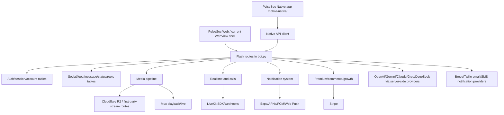
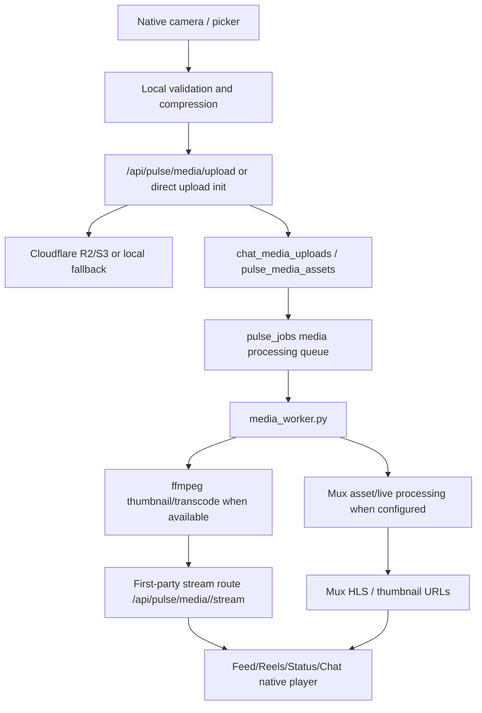

# PulseSoc Native Migration Dependency Graph

Date: 2026-07-04

## Purpose

This is the system reconnaissance layer for the PulseSoc native migration. It extends the initial native app contract by mapping current web surfaces to their API routes, database tables, realtime events, media pipeline, external services, and native readiness.

This report is a static codebase inventory from `/Users/hmcherie/Desktop/CoinPilotX`. It does not prove production runtime health, provider credentials, device push delivery, or real media/call behavior. Those remain QA gates.

## Executive Map

## Frontend Inventory

### App Shell And Navigation

Pages:

- `/pulse`, `/pulse/trending`, `/pulse/following`, `/pulse/questions`, `/pulse/my-posts`, `/pulse/create`, `/pulse/scam-alerts`, `/pulse/arena`
- `/pulse/home`, `/pulse/legacy-home`, `/pulse/home-legacy`, `/pulse/old-home`, `/pulse/legacy`
- `/pulse/search`, `/pulse/discover`, `/pulse/communities`, `/pulse/events`

Core assets:

- `static/js/pulse_home_core.js`
- `static/js/pulse_environment_engine.js`
- `static/js/pulse_search_bridge.js`
- `static/js/pulse_realtime.js`
- `static/js/pulse_reaction_system.js`
- `static/css/pulse_home_os.css`
- `static/css/pulse_mobile_system.css`
- `static/css/pulse_design_system.css`
- `static/css/pulse_reaction_system.css`

Native impact:

- Replace browser DOM composition with native navigation stacks and tabs.
- Keep feed ranking, permissions, moderation, and content transforms server-authoritative.
- Native screens need explicit empty/offline/error states rather than WebView fallback screens.

### Messenger

Pages:

- `/pulse/messages`
- `/pulse/messages/<conversation_id>`
- `/pulse/messages-legacy`
- Communications V2 signal pages: `/pulse/signals`, `/pulse/signals/<signal_key>`, `/pulse/settings/signals`

Components/features to migrate:

- Inbox/conversation list
- Direct messages
- Group conversations
- Rooms/chatrooms
- Message bubble
- Conversation member list
- Typing indicator
- Presence indicator
- Delivery/read receipts
- Message reactions
- Message edit/delete/pin/report/forward/block
- Search
- Media attachments
- Voice notes
- Media viewer
- Push notification deep links
- AI summaries and smart replies
- Call entry points

Assets:

- `templates/pulse_messages_v2.html`
- `static/js/pulse_messages_v2.js`
- `static/js/pulse_messenger_media_viewer.js`
- `static/js/pulse_chat_recovery.js`
- `static/css/pulse_messages_v2.css`
- `static/css/pulse_messenger_media_viewer.css`

Primary APIs:

- Legacy/native bridge: `/api/pulse/messages/conversations`, `/api/pulse/messages/<conversation_id>`, `/api/pulse/messages/<conversation_id>/send`, `/api/pulse/messages/<conversation_id>/messages`, `/api/pulse/messages/<conversation_id>/sync`, `/api/pulse/messages/<conversation_id>/typing`, `/api/pulse/messages/<conversation_id>/presence`, `/api/pulse/messages/search`, `/api/pulse/users/search`, `/api/pulse/messages/media/upload`
- Communications V2: `/api/pulse/communications/v2/conversations`, `/api/pulse/communications/v2/direct/open`, `/api/pulse/communications/v2/groups`, `/api/pulse/communications/v2/rooms`, `/api/pulse/communications/v2/conversations/<conversation_ref>/messages`, `/api/pulse/communications/v2/attachments/upload`, `/api/pulse/communications/v2/realtime`, `/api/pulse/communications/v2/realtime/stream`, `/api/pulse/communications/v2/presence/heartbeat`, `/api/pulse/communications/v2/conversations/<conversation_ref>/typing`, `/api/pulse/communications/v2/conversations/<conversation_ref>/presence`
- Communications V2 deployed aliases: `/api/pulse/comm/v2/conversations`, `/api/pulse/comm/v2/conversations/<conversation_ref>/messages`, `/api/pulse/comm/v2/realtime`, `/api/pulse/comm/v2/realtime/stream`

Tables:

- `conversations`, `conversation_members`, `private_messages`, `message_attachments`, `message_read_receipts`
- `pulse_conversations`, `pulse_conversation_participants`, `pulse_conversation_typing`
- `pulse_chat_rooms`, `pulse_chat_room_members`, `pulse_chat_room_messages`
- `chat_media_uploads`, `chat_reports`, `pulse_chat_health_traces`, `pulse_chat_recovery_events`

Native readiness:

- Core list/detail/send: high.
- Realtime and typing: medium-high, because SSE/polling contracts exist but need native client decisions.
- Media attachments/voice notes: medium, because native capture/upload UX and processing QA remain.

### Feed, Posts, Reactions, And Saved

Pages:

- `/pulse`, `/pulse/post/<post_id>`, `/pulse/saved`, `/pulse/bookmarks`, `/pulse/collections`

Components/features:

- Feed cards
- Composer
- Comments
- Reaction tray
- Follow/friend actions
- Save/repost/share/pin/delete
- Report/block
- Daily mentor prompt
- Topic pages

APIs:

- `/api/pulse/feed`
- `/api/pulse/posts`
- `/api/pulse/posts/<post_id>`
- `/api/pulse/posts/<post_id>/react`
- `/api/pulse/posts/<post_id>/comments`
- `/api/pulse/posts/<post_id>/save`
- `/api/pulse/posts/<post_id>/repost`
- `/api/pulse/posts/<post_id>/view`
- `/api/pulse/follow`
- `/api/pulse/friends`, `/api/pulse/friends/request`, `/api/pulse/friends/accept`, `/api/pulse/friends/decline`
- `/api/pulse/saved`, `/api/pulse/saved/collections`

Tables:

- `pulse_posts`, `pulse_comments`, `pulse_comment_reactions`, `pulse_reactions`, `pulse_post_views`, `pulse_post_saves`, `pulse_follows`, `pulse_friends`, `pulse_friend_requests`, `pulse_friendships`, `pulse_reports`

Native readiness:

- Feed read/react/comment/save: high if existing payloads stay stable.
- Composer/media creation: medium because native camera/media upload work belongs in Phase 2.

### Reels And Videos

Pages:

- `/pulse/reels`, `/pulse/reels/<reel_id>`
- `/pulse/videos`, `/pulse/videos/<video_id>`

Components/features:

- Full-screen vertical player
- Video detail
- Sound persistence
- Tap controls
- Comments/reactions
- Repost/share/save
- Follow creator
- Sound search/upload/save
- Promotions
- Not interested
- Playback retry

Assets:

- `static/css/pulse_reels_experience.css`
- `static/js/pulse_media_renderer.js`
- `static/js/pulse_reaction_system.js`

APIs:

- `/api/pulse/reels/feed`
- `/api/pulse/reels/create`
- `/api/pulse/reels/create-from-camera`
- `/api/pulse/reels/<reel_id>/react`
- `/api/pulse/reels/<reel_id>/view`
- `/api/pulse/reels/<reel_id>/comments`
- `/api/pulse/reels/<reel_id>/save`
- `/api/pulse/reels/<reel_id>/repost`
- `/api/pulse/reels/<reel_id>/share`
- `/api/pulse/reels/<reel_id>/not-interested`
- `/api/pulse/reels/<reel_id>/follow-creator`
- `/api/pulse/reels/sounds`
- `/api/pulse/reels/sounds/save`
- `/api/pulse/reels/sounds/upload`
- `/api/pulse/videos`
- `/api/pulse/videos/<video_id>`
- `/api/pulse/videos/<video_id>/react`
- `/api/pulse/videos/<video_id>/comments`
- `/api/pulse/videos/<video_id>/view`

Tables:

- `pulse_reels`, `pulse_reel_audio`, `pulse_reel_sound_saves`, `pulse_reel_retention_events`
- `pulse_videos`, `pulse_video_views`, `pulse_video_reactions`, `pulse_video_comments`, `pulse_video_categories`
- Shared: `pulse_media_assets`, `chat_media_uploads`, `pulse_content_music`, `pulse_audio_tracks`

Native readiness:

- Reels feed API: medium-high.
- Native player: medium, because current browser player behavior must be rewritten with native video rendering.
- Creation: medium-low until native compression, upload progress, and processing status are tested on devices.

### Status And Stories

Pages:

- `/pulse/status`
- `/pulse/status/<status_id>`

Components/features:

- Status rail
- Immersive status viewer
- Gesture navigation
- Sound toggle
- Text/image/video status creation
- Music selection
- AI story generation
- Reactions/replies/shares/views

Assets:

- `static/js/pulse_status_viewer.js`
- `static/js/pulse_media_picker.js`
- `static/js/pulse_upload_manager.js`
- `static/css/pulse_status_system.css`

APIs:

- `/api/pulse/status/rail`
- `/api/pulse/status`
- `/api/pulse/status/<status_id>`
- `/api/pulse/status/<status_id>/view`
- `/api/pulse/status/<status_id>/react`
- `/api/pulse/status/<status_id>/reply`
- `/api/pulse/status/<status_id>/share`
- `/api/pulse/status/ai-story`
- `/api/pulse/status/music/search`
- `/api/pulse/status/music/trending`

Tables:

- `pulse_status`, `pulse_statuses`, `pulse_status_media`, `pulse_status_music`, `pulse_status_views`, `pulse_status_reactions`, `pulse_status_replies`, `pulse_status_shares`, `pulse_status_live`
- `pulse_story_views`, `pulse_story_reactions`

Native readiness:

- Viewer/read APIs: medium-high.
- Creator/camera/media: medium-low until native camera flow and upload retry are implemented.

### Camera And Media Creation

Pages:

- `/pulse/camera`, `/pulse/camera/photo`, `/pulse/camera/video`, `/pulse/camera/status`, `/pulse/camera/reel`, `/pulse/camera/post`
- `/pulse/create/camera`

Components/features:

- Camera capture
- Preview
- Effects/filter preview
- Publish to post/reel/status
- Profile avatar/cover upload
- Upload progress
- Processing status

Assets:

- `static/js/pulse_camera_engine.js`
- `static/js/pulse_media_picker.js`
- `static/js/pulse_upload_manager.js`
- `static/css/pulse_camera_engine.css`

APIs:

- `/api/pulse/camera/config`
- `/api/pulse/camera/preview`
- `/api/pulse/camera/preview/mark-published`
- `/api/pulse/posts/create-from-camera`
- `/api/pulse/reels/create-from-camera`
- `/api/pulse/media/upload`
- `/api/pulse/media/mux/direct-upload`
- `/api/pulse/media/mux/direct-upload/complete`
- `/api/pulse/media/<media_id>/status`
- `/api/pulse/media/<media_id>/repair`
- `/api/pulse/media/<media_id>/stream`
- `/api/pulse/media/process`
- `/api/pulse/media/filter-preview`

Tables:

- `pulse_camera_captures`, `pulse_camera_previews`, `pulse_camera_effects`, `pulse_filters`
- `pulse_media_assets`, `chat_media_uploads`, `pulse_jobs`

Native readiness:

- API foundation: high.
- Native capture/compression/upload: medium-low until Expo camera/image picker, compression, upload progress, and background recovery are complete.

### Live, Calls, And Spaces

Pages:

- `/pulse/live`, `/pulse/live/eligibility`, `/pulse/live/studio`, `/pulse/live/studio/<stream_id>`, `/pulse/live/<live_id>`, `/pulse/live/schedule`, `/pulse/live/events/create`
- `/pulse/spaces`, `/pulse/spaces/<slug>`

Components/features:

- Live discovery
- Studio start
- Host camera/mic publishing
- Mux live creation
- LiveKit token join
- WebRTC fallback signaling
- Live chat/reactions/viewers
- Join requests/co-host workflow
- Full call lifecycle
- Call quality reports
- Audio/video controls

Assets:

- `static/js/pulse_live_studio.js`
- `static/js/pulse_live_studio_runtime.js`
- `static/js/pulsesoc_global_call_overlay.js`
- `static/css/pulse_live_studio.css`
- `static/css/pulsesoc_global_call_overlay.css`

APIs:

- `/api/pulse/live`, `/api/pulse/live-now`, `/api/pulse/live/stream`
- `/api/pulse/live/start`
- `/api/pulse/live/mux/create`
- `/api/pulse/live/mux/<mux_live_stream_id>`
- `/api/pulse/live/mux/disable`
- `/api/pulse/live/mux/webhook`
- `/api/pulse/live/livekit/webhook`
- `/api/pulse/live/<live_id>/livekit/token`
- `/api/pulse/live/<live_id>/browser-publish`
- `/api/pulse/live/<live_id>/webrtc/signal`
- `/api/pulse/live/<live_id>/webrtc/signals`
- `/api/pulse/live/<live_id>/chat`
- `/api/pulse/live/<live_id>/state`
- `/api/pulse/live/<live_id>/react`
- `/api/pulse/live/<live_id>/join`
- `/api/pulse/live/<live_id>/join-request`
- `/api/pulse/live/<live_id>/cohost/request`
- `/api/pulse/live/<live_id>/join-status`
- `/api/pulse/live/<live_id>/join-requests`
- `/api/pulse/live/<live_id>/end`
- `/api/calls/start`
- `/api/calls/<call_id>/accept`
- `/api/calls/<call_id>/ring-seen`
- `/api/calls/<call_id>/decline`
- `/api/calls/<call_id>/end`
- `/api/calls/<call_id>/join-token`
- `/api/calls/<call_id>/status`
- `/api/calls/active`
- `/api/calls/<call_id>/quality`
- `/api/calls/<call_id>/connected`
- `/api/calls/<call_id>/events`
- `/api/calls/<call_id>/mute-audio`, `/unmute-audio`, `/enable-video`, `/disable-video`, `/switch-camera`, `/speaker`, `/minimize`, `/restore`, `/visibility`

Tables:

- `pulse_live_streams`, `pulse_live_sessions`, `pulse_live_viewers`, `pulse_live_chat`, `pulse_live_reactions`, `pulse_live_guests`, `pulse_live_guest_requests`, `pulse_live_webrtc_signals`, `pulse_live_provider_events`, `pulse_live_audit_logs`, `pulse_live_restream_targets`, `pulse_live_destinations`, `pulse_live_reports`, `pulse_live_moderation`, `pulse_live_clips`, `pulse_live_archive_shares`
- `communication_calls`, `communication_call_participants`, `communication_call_events`, `communication_call_quality_reports`, `communication_call_device_sessions`
- `live_events`, `livestream_access`, `livestream_eligibility`

Native readiness:

- Live discovery/read: medium.
- Native broadcast/calls: low-medium until LiveKit SDK, full-screen incoming call UI, native ringing, background audio, and hardware route controls pass device QA.

### Notifications And Intelligence Alerts

Pages:

- `/pulse/notifications`
- `/pulse/settings/notifications`
- `/pulse/alerts`, `/pulse/alerts/<alert_id>`
- Intelligence center assets under `pulsesoc_intelligence_center`

Components/features:

- Notification list
- Unread count/badge counts
- Mark read/read all/delete
- Preferences
- Push registration and native permissions
- Deep links
- Lock-screen alerts
- Intelligence streams/forecasts/digests/cadence

Assets:

- `templates/pulsesoc_intelligence_center.html`
- `static/js/pulsesoc_intelligence_center.js`
- `static/css/pulsesoc_intelligence_center.css`

APIs:

- `/api/pulse/notifications`
- `/api/pulse/notifications/unread-count`
- `/api/pulse/badge-counts`
- `/api/pulse/notifications/<notification_id>/read`
- `/api/pulse/notifications/read-all`
- `/api/pulse/notifications/<notification_id>`
- `/api/pulse/notifications/preferences`
- `/api/push/subscribe`

Tables:

- `notifications`, `notification_events`, `notification_delivery_jobs`, `notification_device_tokens`, `notification_preferences`
- `pulse_notifications`, `pulse_notification_devices`, `pulse_notification_preferences`, `pulse_notification_deliveries`
- `push_subscriptions`, `push_delivery_jobs`, `user_device_tokens`, `notification_delivery_logs`, `notification_failures`, `notification_jobs`, `notification_schedules`
- Intelligence: `intelligence_streams`, `user_intelligence_streams`, `intelligence_events`, `intelligence_sources`, `intelligence_forecasts`, `intelligence_feedback`, `intelligence_collector_runs`, `intelligence_digest_jobs`, `intelligence_delivery_jobs`, `intelligence_delivery_log`, `intelligence_alert_cadence`

Native readiness:

- In-app notification APIs: medium-high.
- Native push: medium until APNs/FCM/Expo credentials and real-device lock-screen behavior are verified.

### Profile, Account, Settings, And Security

Pages:

- `/pulse/profile`, `/pulse/profile/edit`, `/pulse/@<profile_key>`, `/pulse/u/<profile_key>`, `/pulse/id/<profile_key>`, `/pulse/profile/<profile_key>`
- `/pulse/settings`, `/pulse/settings/security`, `/pulse/settings/account`, `/pulse/settings/privacy`, `/pulse/settings/devices`, `/pulse/settings/recovery`
- `/account`, `/account/settings`, `/account/delete`

Components/features:

- Profile summary/edit
- Avatar/cover upload/remove
- Account settings
- Language
- Security events
- Trusted devices
- 2FA/recovery codes
- Reauthentication
- Account deletion

Auth/session APIs:

- `/api/mobile/auth/session`
- `/api/mobile/auth/refresh`
- `/api/mobile/auth/login`
- `/api/mobile/auth/register`
- `/api/mobile/auth/resend-confirmation`
- `/api/mobile/auth/change-confirmation-email`
- `/api/mobile/auth/confirmation-status`
- `/api/mobile/auth/confirm-email`
- `/api/mobile/auth/recover`
- `/api/mobile/auth/reset-password`
- `/api/mobile/auth/logout`
- `/api/mobile/auth/logout-all`

APIs:

- `/api/pulse/profile/me`
- `/api/pulse/profile/update`
- `/api/pulse/profile/avatar`
- `/api/pulse/profile/cover`
- `/api/pulse/profile/avatar/remove`
- `/api/pulse/profile/cover/remove`
- `/api/dashboard/account/state`
- `/api/dashboard/account/settings`
- `/api/account/language`
- `/api/account/security-events`
- `/api/account/trusted-devices`
- `/api/account/trusted-devices/<device_id>`
- `/api/account/reauthenticate`
- `/api/account/2fa/enable`, `/api/account/2fa/disable`
- `/api/account/recovery-codes/generate`

Tables:

- `users`, `sessions`, `mobile_security_sessions`, `user_settings`, `user_presence`, `user_security_events`, `user_recovery_codes`, `user_trusted_devices`, `security_devices`, `security_events`, `security_login_events`, `profile_audit_logs`, `user_verifications`, `user_trust_profiles`, `user_trust_events`, `user_trust_score`

Native readiness:

- Profile read/update: high.
- Security settings: medium, needs native UX and reauth handling.
- Avatar/cover: medium due to native media upload QA.

### Premium, Billing, Marketplace, Growth, And Creator Tools

Pages:

- `/pulse/premium`, `/pulse/premium/intelligence`, `/pulse/premium/undx`, `/pulse/premium/activate`
- `/pulse/marketplace`, `/pulse/marketplace/create`, `/pulse/merchant/apply`, `/pulse/merchant/dashboard`, `/pulse/merchant/<username>`
- `/pulse/creator/dashboard`, `/pulse/creator-studio`, `/pulse/creator/analytics`, `/pulse/creator-monetization`
- `/pulse/growth`, `/pulse/advertise`, `/pulse/ads`, `/pulse/promote`
- `/pulse/courses`, `/pulse/courses/create`, `/pulse/courses/<course_id>`, `/pulse/teachers`, `/pulse/teacher-dashboard`

Assets:

- `templates/pulse_advertiser_portal.html`
- `static/js/pulse_advertiser_portal.js`
- `static/js/pulsesoc_promotions.js`
- `static/css/pulse_advertiser_portal.css`
- `static/css/pulsesoc_promotions.css`

APIs:

- Premium/subscriptions: `/api/premium/status`, `/api/premium/checkout`, `/api/premium/billing-portal`, `/api/subscriptions/status`, `/api/subscriptions/upgrade`, `/api/subscriptions/downgrade`, `/api/subscriptions/cancel`, `/api/subscriptions/resume`, `/api/pulse/premium/activate`, `/api/pulse/premium/identity-effects`, `/api/pulse/premium/profile-theme`
- Marketplace/creator economy: `/api/pulse/marketplace/search`, `/api/pulse/marketplace/listings/create`, `/api/pulse/marketplace/media/upload`, `/api/pulse/marketplace/listings/save`, `/api/pulse/payments/checkout`, `/api/pulse/payments/orders/<transaction_id>`, `/api/pulse/payments/purchases`, `/api/pulse/payments/entitlements`, `/api/pulse/payouts/connect`
- Growth/ads: `/api/pulse/growth`, `/api/pulse/ads/accounts`, `/api/pulse/ads/campaigns`, `/api/pulse/ads/creatives`, `/api/pulse/ads/analytics`, `/api/pulse/ads/portal`, `/api/pulse/ads/accounts/<account_id>/media/upload`
- Creator tools: `/api/pulse/creator-ai/<tool>`, `/api/dashboard/content-planner/item`, `/api/dashboard/creator/state`, `/api/dashboard/ads/state`

Tables:

- Premium/billing: `subscriptions`, `subscription_plans`, `user_subscriptions`, `premium_entitlements`, `premium_badges`, `stripe_events`, `payment_records`, `payment_audit_logs`, `payment_webhook_events`, `payment_verifications`
- Marketplace/creator economy: `marketplace_listings`, `marketplace_product_media`, `marketplace_sellers`, `marketplace_merchant_applications`, `marketplace_merchant_documents`, `marketplace_saved_products`, `marketplace_reports`, `creator_profiles`, `creator_wallets`, `creator_ledger_entries`, `creator_transactions`, `creator_payouts`, `creator_balances`, `seller_payout_accounts`, `payout_queue`, `escrow_holds`, `fee_ledger`, `revenue_breakdown`
- Growth/ads: `pulse_growth_accounts`, `pulse_growth_workspaces`, `pulse_growth_wallets`, `pulse_growth_ledger`, `pulse_growth_preferences`, `pulse_growth_ai_sessions`, `pulse_ad_accounts`, `pulse_ad_campaigns`, `pulse_ad_creatives`, `pulse_ad_media_assets`, `pulse_ad_impressions`, `pulse_ad_clicks`, `pulse_ad_events`, `pulse_ad_wallets`
- Courses/teachers: `pulse_courses`, `pulse_lessons`, `pulse_lesson_media`, `teacher_profiles`, `teacher_applications`, `teacher_lessons`

Native readiness:

- Premium status and web checkout routing: high.
- Native billing UX: medium because provider constraints must remain server-owned.
- Marketplace/growth/creator tools: medium, mostly API-ready but image/media picker and moderation flows need native UX.

### Crypto And Market Intelligence

Pages/surfaces:

- Dashboard crypto/economy surfaces
- Alerts and watchlists
- Intelligence stream feeds

APIs:

- `/api/crypto/summary`, `/api/crypto/market-pulse`, `/api/crypto/alerts`, `/api/crypto/watchlists`, `/api/crypto/ask-ai`, `/api/crypto/token-scan`, `/api/crypto/trending`, `/api/crypto/gainers`, `/api/crypto/losers`, `/api/crypto/news`, `/api/crypto/calendar`, `/api/crypto/recent`, `/api/crypto/favorites`
- `/api/dashboard/crypto/state`, `/api/dashboard/economy/state`, `/api/dashboard/intelligence/state`

Tables:

- `crypto_alerts`, `crypto_watchlists`, `crypto_watchlist_assets`, `crypto_ai_queries`, `crypto_news_cache`, `crypto_favorite_assets`, `crypto_recent_assets`, `crypto_audit_logs`
- Intelligence tables listed above.

Native readiness:

- Read/CRUD APIs: high.
- Native alert push and background refresh: medium until push delivery and cadence are proven.

## Backend Inventory By Domain

| Domain | Route owners | Middleware/permission expectation | Key dependencies | Native reusable? | Cleanup needed |
| --- | --- | --- | --- | --- | --- |
| Auth/session | `bot.py` mobile auth routes | Account/session validation; email confirmation; cookie/refresh handling | `users`, `sessions`, `mobile_security_sessions`, email services | Yes | Consider explicit token-oriented native auth response beyond cookie capture |
| Mission Control/dashboard | `bot.py` dashboard routes and services | Auth required; account state | dashboard tables, user metrics, worker health | Yes | Split mobile payloads from heavy web dashboard payloads if latency grows |
| Feed/posts | `bot.py` Pulse routes | Auth, moderation, visibility | posts/comments/reactions/follows/media | Yes | Formalize stable native feed schema |
| Messenger legacy | `bot.py` message routes | Auth, conversation membership | conversations/private messages/attachments/notifications | Yes | Prefer one canonical native messaging contract |
| Communications V2 | `pulse_communications_v2/routes.py`, command-center worker services | Auth, membership, feature flags, SSE gating | Redis optional, conversation tables, call engine, notification worker | Yes | Decide whether native app uses V2 over legacy for final migration |
| Realtime | `pulse_communications_v2/routes.py`, `services/command_center_worker/*` | Auth, SSE flag, polling fallback | Redis if enabled, event cache, conversation membership | Yes | Native transport policy needed: SSE vs polling vs future WebSocket |
| Media | `bot.py`, `media_worker.py`, `services/media_*` | Auth, ownership, storage provider validation | R2/S3, first-party stream route, ffmpeg, Mux | Yes | Native upload/resume/compression contract should be explicit |
| Reels/status/videos | `bot.py`, media services | Auth, moderation, visibility | media assets, music, reactions, comments | Yes | Native player payload and sound policy need formal schema |
| Live/calls | `bot.py`, `pulse_communications_v2/routes.py`, call engine | Auth, room/call membership, provider secrets | LiveKit, Mux, WebRTC fallback, call tables | Partly | Needs native LiveKit SDK integration and device QA |
| Notifications | `bot.py`, notification services, workers | Auth, preferences, device token ownership | notification jobs, Expo/APNs/FCM/Web Push, Brevo/SMS | Yes | Provider credential readiness and receipt handling remain QA gates |
| Premium/billing | `bot.py`, billing/payment services | Auth, server-owned entitlements | Stripe, subscriptions, premium entitlements | Yes | Native must route payments through compliant web/provider flow |
| Marketplace/growth/ads | `bot.py`, `services/pulse_ads_service.py`, growth services | Auth, seller/ad account ownership, moderation | media, payments, wallets, review queues | Yes | Native creation workflows need media picker and moderation UX |
| Profile/security | `bot.py`, account services | Auth, reauth for sensitive actions | users, trusted devices, security events | Yes | Native reauth and account deletion UX need explicit QA |

## Database Inventory

### Identity And Auth

Tables:

- `users`, `sessions`, `mobile_security_sessions`, `auth_events`, `user_settings`, `user_presence`, `user_onboarding_progress`, `user_welcome_events`
- `security_events`, `security_devices`, `security_login_events`, `user_security_events`, `user_trusted_devices`, `user_recovery_codes`, `user_verifications`

Relationships/native impact:

- `users.user_id` is the hub for all native user state.
- Session cookies currently remain the practical shared auth bridge.
- Native should not store entitlements or account status as source of truth.

### Social Graph And Feed

Tables:

- `pulse_posts`, `pulse_comments`, `pulse_comment_reactions`, `pulse_reactions`, `pulse_post_views`, `pulse_post_saves`, `pulse_reports`, `pulse_follows`, `pulse_friends`, `pulse_friend_requests`, `pulse_friendships`, `blocked_users`

Indexes observed:

- Feed indexes on visibility/moderation/status/created/id.
- User/feed author indexes.
- Comment and reaction indexes.

Native impact:

- Feed and reaction endpoints are native reusable.
- The native app should cache cautiously because moderation/visibility can change server-side.

### Messaging And Realtime

Tables:

- `conversations`, `conversation_members`, `private_messages`, `message_attachments`, `message_read_receipts`
- `pulse_conversations`, `pulse_conversation_participants`, `pulse_conversation_typing`
- `pulse_chat_rooms`, `pulse_chat_room_members`, `pulse_chat_room_messages`, `pulse_chat_health_traces`, `pulse_chat_recovery_events`

Indexes observed:

- Conversation updated/type indexes.
- Participant user/conversation indexes.
- Private message conversation/id/created/sender indexes.
- Chat media context/uploader/message/moderation indexes.

Native impact:

- Inbox and basic chat are ready to wire.
- Realtime event ordering and offline sync need a native client policy.

### Media, Reels, Status, Videos

Tables:

- `pulse_media_assets`, `chat_media_uploads`, `pulse_jobs`
- `pulse_reels`, `pulse_reel_audio`, `pulse_reel_sound_saves`, `pulse_reel_retention_events`
- `pulse_status`, `pulse_statuses`, `pulse_status_media`, `pulse_status_music`, `pulse_status_views`, `pulse_status_reactions`, `pulse_status_replies`, `pulse_status_shares`, `pulse_status_live`
- `pulse_videos`, `pulse_video_views`, `pulse_video_reactions`, `pulse_video_comments`, `pulse_video_categories`
- `pulse_audio_tracks`, `pulse_music_events`, `pulse_music_reports`, `pulse_content_music`

Relationships/native impact:

- Media assets carry storage provider, storage key, thumbnail/poster/playback URL, Mux asset/playback status, and processing status.
- Reels/status/videos depend on shared media resolution and first-party stream playback.
- Native must report upload progress and processing status truthfully.

### Live And Calls

Tables:

- `pulse_live_streams`, `pulse_live_sessions`, `pulse_live_viewers`, `pulse_live_chat`, `pulse_live_reactions`, `pulse_live_guests`, `pulse_live_guest_requests`, `pulse_live_webrtc_signals`, `pulse_live_provider_events`, `pulse_live_audit_logs`, `pulse_live_restream_targets`, `pulse_live_destinations`, `pulse_live_reports`, `pulse_live_moderation`, `pulse_live_clips`, `pulse_live_archive_shares`
- `communication_calls`, `communication_call_participants`, `communication_call_events`, `communication_call_quality_reports`, `communication_call_device_sessions`
- `live_events`, `livestream_access`, `livestream_eligibility`

Relationships/native impact:

- Live broadcast state and call state are distinct but both touch LiveKit/Mux/provider event flow.
- Native calls should use the communication call engine and LiveKit token flow instead of browser overlays.

### Notifications And Intelligence

Tables:

- `notifications`, `notification_events`, `notification_delivery_jobs`, `notification_device_tokens`, `notification_preferences`
- `pulse_notifications`, `pulse_notification_devices`, `pulse_notification_preferences`, `pulse_notification_deliveries`
- `push_subscriptions`, `push_delivery_jobs`, `user_device_tokens`
- `intelligence_streams`, `user_intelligence_streams`, `intelligence_events`, `intelligence_sources`, `intelligence_forecasts`, `intelligence_feedback`, `intelligence_collector_runs`, `intelligence_digest_jobs`, `intelligence_delivery_jobs`, `intelligence_delivery_log`, `intelligence_alert_cadence`

Relationships/native impact:

- Device-token tables must distinguish Expo/native from Web Push.
- Intelligence alerts should use notification preferences and lock-screen eligibility metadata.

### Commerce, Premium, Growth, And Creator Economy

Tables:

- `subscriptions`, `subscription_plans`, `user_subscriptions`, `premium_entitlements`, `premium_badges`, `stripe_events`, `payment_records`, `payment_audit_logs`, `payment_webhook_events`, `payment_verifications`
- `marketplace_listings`, `marketplace_product_media`, `marketplace_sellers`, `marketplace_merchant_applications`, `marketplace_merchant_documents`, `marketplace_saved_products`, `marketplace_reports`
- `creator_profiles`, `creator_wallets`, `creator_ledger_entries`, `creator_transactions`, `creator_payouts`, `creator_balances`, `seller_payout_accounts`, `payout_queue`, `escrow_holds`, `fee_ledger`, `revenue_breakdown`
- `pulse_growth_accounts`, `pulse_growth_workspaces`, `pulse_growth_wallets`, `pulse_growth_ledger`, `pulse_growth_preferences`, `pulse_growth_ai_sessions`
- `pulse_ad_accounts`, `pulse_ad_campaigns`, `pulse_ad_creatives`, `pulse_ad_media_assets`, `pulse_ad_impressions`, `pulse_ad_clicks`, `pulse_ad_events`, `pulse_ad_wallets`

Native impact:

- Server remains authoritative for entitlements, payments, and balances.
- Native app should use secure web checkout/billing portal flows unless a compliant native purchase path is explicitly designed.

## Realtime Architecture

Current transport:

- Communications V2 exposes `/api/pulse/communications/v2/realtime` as polling.
- `/api/pulse/communications/v2/realtime/stream` supports SSE only when main-app SSE and `PULSE_COMM_V2_SSE_ENABLED` allow it; otherwise it returns polling fallback metadata.
- Command-center worker has internal realtime connect/disconnect/subscribe/event/poll/stream routes and Redis-backed publish/cache helpers when available.

Event inventory from code:

- `message_created`
- `message_delivered`
- `message_read`
- `typing_started`
- `typing_stopped`
- `presence_updated`
- Call lifecycle events through `communication_call_events`
- Live state events through `live_events`, `pulse_live_provider_events`, and provider webhooks
- Notification events through `notification_events`

Native policy needed:

- Phase 1 can poll safely.
- Phase 1.5 should choose SSE or WebSocket-like transport after battery/network testing.
- Typing events should stay rate-limited and ephemeral.
- Message ordering should use server IDs and `after_id`/sync cursors, not client timestamps.
- Native should subscribe per-user and per-conversation, but still recover through polling.

## Media Pipeline

Native implementation rules:

- Use native camera/media APIs, not a WebView media picker.
- Upload with progress, cancellation, retry, and server processing status.
- Prefer server-provided `playback_url`, `mux_hls_url`, `thumbnail_url`, `poster_url`, and `processing_status`.
- Avoid raw R2 URLs for video playback when first-party stream or Mux HLS is available.
- Treat `processing_blocked`, `failed`, or missing `ffmpeg`/provider state as visible retry/error states.

## Third-Party Dependency Map

```mermaid
flowchart TD
  Railway["Railway runtime"] --> DB["Postgres / DATABASE_URL"]
  Railway --> Redis["Redis / command-center realtime optional"]
  Railway --> R2["Cloudflare R2 object storage"]
  Railway --> CF["Cloudflare DNS/CDN/security"]
  Railway --> Mux["Mux video/live/HLS"]
  Railway --> LiveKit["LiveKit rooms/tokens/webhooks"]
  Railway --> Stripe["Stripe checkout/webhooks/billing"]
  Railway --> Brevo["Brevo transactional email/SMS"]
  Railway --> Twilio["Twilio notification foundation/SMS"]
  Railway --> Expo["Expo push token path"]
  Railway --> APNS["APNs direct push readiness"]
  Railway --> FCM["FCM direct push readiness"]
  Railway --> OpenAI["OpenAI server-side AI"]
  Railway --> Gemini["Gemini server-side AI"]
  Railway --> Claude["Claude server-side AI"]
  Railway --> Groq["Groq server-side AI"]
  Railway --> DeepSeek["DeepSeek server-side AI"]
  Railway --> Blockstream["Blockstream crypto data"]
```

Dependency notes:

- Railway hosts web and worker processes.
- Postgres is the production database target; local SQLite exists for audits/dev.
- R2/CDN and first-party streaming are critical for media playback reliability.
- Mux is used for video/live playback and processing where configured.
- LiveKit is the target for native voice/video calls and live publishing.
- Stripe remains server-owned for billing and webhook fulfillment.
- Brevo/Twilio support email/SMS notification paths.
- Expo/APNs/FCM cover native push strategy.
- AI providers must remain server-side only.

## Native Readiness Score

| System | Native Ready | Work Needed |
| --- | ---: | --- |
| Auth/session | 90% | Real-device cookie/session restore, refresh-token policy, biometric/reauth decisions |
| Mission Control | 85% | Mobile payload slimming and native loading/empty states |
| Messenger list/basic chat | 80% | Pick canonical legacy vs Communications V2 contract, sync cursor, read receipts |
| Messenger media/voice | 55% | Native attachment picker, voice recorder, upload progress, retry, processing status |
| Realtime messaging | 65% | Native polling/SSE policy, battery tests, offline replay |
| Feed/posts/reactions | 80% | Stable native feed schema, cache invalidation, composer UX |
| Reels | 60% | Native player, HLS/MP4 fallback, sound policy, scroll performance |
| Status | 55% | Native viewer gestures, creator camera, music, upload retry |
| Media upload pipeline | 65% | Native compression, progress, background recovery, device QA |
| Live discovery | 60% | Native room state, viewer playback, reconnect states |
| Native calls | 40% | LiveKit SDK integration, full-screen incoming calls, ringing, background audio, device controls |
| Notifications | 55% | APNs/FCM/Expo credential proof, lock-screen QA, deep links, badge sync |
| Intelligence alerts | 70% | Native alert center/detail and push cadence QA |
| Profile/settings | 75% | Native edit UX, avatar/cover upload, reauth/security screens |
| Premium/billing | 85% | Native-safe checkout/billing portal UX and entitlement refresh |
| Marketplace | 65% | Native listing creation, image picker, seller verification flows |
| Growth/ads | 60% | Native campaign/creative workflows and media moderation UX |
| Creator/teacher tools | 60% | Native studio forms, media upload, analytics payload shaping |
| Crypto/market alerts | 80% | Native alert UX and push delivery verification |
| Admin/moderation | 40% | Keep primarily web/admin unless native admin app is explicitly planned |

## Master Migration Backlog

1. Choose canonical native messaging API.
   - Recommendation: migrate Phase 1 from legacy endpoints to Communications V2 after confirming payload parity for list/detail/send/read/typing/presence.
2. Define native feed schema.
   - Lock down post, media, author, reaction, comment preview, save/repost, and moderation fields.
3. Define native media upload contract.
   - Include local compression metadata, upload progress, direct upload completion, processing status, retry, and first-party playback URL rules.
4. Define native realtime policy.
   - Start with polling fallback; graduate to SSE or a worker-backed realtime transport after device battery/network tests.
5. Define native push receipt handling.
   - Map Expo/APNs/FCM tokens to device-token tables, invalid-token cleanup, badge counts, and deep links.
6. Define native LiveKit call contract.
   - Map call start, ring, accept, decline, join-token, controls, quality, events, and provider webhook state.
7. Build feature-by-feature parity matrices.
   - Messenger, Feed, Reels, Status, Live/Calls, Notifications, Profile/Settings, Premium, Marketplace, Creator/Growth.
8. Add route/table regression audits.
   - Keep this dependency graph current as routes are added, merged, or deprecated.

## App Store No-Submit Reinforcement

The native app should not be submitted until:

- Login/signup/session restore pass on real devices.
- Messenger list/detail/send/read/sync and push delivery pass.
- Native notifications show correctly on lock screen and route into the correct native screen.
- Reels and Status are smooth with native media rendering.
- Camera upload and compression are reliable.
- Native calls are stable through foreground, background, lock screen, reconnect, camera flip, mic, speaker, and Bluetooth controls.
- Premium, billing, and creator/marketplace flows preserve server-side entitlements and provider constraints.
- This dependency graph has been refreshed against the current codebase.
