# UNDX Phase 3A — PulseSoc System Intelligence Map

Date: 2026-07-29  
Branch inspected: `release/undx-nexus-core-v4`  
Commit inspected: `22227f3efddcb5bb89bc8a418876d5ac56a60dab`  
Mission type: READ → MAP → PRIORITIZE (no capability implementation)

## Executive conclusion

PulseSoc already contains a much larger operating system than UNDX currently exposes. The repository has 231 top-level service modules, 94 native screen files, 65 native API modules, broad deep-link coverage, background workers, and persistent models spanning social, content, communication, commerce, learning, live, security, payments, and intelligence.

The canonical UNDX knowledge map contains 115 records across 29 product areas. Only 43 are verified executable capabilities. The remaining records are deliberately differentiated: 14 implemented but unverified, 14 partial, 24 missing a callable domain service, 12 intentionally disabled, and 8 unsupported. This distinction must remain authoritative: finding a route is not proof that an agent can safely execute it.

The highest-value next training wave should be read-first, cross-system operational intelligence. The immediate targets are Activity summaries, Notification inbox management, Unified Search, Settings inspection, Security session inspection, Premium/entitlement status, Marketplace discovery and order reads, Live discovery, and Learning discovery. These features reuse mature services and native surfaces, are naturally verifiable, and avoid irreversible or financial mutations.

The most compelling PulseSoc-specific “killer feature” is a verified daily operating brief: “Tell me everything important that happened today, what needs my attention, and take me to each item.” It joins activity, notifications, messages, content performance, alerts, account health, marketplace orders, and live events without creating parallel systems.

## 1. Complete PulseSoc system inventory

### Quantitative baseline

| Evidence | Observed |
|---|---:|
| Top-level Python service modules | 231 |
| Native screen files | 94 |
| Native API modules | 65 |
| Knowledge-map records | 115 |
| Verified executable UNDX capabilities | 43 |
| Implemented but unverified | 14 |
| Partially implemented | 14 |
| Domain service required | 24 |
| Intentionally disabled | 12 |
| Unsupported | 8 |
| Product areas represented in the knowledge map | 29 |

### Backend systems discovered

| System | Purpose | Principal repository owners | Data/routes/workers | Maturity | UNDX opportunity | Risk / missing pieces |
|---|---|---|---|---|---|---|
| Identity & account | Authentication, account state, profile ownership | auth/account/profile/settings/security services | users, sessions, devices, security events; account/settings routes | Mature product paths | Account health, session and device explanations | High-risk mutations require re-auth and independent verification |
| Social graph | Follow, friend, block, mute relationships | relationship, profile, settings, safety services | relationship tables and profile routes | Mixed; reads mature, mutations uneven | Relationship summaries and bounded state-setting | Avoid toggle semantics and existence oracles |
| Feed & posts | Create/read/update/delete posts and engagement | pulse/feed/content services | posts, comments, reactions, media | Mature | Content intelligence, drafts, analytics | Publishing/deletion need confirmation and durable receipts |
| Reels | Short-form media lifecycle and engagement | reel/media/moderation services | reels, views, comments, reactions, shares | Mature | Retention analysis, discovery, draft workflows | Upload/transcode and moderation remain multi-stage |
| Status | Ephemeral status lifecycle | status/media services | status, viewers, reactions | Mature | Audience/completion summaries | Expiry and visibility must be preserved |
| Saved content | Collections and saved objects | saved-content service | collections/items | Mature and already executable | Cross-content knowledge librarian | Low risk; object-type normalization needed |
| Messenger | Conversations, messages, media, reactions | messenger/conversation/media services | conversations, members, messages, receipts | Mature reads; some writes partial | Topic search, summaries, follow-up detection | Sending/deleting must bind target, payload and delivery receipt |
| Calls | Audio/video session lifecycle | calls/realtime/LiveKit services | calls, participants, tokens, quality | Product exists | History and quality explanations | Live multi-party execution and CallKit/device QA block agent control |
| Live | Broadcast discovery and lifecycle | live/realtime/media services | live sessions, chat, guests, moderation | Broad but operationally sensitive | Discovery, schedules, replay and health summaries | Starting/moderating streams needs device and multi-party proof |
| Notifications | Delivery, inbox, preferences, jobs | notification services/adapters/jobs | notifications, preferences, delivery jobs | Mature | Inbox summary, mark-read, preference management | Category mapping and read-after-write required |
| Activity & account health | User event aggregation and health | activity, intelligence, security services | activity/event/security records | UI/API exists; callable service gaps | Daily brief and attention queue | Needs a canonical aggregation service |
| Search | Cross-object discovery | search services and native search API | indexed content/users/marketplace | Implemented, unverified for UNDX | Unified natural-language discovery | Result authorization and type-safe navigation |
| Crypto alerts | Alert CRUD, delivery and history | alert services/jobs | alerts, histories, channels | Mature and already executable | Alert intelligence and reliability summaries | Financial advice boundary must remain explicit |
| Marketplace | Listings, sellers, saves, orders, chat | marketplace/store/order services | listings, sellers, orders, saves | Broad and mature | Discovery, order summaries, seller operations | Checkout/refund/payout remain critical-risk |
| Business OS | Businesses, RBAC, store, ads, orders, insights | `services/business_os_*` modules | canonical RBAC, campaigns, ledger, products, analytics | Extensive | Business brief, campaign and store intelligence | Actor/role binding mandatory; financial writes gated |
| Ads | Accounts, campaigns, reporting and wallet | advertising/business OS services | ad accounts, campaigns, performance | Broad, some UNDX records partial | Campaign reporting and pause/resume | Budget changes and launch involve money/regulatory risk |
| Creator | Studio, analytics, planning, recommendations | creator/content/intelligence services | creator metrics, planner data | Native surfaces exist; service ownership fragmented | Growth coach and content plan | Need callable aggregation/planning services |
| Music | Search, upload, selection and reports | music/media services | tracks/uploads/reports | Discovery mature | Track search and media selection | Playback is client/device owned; uploads require scanning |
| Premium | Entitlements, subscription and billing portal | premium/entitlement/payment services | subscription, entitlements, checkout | Mature product path | Explain access and plan status | Purchases and billing mutations stay outside agent |
| Payments & ledger | Checkout, receipts, reconciliation, payouts | payment/ledger/reconciliation workers | transactions, webhooks, ledger entries | Mature but critical | Read-only receipts and explanations | No autonomous transfers, refunds, payouts or checkout |
| Groups | Membership, group chat, rooms and reports | group/messenger/safety services | groups, memberships, rooms | Broad native/API coverage | Discovery, summaries, join/leave | Membership mutations need exact group binding |
| Learning | Courses, progress and tutor | learning/intelligence services | courses, lessons, progress | Mature native/API surface | Learning discovery and progress coach | Tutor grounding and progress verification |
| Events | Discovery and event lifecycle | events/live services | events, attendees, schedules | Broad | Schedule summaries and navigation | Creation/cancellation need timezone and confirmation |
| Safety & moderation | Reports, blocks, scam scans, admin action | safety/report/moderation services | reports, blocks, evidence | Mixed; privileged paths exist | Explain safety state, create user reports | Never expose admin moderation as user-agent capability |
| Verification | Identity/business verification workflows | verification services | cases, requirements, documents | Mature but sensitive | Explain status and requirements | PII/document handling needs strict isolation |
| Support | Tickets and security reports | support/safety services | tickets, messages | Mature API surface | Prepare and track support requests | Avoid disclosing private diagnostic context |
| Presence | Online state and privacy | presence/realtime services | presence state/preferences | Mature | Explain visibility and status | Privacy changes require exact desired state |
| Intelligence | Analytics, digest and recommendation layers | intelligence/analytics/recommendation services | collectors, digests, delivery workers | Broad but distributed | Cross-graph summaries and recommendations | Must cite source state and freshness |
| UNDX runtime | Planning, policy, capability, tool and verification | UNDX registry/map/gateway/runtime services | missions, receipts, audit records | 43 verified capabilities | Operating layer for all safe domains | Registry remains allow-list; no raw route execution |

### Background execution and feature controls

The repository contains worker/job paths for notification delivery, crypto alerts, intelligence digest/delivery, payment reconciliation, message/realtime processing, security processing, and AI work. These are important dependencies: an API acknowledgement is not sufficient verification when the actual outcome is asynchronous. UNDX receipts must distinguish accepted, queued, delivered, failed, and independently verified states.

Agent execution is controlled by explicit enablement flags and the capability registry. Flags are deployment controls, not authorization. Each invocation must still enforce authenticated actor scope, policy, confirmation where required, idempotency, and read-after-write verification.

## 2. Native application map

The native app exposes all major PulseSoc domains through screens, typed API modules and deep links. Important canonical destinations include Dashboard, Home, Search, Saved, Groups, Live, Reels, Status, Messenger, Notifications, Profile, Marketplace, Settings, Music, Camera Studio, Calls, detailed content routes, seller and order routes, Events, Premium, Creator Studio, Content Planner, Courses, Growth, Intelligence, UNDX Action Center, Alerts, Account Devices, Account Health, Safety, Support, Verification, Activity and Notification Preferences.

| Native domain | Human work today | UNDX opportunity |
|---|---|---|
| Activity / notifications | Scan multiple inboxes and decide importance | Summarize, filter, mark read, navigate |
| Messenger | Search threads, review media, find follow-ups | Topic search, thread summary, action queue |
| Feed / Reels / Status | Inspect separate metrics and engagement | Cross-format performance brief |
| Marketplace / orders | Search listings and track order state | Natural-language discovery and order briefing |
| Creator / growth | Correlate analytics and plan content manually | Evidence-grounded growth coach |
| Settings / security | Find preferences, sessions and devices | Explain current state and navigate to controls |
| Live / calls | Find sessions, schedules and quality history | Discovery and quality summaries |
| Learning | Browse courses and remember progress | Goal-oriented lesson discovery |
| Premium / billing | Determine entitlement and plan limitations | Explain access without initiating purchases |
| Business OS | Move between ads, store, orders and insights | Role-scoped business operating brief |

Native context can reduce questions, but it must be treated as a hint. The server remains authoritative for identity, authorization, canonical IDs, policy and state verification. Deep links should use the existing linking map; UNDX must never invent a second navigation registry.

## 3. PulseSoc system graph

```mermaid
flowchart TD
    U["Canonical user/account"] --> I["Identity & security"]
    U --> SG["Social graph"]
    U --> CG["Content graph"]
    U --> COM["Communication graph"]
    U --> ACT["Activity & notification graph"]
    U --> MED["Media graph"]
    U --> BIZ["Business & commerce graph"]
    U --> FIN["Financial graph"]
    U --> EDU["Learning & growth graph"]
    U --> SAFE["Safety & trust graph"]

    I --> PROF["Profile / preferences / devices / sessions"]
    SG --> REL["Followers / friends / blocks / mutes / groups"]
    CG --> POST["Posts / Reels / Status / comments / reactions / saves"]
    COM --> MSG["Conversations / messages / calls / Live"]
    ACT --> EVT["Activity / notifications / alerts / digests"]
    MED --> ASSET["Uploads / attachments / photos / audio / video / music"]
    BIZ --> SHOP["Marketplace / seller / orders / ads / creator / Business OS"]
    FIN --> MONEY["Crypto / subscriptions / payments / ledger / payouts"]
    EDU --> LEARN["Courses / progress / tutor / recommendations"]
    SAFE --> TRUST["Reports / verification / support / moderation"]

    UNDX["UNDX policy + capability registry + gateway + verifier"] --> I
    UNDX --> SG
    UNDX --> CG
    UNDX --> COM
    UNDX --> ACT
    UNDX --> BIZ
    UNDX --> EDU
    UNDX --> SAFE
```

### Additional graphs discovered

- **Attention graph:** notifications, activity, unread messages, pending orders, alert triggers, security events and scheduled Live/events.
- **Entitlement graph:** subscription, Premium access, feature entitlements, seller/business roles and verification state.
- **Trust graph:** reports, blocks, moderation outcomes, verification cases, trusted devices and security events.
- **Creator growth graph:** content, audience, engagement, planner, recommendations, ads and revenue.
- **Operational graph:** background jobs, delivery attempts, idempotency keys, audit events and verification receipts.

## 4. Agent readiness scores

Score = User Value + Data Availability + Authorization Readiness + Verification Readiness + Native Integration (maximum 25). Risk is not numerically hidden inside the score; it is a separate release constraint.

| Rank | Subsystem | Value | Data | Auth | Verify | Native | Score | Risk | Decision |
|---:|---|---:|---:|---:|---:|---:|---:|---|---|
| 1 | Notification center | 5 | 5 | 5 | 5 | 5 | 25 | Low | Teach now |
| 2 | Unified search | 5 | 5 | 5 | 4 | 5 | 24 | Low | Teach now |
| 3 | Settings/preferences read | 5 | 5 | 5 | 5 | 4 | 24 | Low | Teach now |
| 4 | Activity/account-health summary | 5 | 4 | 5 | 4 | 5 | 23 | Low | Add aggregation service, then teach |
| 5 | Saved collections | 4 | 5 | 5 | 5 | 4 | 23 | Low | Expand now |
| 6 | Marketplace discovery | 5 | 5 | 4 | 4 | 5 | 23 | Low | Verify adapter, then teach |
| 7 | Premium/entitlement status | 4 | 5 | 5 | 5 | 4 | 23 | Low | Teach read-only |
| 8 | Security sessions/devices read | 5 | 5 | 5 | 4 | 4 | 23 | Medium | Teach read-only with redaction |
| 9 | Learning discovery/progress | 4 | 5 | 5 | 4 | 5 | 23 | Low | Teach now |
| 10 | Music discovery | 4 | 5 | 5 | 4 | 5 | 23 | Low | Teach search, not playback |
| 11 | Live discovery/schedules | 4 | 5 | 5 | 4 | 5 | 23 | Low | Teach reads only |
| 12 | Marketplace orders read | 5 | 5 | 5 | 4 | 4 | 23 | Medium | Teach read-only |
| 13 | Groups discovery | 4 | 5 | 5 | 4 | 4 | 22 | Low | Teach reads first |
| 14 | Creator analytics | 5 | 4 | 5 | 4 | 4 | 22 | Medium | Build canonical aggregation |
| 15 | Content performance | 5 | 4 | 5 | 4 | 4 | 22 | Medium | Teach grounded summaries |
| 16 | Events discovery | 4 | 5 | 5 | 4 | 4 | 22 | Low | Teach reads |
| 17 | Calls history/quality | 4 | 4 | 5 | 4 | 4 | 21 | Medium | Extract callable read service |
| 18 | Business OS insights | 5 | 5 | 3 | 4 | 4 | 21 | Medium | Role-scoped reads |
| 19 | Verification status | 4 | 5 | 5 | 4 | 3 | 21 | Medium | Redacted reads only |
| 20 | Support | 4 | 5 | 5 | 4 | 3 | 21 | Medium | Read/create with privacy controls |
| 21 | Presence/privacy read | 4 | 5 | 5 | 4 | 3 | 21 | Medium | Teach state inspection |
| 22 | Advertising analytics | 5 | 5 | 3 | 4 | 4 | 21 | Medium | Reads first; no spend changes |
| 23 | Payments/ledger reads | 5 | 5 | 4 | 4 | 3 | 21 | High | Redacted receipts only |
| 24 | Autonomous publishing | 5 | 4 | 3 | 3 | 5 | 20 | High | Block pending draft/confirmation proof |
| 25 | Calls/live execution | 4 | 5 | 3 | 2 | 5 | 19 | High | Block pending multi-device QA |
| 26 | Checkout/refund/payout | 5 | 5 | 2 | 3 | 4 | 19 | Critical | Do not teach |
| 27 | Authentication mutations | 5 | 5 | 2 | 3 | 4 | 19 | Critical | Do not teach without step-up auth |
| 28 | Admin moderation | 3 | 5 | 1 | 4 | 3 | 16 | Critical | Not a user-agent capability |

## 5. Capability gap matrix

Legend: **V** verified today, **U** implemented/unverified, **P** partial, **M** service missing, **D** deliberately disabled, **—** unsupported.

| Subsystem | Read | Write | Explain | Summarize | Navigate | Automate | Main gap |
|---|---|---|---|---|---|---|---|
| Alerts | V | V | V | P | V | P | History/reliability aggregation |
| Notifications | U | V/P | P | M | V | P | Canonical inbox aggregation |
| Activity | U | P | M | M | V | — | Callable domain service |
| Search | U | — | P | P | V | — | UNDX verifier and typed results |
| Settings | U | D | P | P | V | D | Safe per-setting capabilities |
| Security devices/sessions | U | D | P | P | V | D | Redaction and step-up auth |
| Saved | V | V | P | P | V | P | Cross-type summarizer |
| Messenger | V | P | P | P | V | D | Exact target/payload/delivery binding |
| Feed | V | V/P | P | M | V | D | Analytics aggregation |
| Reels | V | V/P | P | M | V | D | Retention service and media verification |
| Status | V | V/P | P | M | V | D | Completion/audience aggregation |
| Profile | V | V | V | P | V | P | Provenance-rich intelligence |
| Relationships | V | P/M | P | P | V | D | Idempotent desired-state services |
| Marketplace | U | M/D | P | P | V | D | Seller/order adapters; no purchase |
| Business OS | U | P/D | P | U | V | D | Role-scoped gateway adapters |
| Premium | U | D | P | P | V | D | Entitlement adapter |
| Payments | U | D | P | P | V | D | Redacted read-only projection |
| Live | M | D/M | P | M | V | D | Callable reads; device/realtime proof |
| Calls | M | D | P | M | V | D | Callable history/quality services |
| Music | U | M/— | P | P | V | — | Search verifier; playback stays native |
| Learning | U | P | P | P | V | P | Grounded tutor and progress verifier |
| Groups | U | P | P | P | V | D | Membership service adapters |
| Safety | U | P/D | V | P | V | D | Evidence-safe report adapter |
| Verification | U | D | V | P | V | D | PII-safe status projection |
| Creator analytics | U | M | P | M | V | P | Cross-format analytics service |

## 6. Highest-value next capabilities and killer features

1. **Today Brief** — “Summarize everything important that happened today.” Combines activity, notifications, unread messages, alerts, orders and security events with source links and freshness.
2. **Smart Inbox** — “Show only the notifications that need action.” Classifies without mutating, then offers verified mark-read actions.
3. **Content Coach** — “What worked this week and what should I post next?” Grounds advice in post, Reel and Status metrics.
4. **Conversation Radar** — “Find every conversation about the launch and show unanswered questions.” Uses authorized message search and thread summaries.
5. **Account Health Navigator** — “Is my account secure and properly configured?” Explains sessions, devices, verification and privacy without making risky changes.
6. **Business Pulse** — “Give me today’s orders, ad performance and store issues.” Uses Business OS RBAC and canonical records.
7. **Marketplace Concierge** — “Find the best matching listings under my budget.” Returns typed cards and canonical listing routes.
8. **Growth Planner** — “Turn my recent performance into a one-week draft plan.” Creates a proposal, never publishes without confirmation.
9. **Live Brief** — “What is live now and what did I schedule?” Joins discovery, schedules and replay state.
10. **Saved Knowledge Librarian** — “Find everything I saved about camera gear and organize the results.” Operates over canonical saved objects and collections.

## 7. Ranked next 100 UNDX capabilities

Each verification method is independent of model text. “Read-back” means querying the canonical service again; “snapshot” means comparing source IDs/revisions used in the response.

| # | Capability | Subsystem | Example command | Required service(s) | Risk | Dependencies | Verification |
|---:|---|---|---|---|---|---|---|
| 1 | `activity.daily_summary` | Activity | “What happened today?” | activity + notification aggregator | Low | Canonical event normalization | Snapshot IDs/freshness |
| 2 | `notifications.feed.list` | Notifications | “Show my notifications.” | notification inbox | Low | Owner-scoped pagination | Returned IDs exist |
| 3 | `search.unified.query` | Search | “Find everything about Bitcoin.” | unified search | Low | Typed authorized results | Re-query result IDs |
| 4 | `settings.preferences.read` | Settings | “Summarize my settings.” | Pulse settings | Low | Redacted projection | Preference revision |
| 5 | `security.sessions.list` | Security | “Where am I signed in?” | sessions/device service | Medium | Sensitive-field redaction | Active session IDs |
| 6 | `premium.status.read` | Premium | “What plan am I on?” | premium + entitlements | Low | Account entitlement projection | Entitlement read-back |
| 7 | `marketplace.listings.search` | Marketplace | “Find a camera under $500.” | marketplace search | Low | Typed filters | Listing IDs/prices |
| 8 | `marketplace.orders.list` | Orders | “Show my recent orders.” | order service | Medium | Buyer ownership | Order IDs/statuses |
| 9 | `live.sessions.list` | Live | “What is live now?” | Live discovery service | Low | Visibility filtering | Session IDs/state |
| 10 | `learning.lessons.search` | Learning | “Find a lesson on editing.” | learning catalog | Low | Published-only filtering | Lesson IDs |
| 11 | `music.tracks.search` | Music | “Find music for a Reel.” | music search | Low | Rights/availability fields | Track IDs |
| 12 | `saved.collections.list` | Saved | “Show my collections.” | saved-content service | Low | Existing capability expansion | Collection IDs |
| 13 | `groups.list` | Groups | “Show my groups.” | group service | Low | Membership scoping | Group IDs |
| 14 | `groups.get` | Groups | “Open the photography group.” | group service | Low | Slug resolution | Group ID + membership |
| 15 | `events.list` | Events | “What events are coming up?” | event service | Low | Timezone normalization | Event IDs/times |
| 16 | `events.get` | Events | “Tell me about this event.” | event service | Low | Visibility | Event revision |
| 17 | `creator.analytics.summary` | Creator | “How did my content perform?” | creator analytics aggregator | Medium | Metric definitions | Source metric snapshot |
| 18 | `creator.recommendations.list` | Creator | “How can I grow?” | recommendation service | Medium | Evidence citations | Recommendation inputs |
| 19 | `account.health.summary` | Account | “Is my account healthy?” | account/security aggregator | Medium | Severity taxonomy | Source event snapshot |
| 20 | `security.events.summary` | Security | “Any suspicious activity?” | security event service | Medium | Redaction | Event IDs/severity |
| 21 | `notifications.mark_read` | Notifications | “Mark this read.” | notification mutation | Low | Exact notification binding | Read-after-write |
| 22 | `notifications.mark_all_read` | Notifications | “Clear unread notifications.” | bulk notification mutation | Medium | Confirmation for broad scope | Unread count becomes zero |
| 23 | `conversation.mute.set` | Messenger | “Mute this chat.” | conversation settings | Medium | Membership + desired state | Read-after-write |
| 24 | `conversation.mark_read` | Messenger | “Mark this conversation read.” | receipt service | Low | Membership | Unread count/read cursor |
| 25 | `marketplace.listing.get` | Marketplace | “Show this listing.” | listing service | Low | Visibility | Listing ID/revision |
| 26 | `marketplace.seller.get` | Marketplace | “Tell me about this seller.” | seller service | Low | Public/redacted projection | Seller ID/status |
| 27 | `orders.get` | Orders | “Where is order 123?” | order service | Medium | Buyer/seller RBAC | Order ID/status |
| 28 | `orders.summary` | Orders | “Summarize my open orders.” | order aggregator | Medium | Ownership | Order snapshot |
| 29 | `presence.status.read` | Presence | “Who can see me online?” | presence preferences | Medium | Self-only | Preference revision |
| 30 | `profile.theme.read` | Profile | “What is my profile theme?” | profile theme service | Low | Self/public projection | Theme revision |
| 31 | `profile.theme.update` | Profile | “Use my dark theme.” | profile theme service | Medium | Preview + confirmation | Read-after-write |
| 32 | `translation.preferences.read` | Localization | “What language settings do I use?” | translation settings | Low | Self-only | Preference revision |
| 33 | `translation.preferences.update` | Localization | “Translate posts to French.” | translation settings | Medium | Supported locale | Read-after-write |
| 34 | `region.preferences.read` | Localization | “What region am I set to?” | account settings | Low | Self-only | Preference revision |
| 35 | `region.preferences.update` | Localization | “Set my region to Canada.” | account settings | Medium | Locale/timezone validation | Read-after-write |
| 36 | `activity.category.summary` | Activity | “Summarize mentions only.” | activity aggregator | Low | Category normalization | Event snapshot |
| 37 | `alerts.history.summary` | Alerts | “How often did alerts fire?” | alert history | Low | Existing alert ownership | History IDs/count |
| 38 | `alerts.channel.readiness` | Alerts | “Will my alerts reach me?” | channel readiness | Low | Push/email state | Channel state read |
| 39 | `content.cross_format.performance` | Content | “Compare posts, Reels and Status.” | analytics aggregator | Medium | Common metric model | Metric snapshot |
| 40 | `content.top_performing.list` | Content | “Show my best content this week.” | content analytics | Low | Time-window semantics | Ranked source IDs |
| 41 | `content.engagement.trends` | Content | “Is engagement improving?” | analytics time series | Medium | Metric/version metadata | Series snapshot |
| 42 | `feed.comments.sentiment` | Feed | “What are people saying?” | comment read + analysis | Medium | Grounding and abuse handling | Comment ID citations |
| 43 | `reel.retention.summary` | Reels | “Where do viewers drop off?” | Reel analytics | Medium | Retention service | Bucket snapshot |
| 44 | `status.completion.summary` | Status | “How many finished my Status?” | Status analytics | Medium | Viewer aggregation | Metric snapshot |
| 45 | `creator.audience.summary` | Creator | “Who is my audience?” | audience analytics | Medium | Privacy thresholds | Aggregated cohort snapshot |
| 46 | `creator.growth.summary` | Creator | “Explain this week’s growth.” | creator analytics | Medium | Attribution rules | Metric snapshot |
| 47 | `creator.revenue.summary` | Creator | “Summarize creator earnings.” | ledger/read model | High | Currency/redaction | Ledger totals/revision |
| 48 | `premium.entitlements.list` | Premium | “What features do I have?” | entitlement service | Low | Canonical feature keys | Entitlement set |
| 49 | `subscription.billing.summary` | Billing | “When does my plan renew?” | subscription read model | High | Redacted provider state | Subscription ID/state |
| 50 | `payment.receipts.list` | Payments | “Show recent receipts.” | payment read model | High | Redaction, ownership | Receipt IDs/amounts |
| 51 | `groups.members.list` | Groups | “Who is in this group?” | membership service | Low | Membership/privacy | Member IDs/count |
| 52 | `groups.join` | Groups | “Join this public group.” | membership mutation | Medium | Exact group + policy | Membership read-back |
| 53 | `groups.leave` | Groups | “Leave this group.” | membership mutation | Medium | Confirmation | Absence read-back |
| 54 | `live.schedule.list` | Live | “Show my scheduled Lives.” | Live schedule service | Low | Host ownership | Schedule IDs/times |
| 55 | `live.replays.list` | Live | “Show recent replays.” | replay service | Low | Visibility | Replay IDs |
| 56 | `live.replay.get` | Live | “Open yesterday’s Live.” | replay service | Low | Canonical deep link | Replay ID/state |
| 57 | `live.health.summary` | Live | “How did my Live perform?” | Live analytics | Medium | Quality/engagement metrics | Session metric snapshot |
| 58 | `calls.history.list` | Calls | “Show recent calls.” | callable call-history service | Medium | Participant scoping | Call IDs |
| 59 | `calls.quality.summary` | Calls | “Why was my last call poor?” | call quality service | Medium | Diagnostic redaction | Quality event snapshot |
| 60 | `message.media.search` | Messenger | “Find photos Sarah sent.” | message search/media index | Medium | Membership scoping | Message/media IDs |
| 61 | `conversation.links.list` | Messenger | “Show links from this chat.” | message search | Medium | Membership | Message IDs/URLs |
| 62 | `conversation.media.list` | Messenger | “Show media in this chat.” | media projection | Medium | Membership | Attachment IDs |
| 63 | `conversation.pinned.list` | Messenger | “Show pinned messages.” | message service | Low | Membership | Message IDs |
| 64 | `conversation.followups.summary` | Messenger | “What do I owe replies to?” | authorized search + summarizer | Medium | Source citations | Message snapshot |
| 65 | `safety.reports.list` | Safety | “Show my open reports.” | report service | Medium | Reporter ownership | Report IDs/status |
| 66 | `safety.report.create` | Safety | “Report this account for fraud.” | report mutation | High | Evidence/target confirmation | Report receipt read-back |
| 67 | `safety.scam.scan` | Safety | “Check this message for scams.” | scam scan | Medium | Content minimization | Scan result/version |
| 68 | `verification.status.read` | Verification | “What is my verification status?” | verification projection | Medium | PII redaction | Case ID/status |
| 69 | `verification.requirements.explain` | Verification | “What do I still need?” | verification rules | Medium | Versioned jurisdiction rules | Requirement set/version |
| 70 | `support.tickets.list` | Support | “Show my support requests.” | ticket service | Medium | Owner scope | Ticket IDs/status |
| 71 | `support.ticket.create` | Support | “Open a support ticket.” | ticket mutation | Medium | Draft preview + confirmation | Ticket receipt/read-back |
| 72 | `account.data_export.request` | Privacy | “Request my data export.” | export job service | High | Re-auth + confirmation | Job ID/status |
| 73 | `account.deletion.status` | Privacy | “What is my deletion status?” | deletion request read model | High | Re-auth/redaction | Request ID/status |
| 74 | `blocked.users.list` | Relationships | “Who have I blocked?” | settings relationship list | Medium | Self-only | Edge IDs |
| 75 | `muted.users.list` | Relationships | “Who have I muted?” | settings relationship list | Low | Self-only | Edge IDs |
| 76 | `user.block.set` | Safety | “Block this user.” | idempotent block service | High | Exact target + confirmation | Edge read-back |
| 77 | `user.mute.set` | Relationships | “Mute this user.” | idempotent mute service | Medium | Exact target | Edge read-back |
| 78 | `friend.requests.list` | Relationships | “Show friend requests.” | relationship service | Low | Recipient scope | Request IDs |
| 79 | `friend.request.accept` | Relationships | “Accept Sarah’s request.” | relationship mutation | Medium | Exact request binding | Relationship read-back |
| 80 | `friend.request.decline` | Relationships | “Decline this request.” | relationship mutation | Medium | Exact request binding | Request terminal state |
| 81 | `marketplace.saved.list` | Marketplace | “Show saved listings.” | marketplace save service | Low | Owner scope | Listing IDs |
| 82 | `marketplace.save.set` | Marketplace | “Save this listing.” | idempotent save service | Low | Desired state | Read-after-write |
| 83 | `seller.listings.list` | Seller | “Show my listings.” | seller listing service | Medium | Seller RBAC | Listing IDs/state |
| 84 | `seller.listing.pause` | Seller | “Pause this listing.” | listing state service | High | Seller RBAC + confirmation | State read-back |
| 85 | `seller.orders.summary` | Seller | “What orders need attention?” | seller order aggregator | Medium | Seller RBAC | Order snapshot |
| 86 | `business.list` | Business OS | “Show my businesses.” | Business OS business service | Medium | Canonical RBAC | Business IDs/roles |
| 87 | `business.members.list` | Business OS | “Who can manage this business?” | Business OS members | High | Role permission | Membership snapshot |
| 88 | `business.insights.summary` | Business OS | “Give me today’s business brief.” | insights + orders + store | Medium | Role-scoped aggregation | Source snapshot |
| 89 | `advertising.campaigns.list` | Ads | “Show active campaigns.” | advertising service | Medium | Business/ad-account RBAC | Campaign IDs/state |
| 90 | `advertising.performance.summary` | Ads | “How did ads perform?” | ads analytics | Medium | Currency/attribution rules | Metric snapshot |
| 91 | `advertising.campaign.pause` | Ads | “Pause the summer campaign.” | campaign state service | High | Exact campaign + confirmation | State read-back |
| 92 | `storefront.summary` | Store | “Summarize my storefront.” | store + orders + insights | Medium | Business RBAC | Source snapshot |
| 93 | `store.products.list` | Store | “Show low-stock products.” | product/inventory service | Medium | Business RBAC | Product IDs/stock |
| 94 | `store.collections.list` | Store | “Show store collections.” | store collection service | Low | Business RBAC | Collection IDs |
| 95 | `merchant.signals.summary` | Merchant | “What needs attention today?” | merchant automation signals | Medium | Role-scoped priorities | Signal IDs/freshness |
| 96 | `merchant.rules.list` | Merchant | “What automations are active?” | merchant rules service | Medium | Business RBAC | Rule IDs/state |
| 97 | `recommendations.for_you` | Intelligence | “What should I do next?” | recommendation service | Medium | Explainability + freshness | Evidence references |
| 98 | `intelligence.daily_brief` | Intelligence | “Give me my PulseSoc brief.” | cross-graph compiler | Medium | All read adapters + provenance | Source IDs/cursors |
| 99 | `portfolio.summary` | Crypto | “Summarize my portfolio.” | portfolio read model | High | No trade execution; freshness | Holdings/price timestamp |
| 100 | `wallet.risk.summary` | Wallet | “Explain my wallet risk.” | wallet/risk service | High | Chain freshness + disclaimers | Address/network snapshot |

## 8. Roadmap

### Short term — next 10

| Capability | Reason | Dependency | Risk | Expected impact |
|---|---|---|---|---|
| `activity.daily_summary` | Highest cross-graph value | Canonical activity aggregator | Low | One place for daily attention |
| `notifications.feed.list` | Mature data and native surface | Owner-scoped adapter | Low | Less manual inbox scanning |
| `search.unified.query` | Broad discovery value | Typed result contract | Low | Natural-language navigation |
| `settings.preferences.read` | Mature canonical service | Redacted projection | Low | Immediate account clarity |
| `security.sessions.list` | High trust value | Redaction | Medium | Detect unfamiliar sessions |
| `premium.status.read` | Easy to verify | Entitlement adapter | Low | Clear plan/access answers |
| `marketplace.listings.search` | High commerce value | Search verifier | Low | Faster product discovery |
| `marketplace.orders.list` | Strong operational value | Ownership enforcement | Medium | Quick order status |
| `live.sessions.list` | Existing native experience | Callable discovery service | Low | Immediate Live discovery |
| `learning.lessons.search` | Existing catalog and routes | Published-only adapter | Low | Goal-driven learning |

### Medium term — next 25

The medium-term tranche is ranks 1–25 in the 100-capability table. It completes the short-term ten, then adds Music, Saved, Groups, Events, Creator analytics, Account Health, Security events, granular notification actions, safe conversation state, and Marketplace detail reads. The gating principle is: verify all read adapters first; then introduce only idempotent, bounded writes.

### Long term — next 100

The complete ranked table is the long-term learning roadmap. Ranks 1–40 establish read intelligence and cross-content analytics; 41–70 add grounded interpretation and carefully confirmed user operations; 71–100 introduce sensitive privacy, safety, seller, business, ads, intelligence, crypto and wallet capabilities only after their stated dependencies are closed.

## 9. Blocked systems: do not teach yet

| Blocked capability/domain | Why blocked | Required exit condition |
|---|---|---|
| Payments, checkout, refunds, payouts, transfers | Irreversible financial harm, provider/webhook uncertainty | Step-up auth, amount/payee binding, idempotency, ledger and provider verification, recovery |
| Password, MFA, login and session revocation mutations | Account takeover/lockout risk | Step-up authentication, trusted-device UX, recovery and security audit |
| Autonomous posting or publishing | Visibility/media/caption mismatches and reputation harm | Server-owned drafts, preview, explicit confirmation, upload/transcode and published-object verification |
| Message sending/deleting | Wrong recipient or duplicate delivery risk | Membership, recipient/payload binding, idempotency, delivery receipt and undo policy |
| Calls and Live execution | Multi-party consent, realtime and device lifecycle | Callable service boundary plus simulator and paired physical-device evidence |
| Account/content destructive deletion | Irreversible data loss | Re-auth, explicit object preview, confirmation expiry, tombstone/read-back and recovery policy |
| Marketplace purchase | Financial and inventory race risk | Checkout ownership, price/stock revalidation, provider receipt and cancellation handling |
| Ad launch/budget/funding changes | Direct spend and regulatory risk | Business RBAC, budget cap, confirmation, ledger verification and rollback |
| Admin moderation | Privileged authority inappropriate for a user assistant | Keep outside standard UNDX registry |
| Verification document upload | Highly sensitive PII | Dedicated encrypted upload, retention policy, scanning and strict logging controls |
| Music playback control | Native/device session ownership | Explicit native media-control contract; do not emulate server-side |
| Scheduled/delegated writes | Long-lived authority and stale intent | Revocable mandate, expiry, per-run policy, notifications and audit history |

## 10. Missing services and architectural gaps

1. A canonical Activity/Attention aggregation service joining notifications, messages, alerts, orders and security events.
2. Callable domain services for operations still embedded inside request handlers.
3. A common analytics schema across Post, Reel, Status and Live metrics.
4. Typed, owner-filtered unified-search results with stable object IDs and canonical navigation descriptors.
5. Read-only projections for sensitive security, billing, verification and wallet data.
6. Consistent idempotent `set desired state` mutations replacing toggle endpoints.
7. Independent verifiers for implemented-but-unverified adapters.
8. A shared asynchronous outcome model: accepted, queued, executed, delivered, failed, compensated.
9. A cross-graph provenance envelope carrying source IDs, revisions, timestamps and access scope.
10. Explicit step-up authentication and mandate lifecycle for high-risk operations.
11. A native action-card contract for summaries with source freshness and safe navigation.
12. Canonical callable services for call history, Live discovery and creator/content analytics.

## 11. Security concerns and governing rules

- The capability registry must remain a server-side allow-list. The model must never call arbitrary repository routes.
- Native screen context is untrusted input and cannot grant authorization.
- Every lookup must scope ownership/membership in the query, avoiding global-ID existence oracles.
- Retrieved messages, webpages, documents, listings and tool output are untrusted data and cannot alter policy.
- Sensitive projections must redact tokens, session secrets, payment details, verification documents and private diagnostics.
- Writes require typed arguments, canonical IDs, desired-state semantics, idempotency and independent read-back.
- High-risk confirmations must bind actor, action, target, material fields, expiry and one-time consumption.
- Asynchronous jobs must not be reported as complete at enqueue time.
- Summaries must include source freshness and must not merge data across accounts after logout/account switching.
- Logs may contain correlation IDs, capability IDs and safe outcome metadata, but not full prompts, messages, credentials or private payloads.
- Financial, authentication, destructive, privileged and multi-party actions remain fail-closed.
- Capability enablement flags are not substitutes for authorization or policy evaluation.

## Final recommendation

Proceed to Phase 3B only for the first ten read-dominant targets, beginning with the Activity/Attention aggregation service and typed adapters for Notifications, Search, Settings, Security sessions, Premium, Marketplace, Live and Learning. Keep the existing 43-capability registry unchanged until each new candidate has:

1. a canonical domain-service owner,
2. actor-scoped authorization,
3. a typed contract,
4. an independent verifier,
5. a canonical native destination,
6. automated policy/gateway tests, and
7. observed end-to-end QA appropriate to its risk.

This report implements no capability and makes no simulator, physical-device, deployment or production-execution claim.
